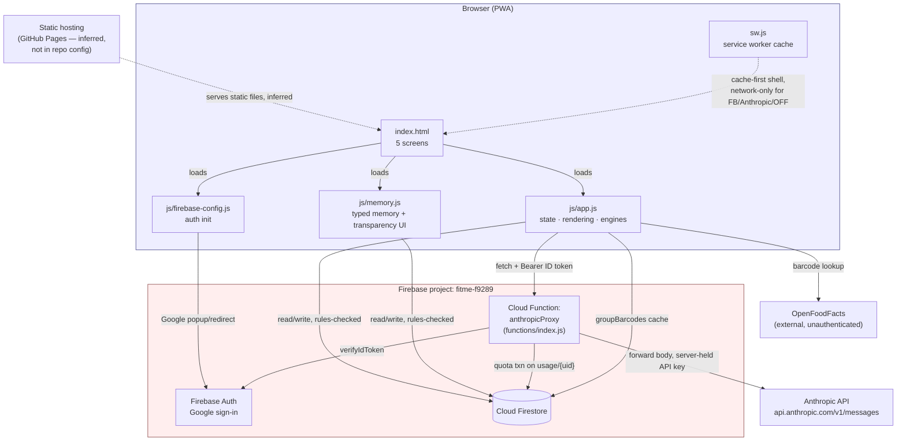
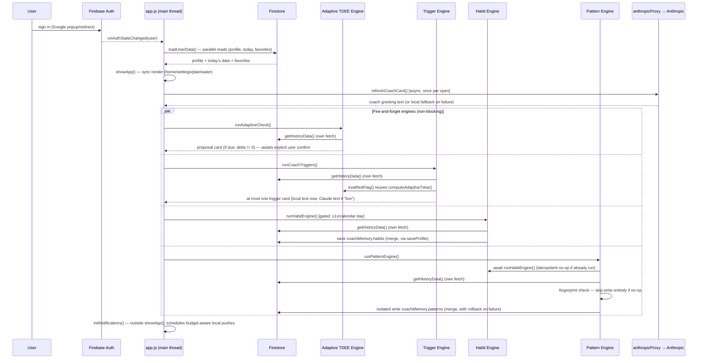

# FitMe — Current-State Architecture (v1)

**Repository:** `randahari/fitme` (origin: `https://github.com/randahari/fitme.git`)
**Snapshot basis:** commit `01ee236` (2026-07-15), app version `2.17.1` (`APP_VERSION` in [js/app.js:2](../../js/app.js), `VERSION` in [sw.js:1](../../sw.js))
**Document status:** describes the system as it exists in the repository today. No redesign, no proposed future state. Anything not directly verifiable from repo contents is explicitly marked as an **assumption**.

---

## 1. Product and System Overview

FitMe is a Hebrew-language (RTL), mobile-first Progressive Web App for nutrition and fitness self-tracking with an AI "coach" persona. A user logs meals (by text, photo, or barcode), water, workouts, weight, and body measurements; the app computes daily calorie/macro targets and renders progress on a single home screen. Layered on top of this tracking core are several algorithmic subsystems ("engines") that observe the user's logged history and adapt targets, surface coaching messages, and build up a private, typed record of what the coach has "learned" about the user.

There is no backend application server in the traditional sense. The system is:

- A static, unbundled client (`index.html` + 3 `<script>` files) — no build step, no framework, no bundler, no package.json at the repo root.
- Firebase as the sole managed backend: **Firebase Auth** (Google sign-in), **Firestore** (all persistent data), and a single **Cloud Function** that proxies calls to the **Anthropic API** (Claude).
- Static hosting is **not configured inside this repo** (no `hosting` block in [firebase.json](../../firebase.json), no CI/deploy workflow files found). The Cloud Function's CORS allow-list (`https://randahari.github.io`, `http://localhost:5000`, `http://localhost:8080` — [functions/index.js:37-41](../../functions/index.js)) and the PWA `start_url`/`scope` of `/fitme/` ([manifest.json](../../manifest.json), [sw.js](../../sw.js)) strongly indicate the static files are served via **GitHub Pages** at a project-page path (`randahari.github.io/fitme/`). **Assumption:** this is inferred from CORS/URL evidence, not from an explicit hosting config file in the repo.

---

## 2. Main Files and Responsibilities

| File | Responsibility |
|---|---|
| [index.html](../../index.html) | Static app shell. Defines `loading-screen`, `login-screen`, `onboarding`, and `app` containers; 5 screens inside `app` (`screen-home`, `screen-food`, `screen-workout`, `screen-profile`, `screen-settings`). Loads Firebase compat SDKs (v10.12.0) from `gstatic.com`, then `js/firebase-config.js`, `js/app.js`, `js/memory.js`, in that order. |
| [js/firebase-config.js](../../js/firebase-config.js) | Initializes the Firebase app (`firebaseConfig`), creates `auth`/`db`/`googleProvider` globals, sets `LOCAL` auth persistence, implements Google sign-in with a popup→redirect fallback (`signInWithGoogle`), handles the redirect result, and registers `sw.js`. |
| [js/app.js](../../js/app.js) (~3,671 lines) | The entire application. Single global-scope script containing: auth-state wiring, Firestore read/write helpers, onboarding, home/food/workout/profile/settings screen rendering, barcode scanning, AI-assisted food logging (text + photo), notifications, and **all** algorithmic engines (Adaptive TDEE, Trigger, Habit, Pattern) and the legacy coach-memory infrastructure. Organized as sequential dated "Stage"/"TASK" blocks; later blocks modify earlier behavior via **global function reassignment** rather than editing functions in place (see §11). |
| [js/memory.js](../../js/memory.js) (~434 lines) | The **typed memory** layer (`window.FitMeMemory`): schema, validation, CRUD against `users/{uid}/memories/{id}`, one-way migration from the legacy `coachMemory.observations`/`preferences` shape, and the "מה המאמן יודע עליי" (What the coach knows about me) transparency bottom-sheet UI wired into Settings. Self-contained IIFE, loaded last, does not touch `app.js` internals except by wrapping `renderSettings`. |
| [functions/index.js](../../functions/index.js) | The only Cloud Function: `anthropicProxy` (HTTPS `onRequest`, `us-central1`, 512MiB, 60s timeout). Verifies the caller's Firebase ID token, enforces a per-user/per-day quota via a Firestore transaction, forwards the request body to `https://api.anthropic.com/v1/messages` using a server-held secret (`ANTHROPIC_API_KEY`), and logs cumulative token usage. |
| [firestore.rules](../../firestore.rules) | Security rules. Owner-only read/write on most user data; group members get **read-only** access to a user's `users/{uid}` profile and `days/{day}` documents (for a leaderboard); `memories` sub-collection writes are restricted to `source in ['user_stated','migrated']`; `usage/{uid}` is client-readable but never client-writable. |
| [sw.js](../../sw.js) | Service worker. Cache-first ("stale-while-revalidate") for the static app shell (versioned cache name `fitme-v2.17.1`); explicit network-only bypass for Firebase/Google/Anthropic/OpenFoodFacts URLs; also handles Web Push (`push`/`notificationclick`) — **note:** no server-side push-sending code was found in this repo, so the push handler's trigger source is unconfirmed from repo contents alone (assumption: push is either unused currently, or sent from an external/manual source such as the Firebase console). |
| [manifest.json](../../manifest.json) | PWA manifest: name, icons, `standalone` display, RTL, `/fitme/` scope. |
| [firebase.json](../../firebase.json) | Declares only `firestore.rules` and the `functions` source directory. No `hosting` key present. |
| [.firebaserc](../../.firebaserc) | Pins the default Firebase project to `fitme-f9289`. |
| [functions/package.json](../../functions/package.json) | Cloud Function dependencies: `firebase-admin@^13.6.0`, `firebase-functions@^7.0.0`, Node 24 engine. |

---

## 3. Data Flow — Browser, Firebase, Firestore, Cloud Functions, Anthropic

```
Browser (index.html + app.js + memory.js)
   │
   ├── Firebase Auth SDK ── Google Sign-In ──▶ Firebase Auth (Google IdP)
   │
   ├── Firestore SDK ── direct reads/writes (subject to firestore.rules) ──▶ Cloud Firestore
   │
   └── fetch() with "Authorization: Bearer <Firebase ID token>"
              │
              ▼
       Cloud Function: anthropicProxy (functions/index.js)
              │  1. admin.auth().verifyIdToken(idToken)
              │  2. Firestore transaction on usage/{uid}: enforce daily quota
              │     (photo: 50/day, text: 300/day, keyed by UTC date)
              │  3. clamp body.max_tokens to ≤ 2000
              │  4. forward body verbatim to Anthropic
              ▼
       https://api.anthropic.com/v1/messages   (model requested by client: "claude-sonnet-4-6")
              │
              ▼
       response JSON relayed back to browser; usage/{uid} incremented
       (totalInputTokens / totalOutputTokens / totalRequests) — fire-and-forget, non-blocking
```

Every AI call from the client goes through the single helper `callClaude(body)` ([js/app.js:6](../../js/app.js)), which fetches a fresh ID token per call and POSTs to the hardcoded `CLAUDE_PROXY_URL` (`https://us-central1-fitme-f9289.cloudfunctions.net/anthropicProxy`). The client **never holds an Anthropic API key**; the key exists only as a Firebase Functions secret (`defineSecret('ANTHROPIC_API_KEY')`) read server-side.

Three distinct AI call shapes exist, all going through the same proxy:
1. **Coach messages** — text-only, `system` prompt built by `buildCoachSystemPrompt()`, short `max_tokens` (120–220).
2. **Food questionnaire / calculation** — text-only, JSON-only response contract, `max_tokens` 600–1200.
3. **Photo analysis** (plate or nutrition label) — `content` array with an `image` block (base64, client-compressed to ≤1024px/JPEG 0.85 via `compressImageForUpload`) plus a text prompt, `max_tokens` 1200.

`classifyCall(body)` (duplicated independently in both [functions/index.js](../../functions/index.js) and [js/app.js](../../js/app.js)) buckets a request as `photo` if any message content block has `type: 'image'`, else `text` (server-side quota) / `coach` (client-side usage-counter bucket, using presence of `body.system` as the discriminator instead).

Barcode lookups additionally call **OpenFoodFacts** (external, unauthenticated) and a Firestore-backed **shared group barcode cache** (`groupBarcodes/{gid}/products/{code}`) — these are separate from the Anthropic flow and do not go through the Cloud Function.

---

## 4. Authentication Flow

1. `js/firebase-config.js` initializes Firebase and sets `Auth.Persistence.LOCAL`.
2. `signInWithGoogle()` calls `auth.signInWithPopup(googleProvider)` first. On failure, only for a specific set of recoverable error codes (`auth/popup-blocked`, `auth/popup-closed-by-user`, `auth/cancelled-popup-request`, `auth/operation-not-supported-in-this-environment`) does it fall back to `auth.signInWithRedirect(googleProvider)` — this fallback exists specifically because iOS installed-PWA redirect flows can lose state crossing from Safari into the installed app shell (per inline comment).
3. `auth.getRedirectResult()` is awaited at load time to complete any pending redirect-based sign-in.
4. `js/app.js` registers `auth.onAuthStateChanged(...)` ([js/app.js:68](../../js/app.js)) as the single source of truth for app state:
   - `user` present → set `currentUser`, call `loadUserData()` (parallel Firestore reads via `Promise.all`: profile doc, today's `days` doc, `favorites` doc), then branch: profile exists → `showApp()` + `initNotifications()`; no profile → `showOnboarding()`.
   - `user` absent → clear `currentUser`/`userProfile`, `showLogin()`.
5. `finishOnboarding()` builds the initial profile (BMR via Mifflin-St Jeor-style formula, activity multiplier from workout-days selection, initial `goalKcal`), writes it with `saveProfile()`, creates a `groups/{groupCode}/members/{uid}` membership doc (every user is auto-assigned a personal group code at signup), then calls `showApp()`.
6. `signOut()` confirms via a native `confirm()` dialog, then `auth.signOut()`.

No custom backend session/JWT exists beyond Firebase's own ID tokens; the Cloud Function is the only place those tokens are verified server-side.

---

## 5. Firestore Collections and Important Stored Data

```
users/{uid}                          — profile document (see fields below)
users/{uid}/days/{YYYY-MM-DD}        — { meals[], burned, steps, water, updatedAt }
users/{uid}/data/favorites           — { meals: [...] }               (favorite meals)
users/{uid}/memories/{memoryId}      — typed memory record (see §13)  [TASK-001]

groups/{gid}                         — group document (read-only to signed-in users; no direct writes)
groups/{gid}/members/{uid}           — membership marker { joinedAt }

groupBarcodes/{gid}/products/{code}  — shared group barcode → nutrition cache

usage/{uid}                          — { daily: { date, photo, text }, totalInputTokens,
                                          totalOutputTokens, totalRequests, lastUsed }
                                        written ONLY by the Cloud Function (admin SDK); rules forbid
                                        client writes.
```

Key fields inside the `users/{uid}` profile document (accumulated across the codebase, not an exhaustive schema — this is a single, ever-growing document, not normalized):

- Identity/plan: `name, age, gender, weight, height, currentWeight, days, goal, foods[], tdee, goalKcal, stepsGoal`
- Coach persona prefs: `coachName, coachStyle, coachChatter`
- Group: `groupId` (canonical; `groupCode` retained for backward compatibility — one-time migration copies `groupCode` → `groupId` on load if missing, see `loadUserData()`)
- Progress: `streak, totalWorkouts, perfectWaterDays, perfectNutritionDays, weightHistory[], measurementHistory[]`
- Adaptive TDEE state: `rate, adaptiveEnabled, adaptiveTdee, currentDeficit, lastTdeeUpdate, tdeeHistory[], confirmedLightDays[]`
- Legacy coach memory blob: `coachMemory { observations[], preferences{}, habits[], habitsMeta, patterns[], patternsMeta, lastUpdated }`, `coachEvents[]` (capped at 200), `coachDay { date, fired[], count }`
- Usage counters (separate from Firestore `usage/{uid}`; this is a lighter monthly client-visible mirror): `usage { month, byType: { photo, coach, text } }`
- Memory-layer migration flags: `schemaVersion, memoryMigratedAt, memoryConsent { granted, at }`
- Quick-log: `quickItems[], quickOnboarded`

`getHistoryData()` ([js/app.js:178](../../js/app.js)) reads the **entire** `days` sub-collection (no query filter/limit — deliberately, per an inline comment, to avoid requiring a composite Firestore index), sorts client-side by document ID (`YYYY-MM-DD` strings sort chronologically), and truncates to the most recent 400 entries in JS. This is the single shared history source consumed by the Adaptive TDEE, Trigger, Habit, and Pattern engines.

---

## 6. Coach Brain and Memory Architecture

"The coach" is not a persistent conversational agent with memory on the Anthropic side — every `callClaude()` invocation is a fresh, stateless request. Continuity is simulated entirely client-side by re-assembling context into the `system` prompt (or user message) on every call:

- `buildCoachSystemPrompt()` ([js/app.js:301](../../js/app.js)) composes: role framing ("אתה 'המאמן'..."), the user's coach-facing name, known profile facts (age/weight/height/goal/goal-calories/training days/preferred foods/streak), a style guide (`friendly/supportive/professional/mixed`) and a length guide (`minimal/balanced/gentle`), plus explicit anti-hallucination and formatting constraints ("never invent data not given to you", "plain text, no markdown").
- This function is later **wrapped** (not replaced) by the Stage-5 hook ([js/app.js:2633](../../js/app.js)) to append `coachMemoryPromptFragment()` — a short natural-language summary of the last 8 `coachMemory.observations` plus all `coachMemory.preferences` — onto the base prompt.
- `coachMessage(context)` sends `{ system: buildCoachSystemPrompt(), messages: [{role:'user', content: context}] }` to Claude and returns the trimmed text response, with local fallback text (`coachLine()`) whenever the network call fails.

The "memory" that feeds this prompt currently exists in **two parallel systems** — see §13.

---

## 7. Adaptive TDEE Engine ("Stage 4", `js/app.js` ~lines 1876–2340)

**Purpose:** periodically re-estimate the user's true maintenance calories (TDEE) from actual logged intake and weight/measurement trends, and gradually steer `goalKcal` toward a target deficit/surplus rather than trusting the static onboarding-time formula forever.

Pure calculation core (side-effect free, operates on a `history` map passed in):

- `computeAdaptiveTdee(history)`: filters the 14-day window (`ADAPT_WINDOW_DAYS`) to days classified `full` or `light` (see `classifyDay`); averages their intake; computes a least-squares weight-trend slope (`linearSlope`) over weigh-ins in the same window (requires ≥3 weigh-ins spanning ≥10 days); `tdee = avgIntake − slopeKgPerDay × 7700`; softens the result against the previous TDEE by at most `ADAPT_MAX_STEP` (250 kcal); clamps to [1200, 5000].
- `analyzeMeasurements()`: linear trend (cm/week) for waist/arm/chest over the last 28 days.
- `buildWeeklySignals(calc, meas)`: combines weight-trend %, waist trend, and arm trend into a named scenario (`clean-cut, recomp, stalled, losing-muscle, clean-bulk, dirty-bulk, stalled-bulk, gaining, drift, holding, steady`) and a boolean `redFlag` (e.g., cutting too fast while losing arm size). Documented principle: **"measurements win over the scale"**.
- `computeNextDeficit(signals)`: steps the current deficit/surplus by a configurable rate (`gentle/balanced/aggressive`, each with its own `step` and final `cutTarget`/`bulkTarget`) toward the goal, or pulls back 100 kcal on a red flag.
- `buildAdaptiveProposal(history)`: assembles the full proposed `newGoal`/`delta` without applying it.

Thin UI layer: `runAdaptiveCheck()` (gated to fire at most once per `ADAPT_CADENCE_DAYS` = 7 days via `userProfile.lastTdeeUpdate`) builds a proposal and shows it in a home-screen card (`renderAdaptiveCard`) with a locally-generated explanation (`adaptiveLocalExplain`) immediately, upgraded asynchronously to a Claude-generated explanation (`coachAdaptiveMessage`) if the network call succeeds. The user must explicitly confirm (`applyAdaptiveUpdate`) or dismiss (`dismissAdaptiveUpdate`) — **the engine never silently changes `goalKcal`**.

A companion sub-feature (`pendingPartialDays` / `renderPartialPrompt` / `confirmDayLight`) flags days with suspiciously low logged intake (below 50% of goal) and asks the user to confirm whether that was a genuinely light-eating day (counted) or incomplete logging (excluded from the TDEE calculation).

---

## 8. Trigger Engine ("Stage 5", `js/app.js` ~lines 2341–2705)

**Purpose:** react to real events/state on app open rather than firing on a fixed clock; surface at most a few relevant nudges per day within a budget.

- A small set of **pure condition functions**, each returning `{type, priority, live, data}` or `null`: `evalRedFlag` (reuses the Adaptive TDEE engine's `computeAdaptiveTdee`/`buildWeeklySignals`), `evalForgotToEat` (14:00–20:00 and <400 kcal logged), `evalLowProtein` (2 consecutive days under 60% of protein target), `evalNoWorkout` (gap since last workout exceeds the user's training-day cadence), `evalCloseToGoal` (evening, within 100–300 kcal of goal), `evalStreakMilestone` (streak ∈ {7,14,30,60,100}).
- `runCoachTriggers()` evaluates all candidates, filters by `canFire(type, priority)` (no repeat of the same trigger type same day; non-health triggers capped at `COACH_DAILY_BUDGET` = 3/day; health-priority triggers bypass the budget), picks the single highest-`priority` survivor (`PRIO: health=3 > opportunity=2 > encouragement=1`), renders it immediately via free local text (`triggerLocalText`), marks it fired (`markFired`) and logs it (`logCoachEvent`), then — only for `live: true` triggers (red-flag, streak milestones) — asynchronously upgrades the card text with a Claude-generated message (`triggerLiveText`).
- A separate immediate trigger, `fireWorkoutTrigger(burn)`, fires synchronously right after a workout is saved (hooked onto `saveWorkout`), independent of the daily-budget gate's "one per day" restriction path (it still logs the event and shows a card, but is not routed through `canFire`/`markFired`).
- `scheduleLocalNotifications()` is **entirely replaced** (not wrapped) by this stage to route all local push notifications through the same `canFire`/`markFired`/`logCoachEvent` budget-and-dedup mechanism the in-app cards use, so a notification and an in-app card for the same condition don't both fire.
- `logCoachEvent(type, meta)` appends to `userProfile.coachEvents` (capped at 200 entries, oldest dropped) — this is the raw event log the code's own comments describe as "the raw material the memory layer will eventually infer patterns from."

---

## 9. Habit Engine ("Stage 6 / TASK-002", `js/app.js` ~lines 2950–3249, v2.15.0)

**Purpose (explicitly scoped in the file's own header comment):** identify, maintain, and update user habits — nothing else. Explicitly *not* responsible for recommendations, coaching logic, complex pattern detection, decisions, initiatives, or UI. Runs once a day, in the background, non-blocking, with no user-facing surface at all (its output only feeds the prompt fragment / other engines).

- Wrapped in an IIFE; recomputes **from source every run** (raw `days` history, `weightHistory`, `measurementHistory` — no incremental event accounting).
- Builds a 42-day (`WINDOW_DAYS`) rolling observation window (`buildObservations`), tracking which weeks were "active" (any meal/workout/weigh-in/measurement) so a vacation/illness week doesn't count against a habit.
- Four pure detectors, each emitting a uniform `signal` object:
  - `detectNutrition`: fixed daily meal-time segments (morning/midday/evening/night) appearing in ≥50% of ≥5 timed-meal days; plus a weekly "logs food consistently" habit (≥4/7 days with a meal, over ≥3 weeks).
  - `detectWorkout`: per-weekday workout regularity (≥3 qualifying weeks, ≥50% hit rate).
  - `detectWeight` / `detectMeasurement`: weekly weigh-in / measurement logging regularity, sharing one helper (`weeklyLogHabit`).
- Lifecycle: `upsertFromSignal` blends new evidence into a smoothed `confidence` (`INERTIA` = 0.6, i.e. 60% previous / 40% new) and derives a deterministic `status` via `statusOf()`: **observed → candidate → confirmed → active**, with a **weakening** state when recent occurrence is late relative to the expected interval, and **inactive** below a confidence floor or after a long absence. A habit present before but absent this run is *decayed*, never deleted (`decayAbsent`), matching the stated principle "a temporary lapse does not erase a habit."
- Output is written to `userProfile.coachMemory.habits[]` / `coachMemory.habitsMeta` (capped at `MAX_HABITS` = 60, lowest-confidence entries dropped first if over cap) via the ordinary `saveProfile()` (merge write, no rollback logic).
- Gated to run at most once per calendar day (`mem.habitsMeta.lastRun === today` short-circuits), and hooked onto `showApp` as a fire-and-forget background task (`Promise.resolve().then(runHabitEngine)`), guaranteed never to block or throw into the UI (wrapped in try/catch).

---

## 10. Pattern Engine ("Stage 7 / TASK-003", `js/app.js` ~lines 3250–3671, v2.16.0/v2.17.0)

**Purpose (explicitly scoped, same style of header comment as Habit Engine):** identify and maintain longer-range recurring behavioral patterns as an **observation layer only** — explicitly no recommendations, coaching, initiatives, decisions, or UI. Runs once per session, after the Habit Engine, in the background.

This is the most carefully engineered piece of the codebase, with the header comments describing several deliberate correctness properties:

- **90-day rolling window** (`PE_WINDOW`), anchored to the **last actual data day** (`lastDataDay`, computed from the data itself), not the calendar date — so calendar days with zero activity (vacations) don't silently shift or blank the window.
- Four detectors, each returning signals via a uniform `finalize()` helper that computes `evidenceCount`/`opportunityCount`/`rawStrength` against explicit "opportunity" sets (so a habit's *rate*, not just its raw count, is captured):
  - `detectTime`: modal day-part (morning/midday/evening/night) of the first and last meal.
  - `detectWeekday`: per-weekday tendency to be either consistently logged (`active`) or consistently skipped (`skip`).
  - `detectSequence`: cross-day/same-day associations — workout day → higher protein than baseline; workout → next-day workout ("back to back"); workout → next-day rest; weigh-in and measurement logged together (±1 day).
  - `detectFrequency`: stability of meals-per-day and workouts-per-week (low standard deviation relative to the mean ⇒ higher pattern strength).
- **Deterministic identity:** a closed catalog of pattern IDs (`isCatalogId`) with static descriptions, so the same behavior always maps to the same record rather than spawning duplicates.
- **Recompute vs. lifecycle-advance separation** (the engine's own "ISSUE 10" comment spells this out): the pattern's *source-derived* fields (`strength`, `evidenceCount`, etc.) are recomputed fresh every run; but the *lifecycle* fields (`confidence`, `status`, `missedPeriods`) only move once per **new data day** (`advance = obs.lastDataDay > patternsMeta.lastAdvanceDataDay`), never on mere calendar-day passage or app re-opens, and never on editing past data. A pattern absent from the current source is preserved (`carryAbsent`), decayed only on a genuine advance, and only marked `inactive` after `MISS_INACTIVE_PERIODS` (3) consecutive missed evaluation periods — a single gap always lands on `weakening` first.
- **Fingerprint-gated writes:** `computeFingerprint()` hashes the relevant window of raw data (including the user's "effective weight", used consistently for both the fingerprint and the protein threshold — called out as a fixed bug in the comments, "ISSUE 3/4"). If neither the fingerprint changed nor a new data day occurred, the run is a complete no-op (`if (!advance && !fpChanged) return;`) — no Firestore write at all.
- **Isolated write with rollback:** unlike every other persistence path in the app (which goes through the swallow-errors `saveProfile()`), this engine writes `coachMemory.patterns`/`patternsMeta` directly via a scoped `db...set(..., {merge:true})` that **can throw**, and on failure explicitly rolls the in-memory state back to a pre-mutation snapshot so a retry is possible and the fingerprint/advance-day markers are not falsely advanced.
- Runs after the Habit Engine on every `showApp` (`await runHabitEngine()` inside `runPatternEngine`, itself wrapped in its own try/catch so a Habit Engine failure doesn't cancel the Pattern Engine — it just proceeds on raw data alone), hooked as a background, non-blocking `Promise.resolve().then(runPatternEngine)`.

---

## 11. Startup and Engine Execution Order

`app.js` is loaded as one script; because it is built out of sequential "Stage" blocks that each capture-and-reassign the previous version of a function (e.g. `const _s4_showApp = showApp; showApp = function(){ _s4_showApp(); ... }`), **the effective behavior of `showApp()` at runtime is the composition of every stage's wrapper, in file (definition) order** — not something visible from any single function body. As of this snapshot, the composed chain is:

1. **Base `showApp()`** ([js/app.js:99](../../js/app.js)): un-hide the `app` container, hide loading/login/onboarding, apply dark mode, `setTodayDate()`, `renderHome()` (itself later overridden — see below), `renderSettings()`, `renderPlanBanner()`, `buildWater()`.
2. **Stage 4 wrapper** ([js/app.js:2316](../../js/app.js)): + `runAdaptiveCheck()` (not awaited).
3. **Stage 5 wrapper** ([js/app.js:2641](../../js/app.js)): + `runCoachTriggers()` (not awaited).
4. **Stage 6 wrapper** ([js/app.js:3242](../../js/app.js)): + `Promise.resolve().then(runHabitEngine)` (background, never throws into caller).
5. **Stage 7 wrapper** ([js/app.js:3666](../../js/app.js)): + `Promise.resolve().then(runPatternEngine)` (background; internally `await`s `runHabitEngine()` again first — harmless no-op the second time due to the Habit Engine's own once-per-day gate).

Separately, `renderHome` (called from step 1) is **fully replaced** later in the file (["OVERRIDE: renderHome with ring", js/app.js:1782](../../js/app.js)) rather than wrapped — this replacement version additionally calls `refreshCoachCard()` (the home-screen LLM-generated greeting card, gated to render at most once per app-open via the `coachCardShown` flag), `buildWater()`, and `buildWeekChart()`.

`initNotifications()` and `loadUserData()` are called from the top-level `auth.onAuthStateChanged` handler, **outside** of `showApp()` itself.

Sequence at cold start (from the moment a returning, already-onboarded user's auth state resolves):

```
onAuthStateChanged(user)
 → loadUserData()                         (parallel: profile, today's day doc, favorites)
 → showApp()
     → [sync] base render (home/settings/plan banner/water)
         → renderHome() (overridden) → refreshCoachCard()   [async, LLM call, gated once/open]
     → [fire-and-forget] runAdaptiveCheck()                 [async, reads full history]
     → [fire-and-forget] runCoachTriggers()                 [async, reads full history]
     → [fire-and-forget] runHabitEngine()                   [async, reads full history, ≤1x/day]
     → [fire-and-forget] runPatternEngine()                 [async, awaits runHabitEngine first, reads full history]
 → initNotifications()                    (separately, outside showApp)
```

Several of these independently call `getHistoryData()` (a full-collection Firestore read of up to 400 days) on the same app open — Adaptive TDEE, Trigger Engine, Habit Engine, and Pattern Engine each fetch it separately rather than sharing one fetched copy (see §14, Risks).

---

## 12. Dependencies Between the Engines

```
Adaptive TDEE Engine  ──(read-only reuse of computeAdaptiveTdee/buildWeeklySignals)──▶  Trigger Engine (evalRedFlag)
Habit Engine          ──(explicitly optional/no hard dependency; documented as "enrichment only, not a source")──▶  Pattern Engine
Pattern Engine        ──(sequences before it runs)──▶  awaits Habit Engine's completion, but tolerates its failure
Typed Memory (memory.js) ──(one-way, one-time)──▶  migrates legacy coachMemory.observations/preferences on first load after schema bump
Coach persona (buildCoachSystemPrompt) ──(reads)──▶  legacy coachMemory.observations/preferences via coachMemoryPromptFragment()
```

Concretely:
- The **Trigger Engine**'s red-flag condition directly calls the Adaptive TDEE Engine's pure functions (`computeAdaptiveTdee`, `analyzeMeasurements`, `buildWeeklySignals`) rather than duplicating that logic.
- The **Pattern Engine** is sequenced to run after the **Habit Engine** on every `showApp` and can *read* Habit Engine output as optional enrichment (per its header comment), but its own header explicitly states its primary source is raw history, and it degrades gracefully (continues on raw data) if the Habit Engine throws.
- The **Habit Engine** has no dependency on the Pattern Engine, Trigger Engine, or Adaptive TDEE Engine.
- The **coach system prompt** reads from the *legacy* `coachMemory.observations`/`preferences` fields only — it does **not** currently read `coachMemory.habits`, `coachMemory.patterns`, or the typed `users/{uid}/memories` collection. In other words, the Habit Engine and Pattern Engine currently compute and persist data that **no other part of the app reads back** — they are write-only observation layers as of this snapshot (consistent with their own header comments: "לא כולל... UI" / "no UI").

---

## 13. Legacy vs. Typed Memory Systems (Both Currently Exist)

There are **two separate, independently-written memory representations live in production simultaneously**:

### A. Legacy: `userProfile.coachMemory` (blob inside the single `users/{uid}` document)
Introduced in Stage 5 (v2.10.0) as an empty scaffold (`ensureCoachMemory()`), then populated by:
- `coachMemory.observations[]` / `coachMemory.preferences{}` — the original, unstructured slots (still read by `coachMemoryPromptFragment()` for the live coach prompt).
- `coachMemory.habits[]` / `habitsMeta` — written by the Habit Engine (§9).
- `coachMemory.patterns[]` / `patternsMeta` — written by the Pattern Engine (§10), with its own isolated/rollback-capable write path distinct from the ordinary `saveProfile()`.
- `coachEvents[]` (raw event log, capped 200) and `coachDay` (daily trigger-budget tracker) live alongside `coachMemory` on the profile document but are conceptually the Trigger Engine's own state.

### B. Typed: `users/{uid}/memories/{id}` (introduced TASK-001, `js/memory.js`)
A proper per-record sub-collection with an explicit schema:
- `type ∈ {fact, habit, pattern, preference, coach_note, conversation_memory, recurring_meal}`
- `source ∈ {user_stated, inferred_event, inferred_pattern, coach_generated, migrated}` — Firestore rules ([firestore.rules:57-74](../../firestore.rules)) restrict **client** create/update/delete to `source ∈ {user_stated, migrated}`; the other sources are described in code comments as server/admin-only (via a Cloud Function using the Admin SDK, bypassing rules) — **no such Cloud Function currently exists in this repo** (`functions/index.js` contains only `anthropicProxy`), so as of this snapshot **no code path writes `inferred_event`, `inferred_pattern`, or `coach_generated` memories** — the schema and rules anticipate a producer that has not yet been built.
- `status ∈ {candidate, active, superseded, rejected, archived}`, `confidence` (0–1), `created_at/updated_at/last_confirmed_at`.
- `migrateIfNeeded()` performs a **one-time, one-way** migration: legacy `coachMemory.observations[]` → typed `coach_note` records, legacy `coachMemory.preferences{}` → typed `preference` records, using deterministic IDs (`mig_obs_N`, `mig_pref_<safeKey>`) for idempotency; gated by `userProfile.schemaVersion`. It does **not** migrate `coachMemory.habits[]` or `coachMemory.patterns[]`.
- Ships a full transparency UI (a bottom sheet reachable from Settings: "מה המאמן יודע עליי") — view grouped-by-type, confirm (+0.1 confidence), reject, edit, delete, add manually, and a `memoryConsent` checkbox — none of which exists for the legacy `coachMemory` blob.

**Net effect:** the Habit Engine and Pattern Engine (the two most algorithmically sophisticated pieces of the system) write exclusively into the *legacy* blob, which has no user-facing transparency/consent surface and is not migrated into the typed collection; the typed collection currently only holds migrated legacy observations/preferences plus anything the user adds manually. These two memory systems are not yet unified.

---

## 14. Technical Risks and Technical Debt

- **Global-scope monolith with cascading function overrides.** `app.js` has no modules; every "Stage" either wraps a global function (capturing the previous version in a closure-scoped `_sN_name` variable) or fully replaces it. Correctness of any given call depends on the textual order of these reassignments in the file. This pattern is called out in the code's own comments as temporary ("יעוצב מחדש בשלב העיצוב" — will be redesigned later) and has already caused at least one regression fixed in this history: `d549b4b` ("restore Coach Memory transparency UI - re-add memory.js script tag and SW SHELL entry").
- **Two parallel, unreconciled memory systems** (§13) — the more sophisticated engines (Habit, Pattern) write to a blob with no consent/transparency UI, while the typed, consent-aware store only contains migrated legacy data. A developer adding a new memory consumer must know to check both.
- **Habit/Pattern engine output currently has no consumer.** Both are explicitly write-only observation layers per their own header comments; the coach prompt only reads the older `observations`/`preferences` fields. The substantial engineering investment in these two engines (§9, §10) is not yet connected to any user-visible behavior.
- **Single ever-growing profile document.** `weightHistory`, `measurementHistory`, `coachEvents` (capped 200), `coachMemory.habits` (capped 60), and `coachMemory.patterns` (uncapped in the code read) all live inside one `users/{uid}` document with no archival/pagination — long-lived users risk approaching Firestore's 1 MiB document size limit.
- **Redundant full-history reads per app open.** `getHistoryData()` (an uncapped-by-query, capped-in-JS-to-400 read of the entire `days` sub-collection) is called independently by the Adaptive TDEE engine, the Trigger engine, the Habit engine, and the Pattern engine on the same `showApp()` invocation — no shared/cached fetch across engines within a single session (the Adaptive TDEE engine does stash its result in `window._adaptHistoryCache`, but the other three each fetch their own copy).
- **No automated tests found.** `functions/package.json` lists `firebase-functions-test` as a dev dependency, but no test files were found anywhere in the repository (outside `node_modules`). Correctness currently rests on manual QA and unusually detailed inline comments (particularly in the Pattern Engine, which reads as if written to prevent a recurrence of specific past bugs — "ISSUE 2/3/4/10" comment labels suggest a prior review or bug-bash cycle).
- **Duplicated logic between client and server.** `classifyCall()` (photo vs. text classification) is implemented independently in both `functions/index.js` and `js/app.js`, for different purposes (server quota vs. client usage display) — they can drift.
- **Hosting configuration is not visible in this repo** (§1) — anyone reasoning about deploys from repo contents alone cannot confirm where/how the static files are actually published; this is inferred, not verified.
- **Client-computed, unverified nutrition/coaching data.** All food-photo/label parsing and nutritional math is produced by an LLM following a JSON-contract prompt with self-check instructions embedded in the prompt text itself (e.g. "verify saturated fat ≤ total fat" for labels) — there is no server-side or code-level validation of the returned JSON's nutritional plausibility before it's shown to the user or saved.
- **Minor:** an untracked file `js/fitme_dial_elegant_options.png` (~161 KB) sits in the working tree (confirmed via `git status --short`, below) — appears to be a stray design-exploration asset not referenced anywhere in `index.html` or `app.js`.

---

## 15. Architecture Constraints Future Tasks Must Preserve

Based on explicit in-code documentation and observed behavior, the following constraints appear intentional and should not be silently broken by future changes:

1. **Engines must never block the UI or break app startup.** Habit Engine and Pattern Engine are invoked as `Promise.resolve().then(fn)` and internally wrap their entire body in try/catch that only `console.error`s — this is stated explicitly in both engines' header comments ("לא חוסם עלייה" / does not block startup, "לעולם לא שובר עלייה" / never breaks startup).
2. **Recompute-from-source, not incremental accounting.** Both the Habit Engine and Pattern Engine explicitly recompute their source-derived fields fresh from raw `days`/`weightHistory`/`measurementHistory` on every run rather than maintaining running counters — this is what makes editing/deleting a past meal correctly reflect in the next run without a separate reconciliation step. Any future change must preserve this property rather than reintroducing incremental/event-sourced counters.
3. **Lifecycle advancement is gated on new data, not on time or app opens.** The Pattern Engine in particular (its own "ISSUE 10" comment) is explicit that confidence/status must only change on a genuinely new `lastDataDay`, never merely because a calendar day passed or the user reopened the app. Do not "simplify" this into a time-based cooldown.
4. **A temporary gap must never look like abandonment.** Both engines require multiple consecutive missed periods (not a single miss) before marking something `inactive`, and never delete a habit/pattern outright — decay only. Preserve the distinct `weakening`/`inactive` staging.
5. **Fingerprint/no-op write gating in the Pattern Engine must be preserved** — writes are skipped entirely when neither the data fingerprint changed nor a new data day occurred, to avoid needless Firestore writes and to keep `lastAdvanceDataDay` semantically meaningful for future retries.
6. **The Anthropic API key must never reach the client.** All AI calls must continue to route through the `anthropicProxy` Cloud Function using Firebase ID token auth; do not reintroduce a client-held API key (the commit history shows this was deliberately removed: `f7747b8 "use cloud proxy, remove per-user API keys"`).
7. **Client-writable memory sources are restricted by Firestore rules** to `user_stated`/`migrated` — any future engine that wants to write inferred memories into the *typed* `users/{uid}/memories` collection will need a server-side (Cloud Function/Admin SDK) write path, per the existing rules comment; it cannot simply write from the client with an `inferred_*` or `coach_generated` source.
8. **The coach must never fabricate data.** `buildCoachSystemPrompt()` explicitly instructs the model never to invent data not provided — any future prompt-composition change should preserve this constraint rather than loosen it.
9. **Daily/monthly quota and usage-tracking behavior must remain fail-open, not fail-closed.** The Cloud Function's rate-limit check explicitly allows the call through if the Firestore quota check itself fails (network/transaction error) — "so a legitimate user is not blocked" (inline comment) — this tolerance should be preserved rather than "hardened" into a fail-closed check without discussion.
10. **RTL/Hebrew-first UI and copy.** All user-facing strings, date formatting, and layout assume Hebrew/RTL (`dir="rtl"`, Hebrew weekday arrays, Hebrew-only coach responses enforced in the system prompt) — this is a product constraint, not an oversight, and should be preserved in any new UI/text.

---

## 16. Overall Architecture and Data Flow (Mermaid)



---

## 17. App Startup and Background Engine Execution (Mermaid Sequence)



---

## 18. Current Version and Implementation Status (Repository Evidence Only)

- **App version:** `2.17.1` (`APP_VERSION` in [js/app.js:2](../../js/app.js); matches `VERSION`/cache name in [sw.js:1](../../sw.js)).
- **Latest commits at snapshot time** (`git log --oneline`, newest first): `01ee236` BUGFIX-001 (fix `getHistoryData` index error, bump to v2.17.1) → `d549b4b` BUG-001 (restore Coach Memory transparency UI) → `b712f7e` TASK-003 Pattern Engine v2.17.0 → `5bfa42e` TASK-002 Habit Engine v2.15.0 → `a0b863a`/`27ce685` PERF-002 (temporary startup instrumentation, then removed) → `4b6d432` PERF-001 (cache-first SW shell, parallelized `loadUserData`) → `05b1bcf` TASK-001 typed memory schema/migration/transparency UI.
- **Implemented and shipped:** Auth (Google), onboarding, meal logging (text/photo/barcode), water/workout/weight/measurement tracking, group leaderboard, favorites, quick-log, Adaptive TDEE engine (with explicit user confirmation gate), Trigger engine, Habit engine, Pattern engine, typed memory schema + transparency UI + one-way legacy migration, Cloud Function AI proxy with per-user daily quotas and usage tracking, PWA installability + service worker + local notifications.
- **Implemented but not yet consumed (write-only):** Habit Engine and Pattern Engine outputs (`coachMemory.habits`, `coachMemory.patterns`) — computed and persisted, but no other code path reads them back into the coach prompt or any UI as of this snapshot (§12, §14).
- **Schema/rules present but no producer exists yet:** the typed memory `source` values `inferred_event`, `inferred_pattern`, `coach_generated` are defined in `js/memory.js` and permitted server-side by `firestore.rules`, but no Cloud Function or other server-side writer for them exists in this repository yet.
- **Explicitly acknowledged as provisional by the code itself:** Adaptive TDEE, Trigger, Habit, and Pattern engines are all annotated in their own header comments as "designed functionally only — will be redesigned in the design phase" (`עוצב פונקציונלית בלבד — יעוצב מחדש בשלב העיצוב`), i.e., the current architecture is understood by its authors to be an intermediate, not final, state.
