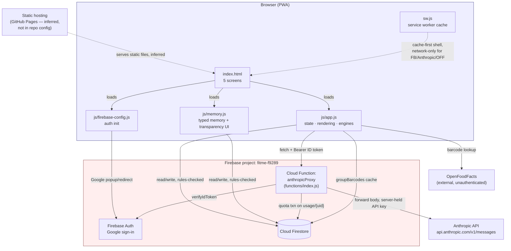
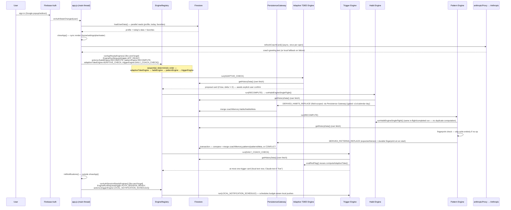

# FitMe — Current-State Architecture (v1)

**Repository:** `randahari/fitme` (origin: `https://github.com/randahari/fitme.git`)
**Snapshot basis:** commit `01ee236` (2026-07-15), app version `2.17.1` (`APP_VERSION` in [js/app.js:2](../../js/app.js), `VERSION` in [sw.js:1](../../sw.js))
**Document status:** describes the system as it exists in the repository today. No redesign, no proposed future state. Anything not directly verifiable from repo contents is explicitly marked as an **assumption**.

---

## 1. Product and System Overview

FitMe is a Hebrew-language (RTL), mobile-first Progressive Web App for nutrition and fitness self-tracking with an AI "coach" persona. A user logs meals (by text, photo, or barcode), water, workouts, weight, and body measurements; the app computes daily calorie/macro targets and renders progress on a single home screen. Layered on top of this tracking core are several algorithmic subsystems ("engines") that observe the user's logged history and adapt targets, surface coaching messages, and build up a private, typed record of what the coach has "learned" about the user.

There is no backend application server in the traditional sense. The system is:

- A static, unbundled client (`index.html` + 3 `<script>` files) — no build step, no framework, no bundler, no package.json at the repo root.
- Firebase as the sole managed backend: **Firebase Auth** (Google sign-in), **Firestore** (all persistent data), and a single **Cloud Function** that proxies calls to the **Anthropic API** (Claude).
- Static hosting is **not configured inside this repo** (no `hosting` block in [firebase.json](../../firebase.json), no CI/deploy workflow files found). The Cloud Function's CORS allow-list (`https://randahari.github.io`, `http://localhost:5000`, `http://localhost:8080` — [functions/index.js:37-41](../../functions/index.js)) and the PWA `start_url`/`scope` of `/fitme/` ([manifest.json](../../manifest.json), [sw.js](../../sw.js)) strongly indicate the static files are served via **GitHub Pages** at a project-page path (`randahari.github.io/fitme/`). **Assumption:** this is inferred from CORS/URL evidence, not from an explicit hosting config file in the repo.

---

## 2. Main Files and Responsibilities

| File | Responsibility |
|---|---|
| [index.html](../../index.html) | Static app shell. Defines `loading-screen`, `login-screen`, `onboarding`, and `app` containers; 5 screens inside `app` (`screen-home`, `screen-food`, `screen-workout`, `screen-profile`, `screen-settings`). Loads Firebase compat SDKs (v10.12.0) from `gstatic.com`, then `js/firebase-config.js`, `js/app.js`, `js/memory.js`, in that order. |
| [js/firebase-config.js](../../js/firebase-config.js) | Initializes the Firebase app (`firebaseConfig`), creates `auth`/`db`/`googleProvider` globals, sets `LOCAL` auth persistence, implements Google sign-in with a popup→redirect fallback (`signInWithGoogle`), handles the redirect result, and registers `sw.js`. |
| [js/app.js](../../js/app.js) (~3,671 lines) | The entire application. Single global-scope script containing: auth-state wiring, Firestore read/write helpers, onboarding, home/food/workout/profile/settings screen rendering, barcode scanning, AI-assisted food logging (text + photo), notifications, and **all** algorithmic engines (Adaptive TDEE, Trigger, Habit, Pattern) and the legacy coach-memory infrastructure. Organized as sequential dated "Stage"/"TASK" blocks; later blocks modify earlier behavior via **global function reassignment** rather than editing functions in place (see §11). |
| [js/memory.js](../../js/memory.js) (~434 lines) | The **typed memory** layer (`window.FitMeMemory`): schema, validation, CRUD against `users/{uid}/memories/{id}`, one-way migration from the legacy `coachMemory.observations`/`preferences` shape, and the "מה המאמן יודע עליי" (What the coach knows about me) transparency bottom-sheet UI wired into Settings. Self-contained IIFE, loaded last, does not touch `app.js` internals except by wrapping `renderSettings`. |
| [functions/index.js](../../functions/index.js) | The only Cloud Function: `anthropicProxy` (HTTPS `onRequest`, `us-central1`, 512MiB, 60s timeout). Verifies the caller's Firebase ID token, enforces a per-user/per-day quota via a Firestore transaction, forwards the request body to `https://api.anthropic.com/v1/messages` using a server-held secret (`ANTHROPIC_API_KEY`), and logs cumulative token usage. |
| [firestore.rules](../../firestore.rules) | Security rules. Owner-only read/write on most user data; group members get **read-only** access to a user's `users/{uid}` profile and `days/{day}` documents (for a leaderboard); `memories` sub-collection writes are restricted to `source in ['user_stated','migrated']`; `usage/{uid}` is client-readable but never client-writable. |
| [sw.js](../../sw.js) | Service worker. Cache-first ("stale-while-revalidate") for the static app shell (versioned cache name `fitme-v2.17.1`); explicit network-only bypass for Firebase/Google/Anthropic/OpenFoodFacts URLs; also handles Web Push (`push`/`notificationclick`) — **note:** no server-side push-sending code was found in this repo, so the push handler's trigger source is unconfirmed from repo contents alone (assumption: push is either unused currently, or sent from an external/manual source such as the Firebase console). |
| [manifest.json](../../manifest.json) | PWA manifest: name, icons, `standalone` display, RTL, `/fitme/` scope. |
| [firebase.json](../../firebase.json) | Declares only `firestore.rules` and the `functions` source directory. No `hosting` key present. |
| [.firebaserc](../../.firebaserc) | Pins the default Firebase project to `fitme-f9289`. |
| [functions/package.json](../../functions/package.json) | Cloud Function dependencies: `firebase-admin@^13.6.0`, `firebase-functions@^7.0.0`, Node 24 engine. |

---

## 3. Data Flow — Browser, Firebase, Firestore, Cloud Functions, Anthropic

```
Browser (index.html + app.js + memory.js)
   │
   ├── Firebase Auth SDK ── Google Sign-In ──▶ Firebase Auth (Google IdP)
   │
   ├── Firestore SDK ── direct reads/writes (subject to firestore.rules) ──▶ Cloud Firestore
   │
   └── fetch() with "Authorization: Bearer <Firebase ID token>"
              │
              ▼
       Cloud Function: anthropicProxy (functions/index.js)
              │  1. admin.auth().verifyIdToken(idToken)
              │  2. Firestore transaction on usage/{uid}: enforce daily quota
              │     (photo: 50/day, text: 300/day, keyed by UTC date)
              │  3. clamp body.max_tokens to ≤ 2000
              │  4. forward body verbatim to Anthropic
              ▼
       https://api.anthropic.com/v1/messages   (model requested by client: "claude-sonnet-4-6")
              │
              ▼
       response JSON relayed back to browser; usage/{uid} incremented
       (totalInputTokens / totalOutputTokens / totalRequests) — fire-and-forget, non-blocking
```

Every AI call from the client goes through the single helper `callClaude(body)` ([js/app.js:6](../../js/app.js)), which fetches a fresh ID token per call and POSTs to the hardcoded `CLAUDE_PROXY_URL` (`https://us-central1-fitme-f9289.cloudfunctions.net/anthropicProxy`). The client **never holds an Anthropic API key**; the key exists only as a Firebase Functions secret (`defineSecret('ANTHROPIC_API_KEY')`) read server-side.

Three distinct AI call shapes exist, all going through the same proxy:
1. **Coach messages** — text-only, `system` prompt built by `buildCoachSystemPrompt()`, short `max_tokens` (120–220).
2. **Food questionnaire / calculation** — text-only, JSON-only response contract, `max_tokens` 600–1200.
3. **Photo analysis** (plate or nutrition label) — `content` array with an `image` block (base64, client-compressed to ≤1024px/JPEG 0.85 via `compressImageForUpload`) plus a text prompt, `max_tokens` 1200.

`classifyCall(body)` (duplicated independently in both [functions/index.js](../../functions/index.js) and [js/app.js](../../js/app.js)) buckets a request as `photo` if any message content block has `type: 'image'`, else `text` (server-side quota) / `coach` (client-side usage-counter bucket, using presence of `body.system` as the discriminator instead).

Barcode lookups additionally call **OpenFoodFacts** (external, unauthenticated) and a Firestore-backed **shared group barcode cache** (`groupBarcodes/{gid}/products/{code}`) — these are separate from the Anthropic flow and do not go through the Cloud Function.

---

## 4. Authentication Flow

1. `js/firebase-config.js` initializes Firebase and sets `Auth.Persistence.LOCAL`.
2. `signInWithGoogle()` calls `auth.signInWithPopup(googleProvider)` first. On failure, only for a specific set of recoverable error codes (`auth/popup-blocked`, `auth/popup-closed-by-user`, `auth/cancelled-popup-request`, `auth/operation-not-supported-in-this-environment`) does it fall back to `auth.signInWithRedirect(googleProvider)` — this fallback exists specifically because iOS installed-PWA redirect flows can lose state crossing from Safari into the installed app shell (per inline comment).
3. `auth.getRedirectResult()` is awaited at load time to complete any pending redirect-based sign-in.
4. `js/app.js` registers `auth.onAuthStateChanged(...)` ([js/app.js:68](../../js/app.js)) as the single source of truth for app state:
   - `user` present → set `currentUser`, call `loadUserData()` (parallel Firestore reads via `Promise.all`: profile doc, today's `days` doc, `favorites` doc), then branch: profile exists → `showApp()` + `initNotifications()`; no profile → `showOnboarding()`.
   - `user` absent → clear `currentUser`/`userProfile`, `showLogin()`.
5. `finishOnboarding()` builds the initial profile (BMR via Mifflin-St Jeor-style formula, activity multiplier from workout-days selection, initial `goalKcal`), writes it with `saveProfile()`, creates a `groups/{groupCode}/members/{uid}` membership doc (every user is auto-assigned a personal group code at signup), then calls `showApp()`.
6. `signOut()` confirms via a native `confirm()` dialog, then `auth.signOut()`.

No custom backend session/JWT exists beyond Firebase's own ID tokens; the Cloud Function is the only place those tokens are verified server-side.

---

## 5. Firestore Collections and Important Stored Data

```
users/{uid}                          — profile document (see fields below)
users/{uid}/days/{YYYY-MM-DD}        — { meals[], burned, steps, water, updatedAt }
users/{uid}/data/favorites           — { meals: [...] }               (favorite meals)
users/{uid}/memories/{memoryId}      — typed memory record (see §13)  [TASK-001]

groups/{gid}                         — group document (read-only to signed-in users; no direct writes)
groups/{gid}/members/{uid}           — membership marker { joinedAt }

groupBarcodes/{gid}/products/{code}  — shared group barcode → nutrition cache

usage/{uid}                          — { daily: { date, photo, text }, totalInputTokens,
                                          totalOutputTokens, totalRequests, lastUsed }
                                        written ONLY by the Cloud Function (admin SDK); rules forbid
                                        client writes.
```

Key fields inside the `users/{uid}` profile document (accumulated across the codebase, not an exhaustive schema — this is a single, ever-growing document, not normalized):

- Identity/plan: `name, age, gender, weight, height, currentWeight, days, goal, foods[], tdee, goalKcal, stepsGoal`
- Coach persona prefs: `coachName, coachStyle, coachChatter`
- Group: `groupId` (canonical; `groupCode` retained for backward compatibility — one-time migration copies `groupCode` → `groupId` on load if missing, see `loadUserData()`)
- Progress: `streak, totalWorkouts, perfectWaterDays, perfectNutritionDays, weightHistory[], measurementHistory[]`
- Adaptive TDEE state: `rate, adaptiveEnabled, adaptiveTdee, currentDeficit, lastTdeeUpdate, tdeeHistory[], confirmedLightDays[]`
- Legacy coach memory blob: `coachMemory { observations[], preferences{}, habits[], habitsMeta, patterns[], patternsMeta, lastUpdated }`, `coachEvents[]` (capped at 200), `coachDay { date, fired[], count }`
- Usage counters (separate from Firestore `usage/{uid}`; this is a lighter monthly client-visible mirror): `usage { month, byType: { photo, coach, text } }`
- Memory-layer migration flags: `schemaVersion, memoryMigratedAt, memoryConsent { granted, at }`
- Quick-log: `quickItems[], quickOnboarded`

`getHistoryData()` ([js/app.js:178](../../js/app.js)) reads the **entire** `days` sub-collection (no query filter/limit — deliberately, per an inline comment, to avoid requiring a composite Firestore index), sorts client-side by document ID (`YYYY-MM-DD` strings sort chronologically), and truncates to the most recent 400 entries in JS. This is the single shared history source consumed by the Adaptive TDEE, Trigger, Habit, and Pattern engines.

---

## 6. Coach Brain and Memory Architecture

"The coach" is not a persistent conversational agent with memory on the Anthropic side — every `callClaude()` invocation is a fresh, stateless request. Continuity is simulated entirely client-side by re-assembling context into the `system` prompt (or user message) on every call:

- `buildCoachSystemPrompt()` ([js/app.js:301](../../js/app.js)) composes: role framing ("אתה 'המאמן'..."), the user's coach-facing name, known profile facts (age/weight/height/goal/goal-calories/training days/preferred foods/streak), a style guide (`friendly/supportive/professional/mixed`) and a length guide (`minimal/balanced/gentle`), plus explicit anti-hallucination and formatting constraints ("never invent data not given to you", "plain text, no markdown").
- This function is later **wrapped** (not replaced) by the Stage-5 hook ([js/app.js:2633](../../js/app.js)) to append `coachMemoryPromptFragment()` — a short natural-language summary of the last 8 `coachMemory.observations` plus all `coachMemory.preferences` — onto the base prompt.
- `coachMessage(context)` sends `{ system: buildCoachSystemPrompt(), messages: [{role:'user', content: context}] }` to Claude and returns the trimmed text response, with local fallback text (`coachLine()`) whenever the network call fails.

The "memory" that feeds this prompt currently exists in **two parallel systems** — see §13.

---

## 7. Adaptive TDEE Engine ("Stage 4", `js/app.js` ~lines 1876–2340)

**Purpose:** periodically re-estimate the user's true maintenance calories (TDEE) from actual logged intake and weight/measurement trends, and gradually steer `goalKcal` toward a target deficit/surplus rather than trusting the static onboarding-time formula forever.

Pure calculation core (side-effect free, operates on a `history` map passed in):

- `computeAdaptiveTdee(history)`: filters the 14-day window (`ADAPT_WINDOW_DAYS`) to days classified `full` or `light` (see `classifyDay`); averages their intake; computes a least-squares weight-trend slope (`linearSlope`) over weigh-ins in the same window (requires ≥3 weigh-ins spanning ≥10 days); `tdee = avgIntake − slopeKgPerDay × 7700`; softens the result against the previous TDEE by at most `ADAPT_MAX_STEP` (250 kcal); clamps to [1200, 5000].
- `analyzeMeasurements()`: linear trend (cm/week) for waist/arm/chest over the last 28 days.
- `buildWeeklySignals(calc, meas)`: combines weight-trend %, waist trend, and arm trend into a named scenario (`clean-cut, recomp, stalled, losing-muscle, clean-bulk, dirty-bulk, stalled-bulk, gaining, drift, holding, steady`) and a boolean `redFlag` (e.g., cutting too fast while losing arm size). Documented principle: **"measurements win over the scale"**.
- `computeNextDeficit(signals)`: steps the current deficit/surplus by a configurable rate (`gentle/balanced/aggressive`, each with its own `step` and final `cutTarget`/`bulkTarget`) toward the goal, or pulls back 100 kcal on a red flag.
- `buildAdaptiveProposal(history)`: assembles the full proposed `newGoal`/`delta` without applying it.

Thin UI layer: `runAdaptiveCheck()` (gated to fire at most once per `ADAPT_CADENCE_DAYS` = 7 days via `userProfile.lastTdeeUpdate`) builds a proposal and shows it in a home-screen card (`renderAdaptiveCard`) with a locally-generated explanation (`adaptiveLocalExplain`) immediately, upgraded asynchronously to a Claude-generated explanation (`coachAdaptiveMessage`) if the network call succeeds. The user must explicitly confirm (`applyAdaptiveUpdate`) or dismiss (`dismissAdaptiveUpdate`) — **the engine never silently changes `goalKcal`**.

A companion sub-feature (`pendingPartialDays` / `renderPartialPrompt` / `confirmDayLight`) flags days with suspiciously low logged intake (below 50% of goal) and asks the user to confirm whether that was a genuinely light-eating day (counted) or incomplete logging (excluded from the TDEE calculation).

---

## 8. Trigger Engine ("Stage 5", `js/app.js` ~lines 2341–2705)

**Purpose:** react to real events/state on app open rather than firing on a fixed clock; surface at most a few relevant nudges per day within a budget.

- A small set of **pure condition functions**, each returning `{type, priority, live, data}` or `null`: `evalRedFlag` (reuses the Adaptive TDEE engine's `computeAdaptiveTdee`/`buildWeeklySignals`), `evalForgotToEat` (14:00–20:00 and <400 kcal logged), `evalLowProtein` (2 consecutive days under 60% of protein target), `evalNoWorkout` (gap since last workout exceeds the user's training-day cadence), `evalCloseToGoal` (evening, within 100–300 kcal of goal), `evalStreakMilestone` (streak ∈ {7,14,30,60,100}).
- `runCoachTriggers()` evaluates all candidates, filters by `canFire(type, priority)` (no repeat of the same trigger type same day; non-health triggers capped at `COACH_DAILY_BUDGET` = 3/day; health-priority triggers bypass the budget), picks the single highest-`priority` survivor (`PRIO: health=3 > opportunity=2 > encouragement=1`), renders it immediately via free local text (`triggerLocalText`), marks it fired (`markFired`) and logs it (`logCoachEvent`), then — only for `live: true` triggers (red-flag, streak milestones) — asynchronously upgrades the card text with a Claude-generated message (`triggerLiveText`).
- A separate immediate trigger, `fireWorkoutTrigger(burn)`, fires synchronously right after a workout is saved (hooked onto `saveWorkout`), independent of the daily-budget gate's "one per day" restriction path (it still logs the event and shows a card, but is not routed through `canFire`/`markFired`).
- `scheduleLocalNotifications()` is **entirely replaced** (not wrapped) by this stage to route all local push notifications through the same `canFire`/`markFired`/`logCoachEvent` budget-and-dedup mechanism the in-app cards use, so a notification and an in-app card for the same condition don't both fire.
- `logCoachEvent(type, meta)` appends to `userProfile.coachEvents` (capped at 200 entries, oldest dropped) — this is the raw event log the code's own comments describe as "the raw material the memory layer will eventually infer patterns from."

---

## 9. Habit Engine ("Stage 6 / TASK-002", `js/app.js` ~lines 2950–3249, v2.15.0)

**Purpose (explicitly scoped in the file's own header comment):** identify, maintain, and update user habits — nothing else. Explicitly *not* responsible for recommendations, coaching logic, complex pattern detection, decisions, initiatives, or UI. Runs once a day, in the background, non-blocking, with no user-facing surface at all (its output only feeds the prompt fragment / other engines).

- Wrapped in an IIFE; recomputes **from source every run** (raw `days` history, `weightHistory`, `measurementHistory` — no incremental event accounting).
- Builds a 42-day (`WINDOW_DAYS`) rolling observation window (`buildObservations`), tracking which weeks were "active" (any meal/workout/weigh-in/measurement) so a vacation/illness week doesn't count against a habit.
- Four pure detectors, each emitting a uniform `signal` object:
  - `detectNutrition`: fixed daily meal-time segments (morning/midday/evening/night) appearing in ≥50% of ≥5 timed-meal days; plus a weekly "logs food consistently" habit (≥4/7 days with a meal, over ≥3 weeks).
  - `detectWorkout`: per-weekday workout regularity (≥3 qualifying weeks, ≥50% hit rate).
  - `detectWeight` / `detectMeasurement`: weekly weigh-in / measurement logging regularity, sharing one helper (`weeklyLogHabit`).
- Lifecycle: `upsertFromSignal` blends new evidence into a smoothed `confidence` (`INERTIA` = 0.6, i.e. 60% previous / 40% new) and derives a deterministic `status` via `statusOf()`: **observed → candidate → confirmed → active**, with a **weakening** state when recent occurrence is late relative to the expected interval, and **inactive** below a confidence floor or after a long absence. A habit present before but absent this run is *decayed*, never deleted (`decayAbsent`), matching the stated principle "a temporary lapse does not erase a habit." **Repository-verified correction, now implemented (see `docs/governance/FITME_Coach_Semantic_Foundation_Canonical_Decision_Package_v1.0.md` Chapter 29):** as implemented **prior to** this correction, the above description was accurate only for the four `period:'daily'` detectors (`meal:morning`/`midday`/`evening`/`night`) — for the eight `period:'weekly'` signal identities (`log-consistency`, `workout:weekday:0..6`, `weigh-in`, `measurement`), `WINDOW_DAYS=42`/`OCC_CONFIRMED=5`/`INTERVAL_WEEKLY=9` interact such that occurrence falls below the confirmed floor before lateness can cross the `weakening` threshold, so these types skipped `weakening` entirely (`confirmed/active → inactive` directly). The approved correction (Historical Fact vs. Current-Episode Establishment Authority, CSF Chapter 29) is **now implemented and production-backed verified** (Chapter 29.7): `statusOf()` gained a `currentEpisodeEstablished` parameter, and all eight `period:'weekly'` signal identities now naturally reach `weakening` before `inactive`, exactly like the daily detectors, without any numeric constant changing.
- Output is written to `userProfile.coachMemory.habits[]` / `coachMemory.habitsMeta` (capped at `MAX_HABITS` = 60, lowest-confidence entries dropped first if over cap). **Updated by B4 (v2.23.0):** the write no longer goes through `saveProfile()`; it is submitted as a `DERIVED_HABITS_REPLACE` request through the Persistence Gateway (`js/persistenceGateway.js`), which performs a field-scoped merge (`coachMemory.habits`/`coachMemory.habitsMeta` only) and normalizes success/failure. `js/stateAccess.js`'s `writeReplaceDerivedHabitView` snapshots and rolls back the in-memory `habits`/`habitsMeta` if the durable write does not succeed — see §19.
- Gated to run at most once per calendar day (`mem.habitsMeta.lastRun === today` short-circuits), and hooked onto `showApp` as a fire-and-forget background task (`Promise.resolve().then(runHabitEngine)`), guaranteed never to block or throw into the UI (wrapped in try/catch).

---

## 10. Pattern Engine ("Stage 7 / TASK-003", `js/app.js` ~lines 3250–3671, v2.16.0/v2.17.0)

**Purpose (explicitly scoped, same style of header comment as Habit Engine):** identify and maintain longer-range recurring behavioral patterns as an **observation layer only** — explicitly no recommendations, coaching, initiatives, decisions, or UI. Runs once per session, after the Habit Engine, in the background.

This is the most carefully engineered piece of the codebase, with the header comments describing several deliberate correctness properties:

- **90-day rolling window** (`PE_WINDOW`), anchored to the **last actual data day** (`lastDataDay`, computed from the data itself), not the calendar date — so calendar days with zero activity (vacations) don't silently shift or blank the window.
- Four detectors, each returning signals via a uniform `finalize()` helper that computes `evidenceCount`/`opportunityCount`/`rawStrength` against explicit "opportunity" sets (so a habit's *rate*, not just its raw count, is captured):
  - `detectTime`: modal day-part (morning/midday/evening/night) of the first and last meal.
  - `detectWeekday`: per-weekday tendency to be either consistently logged (`active`) or consistently skipped (`skip`).
  - `detectSequence`: cross-day/same-day associations — workout day → higher protein than baseline; workout → next-day workout ("back to back"); workout → next-day rest; weigh-in and measurement logged together (±1 day).
  - `detectFrequency`: stability of meals-per-day and workouts-per-week (low standard deviation relative to the mean ⇒ higher pattern strength).
- **Deterministic identity:** a closed catalog of pattern IDs (`isCatalogId`) with static descriptions, so the same behavior always maps to the same record rather than spawning duplicates.
- **Recompute vs. lifecycle-advance separation** (the engine's own "ISSUE 10" comment spells this out): the pattern's *source-derived* fields (`strength`, `evidenceCount`, etc.) are recomputed fresh every run; but the *lifecycle* fields (`confidence`, `status`, `missedPeriods`) only move once per **new data day** (`advance = obs.lastDataDay > patternsMeta.lastAdvanceDataDay`), never on mere calendar-day passage or app re-opens, and never on editing past data. A pattern absent from the current source is preserved (`carryAbsent`), decayed only on a genuine advance, and only marked `inactive` after `MISS_INACTIVE_PERIODS` (3) consecutive missed evaluation periods — a single gap always lands on `weakening` first.
- **Fingerprint-gated writes:** `computeFingerprint()` hashes the relevant window of raw data (including the user's "effective weight", used consistently for both the fingerprint and the protein threshold — called out as a fixed bug in the comments, "ISSUE 3/4"). If neither the fingerprint changed nor a new data day occurred, the run is a complete no-op (`if (!advance && !fpChanged) return;`) — no Firestore write at all.
- **Isolated write with rollback, now conflict-checked:** this engine writes `coachMemory.patterns`/`patternsMeta` via a scoped path that can fail, and on failure explicitly rolls the in-memory state back to a pre-mutation snapshot so a retry is possible and the fingerprint/advance-day markers are not falsely advanced. **Updated by B4 (v2.23.0):** the write is submitted as a `DERIVED_PATTERNS_REPLACE` request through the Persistence Gateway, which wraps it in a Firestore transaction comparing the request's `expectedVersion` (the fingerprint that was durable when this run started) against the currently-durable `patternsMeta.sourceFingerprint`; a mismatch returns `CONFLICT` (distinct from a generic write failure) instead of silently overwriting newer durable state. See §19.
- Runs after the Habit Engine on every `showApp` (`await runHabitEngine()` inside `runPatternEngine`, itself wrapped in its own try/catch so a Habit Engine failure doesn't cancel the Pattern Engine — it just proceeds on raw data alone), hooked as a background, non-blocking `Promise.resolve().then(runPatternEngine)`.

---

## 11. Startup and Engine Execution Order

**Updated by B2 (v2.21.0).** Prior to B2, `showApp()`, `logWeight()`, `saveWorkout()`
and `scheduleLocalNotifications` were each override-chained by successive
"Stage" blocks (`const _sN_fn = fn; fn = function(){ _sN_fn(); ...engine
call...; }`), so the effective runtime behavior of these functions was an
invisible composition of every stage's wrapper in file-definition order.
That pattern has been removed for the four intelligence engines and
replaced by one central **Engine Registry / Orchestrator**
(`js/engineRegistry.js`), with the four engines registered in a
"Stage 8 / B2" block near the end of `js/app.js`. See
`docs/tasks/B2/B2_SPEC.md` for the full contract.

1. **Base `showApp()`** ([js/app.js:161](../../js/app.js)): un-hide the `app` container, hide loading/login/onboarding, apply dark mode, `setTodayDate()`, `renderHome()` (still later overridden — see below), `renderSettings()`, `renderPlanBanner()`, `buildWater()`, then one added call: `runAppReadyEngines()` (non-blocking).
2. **`runAppReadyEngines()`** builds one explicit `EngineRunRequest` for the `APP_READY` trigger, supplying a distinct, explicit action per engine (`habitEngine`/`patternEngine` → `RECOMPUTE`, `adaptiveTdeeEngine` → `ADAPTIVE_CHECK`, `triggerEngine` → `DAILY_COACH_CHECK`) and calls `EngineRegistry.run(request)` without awaiting it.
3. **`EngineRegistry.run()`** resolves the four eligible engines' deterministic execution order (topological, lexicographic tie-break among independents: `adaptiveTdeeEngine` → `habitEngine` → `patternEngine` → `triggerEngine`) and executes them **sequentially, one at a time** (a deliberate B2 design choice — see §12 and B2 SPEC §9/§12), rather than the prior implicit concurrent fire-and-forget behavior.
4. **Habit Engine single-flight.** Because Pattern Engine's own `run()` still internally invokes Habit Engine's underlying computation (as enrichment — see §12), the Habit orchestration path wraps it in a session-generation-scoped single-flight (`runHabitEngineSingleFlight()`): a concurrent or overlapping call for the same session is handed the same in-flight `Promise` rather than starting a duplicate run. Correctness here does not depend on execution order.

Separately, `renderHome` (called from step 1) is **fully replaced** later in the file (["OVERRIDE: renderHome with ring", js/app.js:1782](../../js/app.js)) rather than wrapped — this replacement version additionally calls `refreshCoachCard()` (the home-screen LLM-generated greeting card, gated to render at most once per app-open via the `coachCardShown` flag), `buildWater()`, and `buildWeekChart()`. This non-engine override was not in B2's scope and is unchanged.

`initNotifications()` and `loadUserData()` are called from the top-level `auth.onAuthStateChanged` handler, **outside** of `showApp()` itself. `initNotifications()` now calls `runAuthSessionReadyEngines()` (also Registry-mediated, action `LOCAL_NOTIFICATION_SCHEDULE`) instead of calling `scheduleLocalNotifications()` directly; that function itself is now a single consolidated definition (the prior base-definition-plus-full-replacement pair was collapsed — the base was confirmed dead code, since the replacement always ran first at script-load time).

Sequence at cold start (from the moment a returning, already-onboarded user's auth state resolves):

```
onAuthStateChanged(user)
 → loadUserData()                         (parallel: profile, today's day doc, favorites)
 → showApp()
     → [sync] base render (home/settings/plan banner/water)
         → renderHome() (overridden) → refreshCoachCard()   [async, LLM call, gated once/open]
     → [fire-and-forget] runAppReadyEngines()
         → EngineRegistry.run({trigger: APP_READY, actions: {...}})
             → adaptiveTdeeEngine  → runAdaptiveCheck()                       [awaited, reads full history]
             → habitEngine         → runHabitEngineSingleFlight()             [awaited, reads full history, ≤1x/day]
             → patternEngine       → runPatternEngine()                       [awaited; internally awaits the same
                                                                                 single-flight Habit run — no-op if
                                                                                 already completed this cycle]
             → triggerEngine       → runCoachTriggers()                       [awaited, reads full history]
 → initNotifications() → runAuthSessionReadyEngines()   (separately, outside showApp)
```

Several of these independently call `getHistoryData()` (a full-collection Firestore read of up to 400 days) on the same app open — Adaptive TDEE, Trigger Engine, Habit Engine, and Pattern Engine each fetch it separately rather than sharing one fetched copy (see §14, Risks; unchanged by B2). Because engine execution is now sequential rather than concurrent, this app-open background work now completes in roughly the *sum* of each engine's duration rather than the *max* — a deliberate correctness-over-latency trade-off made during B2 (it does not block the synchronous UI render in step 1).

---

## 12. Dependencies Between the Engines

```
Adaptive TDEE Engine  ──(read-only reuse of computeAdaptiveTdee/buildWeeklySignals)──▶  Trigger Engine (evalRedFlag)
Habit Engine          ──(explicitly optional/no hard dependency; documented as "enrichment only, not a source")──▶  Pattern Engine
Pattern Engine        ──(internally invokes, via single-flight)──▶  Habit Engine's underlying computation, but tolerates its failure
Typed Memory (memory.js) ──(one-way, one-time)──▶  migrates legacy coachMemory.observations/preferences on first load after schema bump
Coach persona (buildCoachSystemPrompt) ──(reads)──▶  legacy coachMemory.observations/preferences via coachMemoryPromptFragment()
```

Concretely:
- The **Trigger Engine**'s red-flag condition directly calls the Adaptive TDEE Engine's pure functions (`computeAdaptiveTdee`, `analyzeMeasurements`, `buildWeeklySignals`) rather than duplicating that logic.
- **Updated by B2 (v2.21.0).** The **Pattern Engine** and **Habit Engine** are both registered independently with the Engine Registry, each with `dependsOn: []` — this is deliberately *not* a registry-level dependency, because promoting it would invoke the Registry's Failure Policy and change Pattern's approved behavior of continuing on raw data if Habit fails. Pattern Engine still internally reads Habit Engine output as optional enrichment (per its own header comment; primary source remains raw history), but that internal call now goes through a session-generation-scoped single-flight wrapper (`runHabitEngineSingleFlight()`) rather than a raw direct call, so that it cannot start a duplicate Habit computation regardless of whether the Registry has already started (or finished) its own Habit invocation for this session. See B2 SPEC §11 for the full rationale.
- The **Habit Engine** has no dependency on the Pattern Engine, Trigger Engine, or Adaptive TDEE Engine.
- The **coach system prompt** reads from the *legacy* `coachMemory.observations`/`preferences` fields only — it does **not** currently read `coachMemory.habits`, `coachMemory.patterns`, or the typed `users/{uid}/memories` collection. In other words, the Habit Engine and Pattern Engine currently compute and persist data that **no other part of the app reads back** — they are write-only observation layers as of this snapshot (consistent with their own header comments: "לא כולל... UI" / "no UI").

---

## 13. Legacy vs. Typed Memory Systems (Both Currently Exist)

There are **two separate, independently-written memory representations live in production simultaneously**:

### A. Legacy: `userProfile.coachMemory` (blob inside the single `users/{uid}` document)
Introduced in Stage 5 (v2.10.0) as an empty scaffold (`ensureCoachMemory()`), then populated by:
- `coachMemory.observations[]` / `coachMemory.preferences{}` — the original, unstructured slots (still read by `coachMemoryPromptFragment()` for the live coach prompt).
- `coachMemory.habits[]` / `habitsMeta` — written by the Habit Engine (§9).
- `coachMemory.patterns[]` / `patternsMeta` — written by the Pattern Engine (§10), with its own isolated/rollback-capable write path distinct from the ordinary `saveProfile()`.
- `coachEvents[]` (raw event log, capped 200) and `coachDay` (daily trigger-budget tracker) live alongside `coachMemory` on the profile document but are conceptually the Trigger Engine's own state.

### B. Typed: `users/{uid}/memories/{id}` (introduced TASK-001, `js/memory.js`)
A proper per-record sub-collection with an explicit schema:
- `type ∈ {fact, habit, pattern, preference, coach_note, conversation_memory, recurring_meal}`
- `source ∈ {user_stated, inferred_event, inferred_pattern, coach_generated, migrated}` — Firestore rules ([firestore.rules:57-74](../../firestore.rules)) restrict **client** create/update/delete to `source ∈ {user_stated, migrated}`; the other sources are described in code comments as server/admin-only (via a Cloud Function using the Admin SDK, bypassing rules) — **no such Cloud Function currently exists in this repo** (`functions/index.js` contains only `anthropicProxy`), so as of this snapshot **no code path writes `inferred_event`, `inferred_pattern`, or `coach_generated` memories** — the schema and rules anticipate a producer that has not yet been built.
- `status ∈ {candidate, active, superseded, rejected, archived}`, `confidence` (0–1), `created_at/updated_at/last_confirmed_at`.
- `migrateIfNeeded()` performs a **one-time, one-way** migration: legacy `coachMemory.observations[]` → typed `coach_note` records, legacy `coachMemory.preferences{}` → typed `preference` records, using deterministic IDs (`mig_obs_N`, `mig_pref_<safeKey>`) for idempotency; gated by `userProfile.schemaVersion`. It does **not** migrate `coachMemory.habits[]` or `coachMemory.patterns[]`.
- Ships a full transparency UI (a bottom sheet reachable from Settings: "מה המאמן יודע עליי") — view grouped-by-type, confirm (+0.1 confidence), reject, edit, delete, add manually, and a `memoryConsent` checkbox — none of which exists for the legacy `coachMemory` blob.

**Net effect:** the Habit Engine and Pattern Engine (the two most algorithmically sophisticated pieces of the system) write exclusively into the *legacy* blob, which has no user-facing transparency/consent surface and is not migrated into the typed collection; the typed collection currently only holds migrated legacy observations/preferences plus anything the user adds manually. These two memory systems are not yet unified.

---

## 14. Technical Risks and Technical Debt

- **Global-scope monolith with cascading function overrides.** `app.js` has no modules; every "Stage" either wraps a global function (capturing the previous version in a closure-scoped `_sN_name` variable) or fully replaces it. Correctness of any given call depends on the textual order of these reassignments in the file. This pattern is called out in the code's own comments as temporary ("יעוצב מחדש בשלב העיצוב" — will be redesigned later) and has already caused at least one regression fixed in this history: `d549b4b` ("restore Coach Memory transparency UI - re-add memory.js script tag and SW SHELL entry"). **Updated by B2 (v2.21.0):** resolved specifically for the four intelligence engines (Habit, Pattern, Adaptive TDEE, Trigger) — see §11 — via a central Engine Registry. Non-engine cascading overrides remain (e.g. `callClaude`, `buildCoachSystemPrompt`, `renderSettings`, `renderProfile`, and `renderHome`'s full replacement), out of B2's scope.
- **Two parallel, unreconciled memory systems** (§13) — the more sophisticated engines (Habit, Pattern) write to a blob with no consent/transparency UI, while the typed, consent-aware store only contains migrated legacy data. A developer adding a new memory consumer must know to check both.
- **Habit/Pattern engine output currently has no consumer.** Both are explicitly write-only observation layers per their own header comments; the coach prompt only reads the older `observations`/`preferences` fields. The substantial engineering investment in these two engines (§9, §10) is not yet connected to any user-visible behavior.
- **Single ever-growing profile document.** `weightHistory`, `measurementHistory`, `coachEvents` (capped 200), `coachMemory.habits` (capped 60), and `coachMemory.patterns` (uncapped in the code read) all live inside one `users/{uid}` document with no archival/pagination — long-lived users risk approaching Firestore's 1 MiB document size limit.
- **Redundant full-history reads per app open.** `getHistoryData()` (an uncapped-by-query, capped-in-JS-to-400 read of the entire `days` sub-collection) is called independently by the Adaptive TDEE engine, the Trigger engine, the Habit engine, and the Pattern engine on the same `showApp()` invocation — no shared/cached fetch across engines within a single session (the Adaptive TDEE engine does stash its result in `window._adaptHistoryCache`, but the other three each fetch their own copy).
- **No automated tests found.** `functions/package.json` lists `firebase-functions-test` as a dev dependency, but no test files were found anywhere in the repository (outside `node_modules`). Correctness currently rests on manual QA and unusually detailed inline comments (particularly in the Pattern Engine, which reads as if written to prevent a recurrence of specific past bugs — "ISSUE 2/3/4/10" comment labels suggest a prior review or bug-bash cycle).
- **Duplicated logic between client and server.** `classifyCall()` (photo vs. text classification) is implemented independently in both `functions/index.js` and `js/app.js`, for different purposes (server quota vs. client usage display) — they can drift.
- **Hosting configuration is not visible in this repo** (§1) — anyone reasoning about deploys from repo contents alone cannot confirm where/how the static files are actually published; this is inferred, not verified.
- **Client-computed, unverified nutrition/coaching data.** All food-photo/label parsing and nutritional math is produced by an LLM following a JSON-contract prompt with self-check instructions embedded in the prompt text itself (e.g. "verify saturated fat ≤ total fat" for labels) — there is no server-side or code-level validation of the returned JSON's nutritional plausibility before it's shown to the user or saved.
- **Minor:** an untracked file `js/fitme_dial_elegant_options.png` (~161 KB) sits in the working tree (confirmed via `git status --short`, below) — appears to be a stray design-exploration asset not referenced anywhere in `index.html` or `app.js`.

---

## 15. Architecture Constraints Future Tasks Must Preserve

Based on explicit in-code documentation and observed behavior, the following constraints appear intentional and should not be silently broken by future changes:

1. **Engines must never block the UI or break app startup.** Habit Engine and Pattern Engine internally wrap their entire body in try/catch that only `console.error`s — this is stated explicitly in both engines' header comments ("לא חוסם עלייה" / does not block startup, "לעולם לא שובר עלייה" / never breaks startup). **Updated by B2 (v2.21.0):** invocation is now via the Engine Registry (`js/engineRegistry.js`), triggered non-blockingly from `showApp()` through `runAppReadyEngines()` (the call itself is not awaited by `showApp()`), rather than the prior per-engine `Promise.resolve().then(fn)` wrappers. The engines' own internal try/catch behavior is unchanged.
2. **Recompute-from-source, not incremental accounting.** Both the Habit Engine and Pattern Engine explicitly recompute their source-derived fields fresh from raw `days`/`weightHistory`/`measurementHistory` on every run rather than maintaining running counters — this is what makes editing/deleting a past meal correctly reflect in the next run without a separate reconciliation step. Any future change must preserve this property rather than reintroducing incremental/event-sourced counters.
3. **Lifecycle advancement is gated on new data, not on time or app opens.** The Pattern Engine in particular (its own "ISSUE 10" comment) is explicit that confidence/status must only change on a genuinely new `lastDataDay`, never merely because a calendar day passed or the user reopened the app. Do not "simplify" this into a time-based cooldown.
4. **A temporary gap must never look like abandonment.** Both engines require multiple consecutive missed periods (not a single miss) before marking something `inactive`, and never delete a habit/pattern outright — decay only. Preserve the distinct `weakening`/`inactive` staging. **Correction (repository-verified during G-2 Engineering Readiness Review; now implemented — see `docs/governance/FITME_Coach_Semantic_Foundation_Canonical_Decision_Package_v1.0.md` Chapter 29):** this invariant already held for Pattern Engine and for the Habit Engine's four `period:'daily'` detectors, but **did not** hold for the Habit Engine's eight `period:'weekly'` signal identities, which used to skip `weakening` entirely. The approved Product + Architecture correction (CSF Chapter 29 — separating a permanent Historical Fact from a resettable Current-Episode Establishment Authority, reusing all existing numeric constants unchanged) is **now implemented and production-backed verified** (Chapter 29.7): all eight `period:'weekly'` signal identities now correctly stage through `weakening` before `inactive`, closing this gap generically. This item's original intent, as stated above, is preserved exactly and now holds for every Habit signal identity, not only the daily ones.
5. **Fingerprint/no-op write gating in the Pattern Engine must be preserved** — writes are skipped entirely when neither the data fingerprint changed nor a new data day occurred, to avoid needless Firestore writes and to keep `lastAdvanceDataDay` semantically meaningful for future retries.
6. **The Anthropic API key must never reach the client.** All AI calls must continue to route through the `anthropicProxy` Cloud Function using Firebase ID token auth; do not reintroduce a client-held API key (the commit history shows this was deliberately removed: `f7747b8 "use cloud proxy, remove per-user API keys"`).
7. **Client-writable memory sources are restricted by Firestore rules** to `user_stated`/`migrated` — any future engine that wants to write inferred memories into the *typed* `users/{uid}/memories` collection will need a server-side (Cloud Function/Admin SDK) write path, per the existing rules comment; it cannot simply write from the client with an `inferred_*` or `coach_generated` source.
8. **The coach must never fabricate data.** `buildCoachSystemPrompt()` explicitly instructs the model never to invent data not provided — any future prompt-composition change should preserve this constraint rather than loosen it.
9. **Daily/monthly quota and usage-tracking behavior must remain fail-open, not fail-closed.** The Cloud Function's rate-limit check explicitly allows the call through if the Firestore quota check itself fails (network/transaction error) — "so a legitimate user is not blocked" (inline comment) — this tolerance should be preserved rather than "hardened" into a fail-closed check without discussion.
10. **RTL/Hebrew-first UI and copy.** All user-facing strings, date formatting, and layout assume Hebrew/RTL (`dir="rtl"`, Hebrew weekday arrays, Hebrew-only coach responses enforced in the system prompt) — this is a product constraint, not an oversight, and should be preserved in any new UI/text.

---

## 16. Overall Architecture and Data Flow (Mermaid)


```mermaid
flowchart TB
    subgraph Client["Browser (PWA)"]
        HTML["index.html<br/>5 screens"]
        APPJS["js/app.js<br/>state · rendering · engines"]
        MEMJS["js/memory.js<br/>typed memory + transparency UI"]
        FBCFG["js/firebase-config.js<br/>auth init"]
        SW["sw.js<br/>service worker cache"]
    end

    subgraph FirebaseProject["Firebase project: fitme-f9289"]
        AUTH["Firebase Auth<br/>Google sign-in"]
        FS[("Cloud Firestore")]
        CF["Cloud Function:<br/>anthropicProxy<br/>(functions/index.js)"]
    end

    ANTHROPIC["Anthropic API<br/>api.anthropic.com/v1/messages"]
    OFF["OpenFoodFacts<br/>(external, unauthenticated)"]
    PAGES["Static hosting<br/>(GitHub Pages — inferred,<br/>not in repo config)"]

    HTML -->|loads| FBCFG
    HTML -->|loads| APPJS
    HTML -->|loads| MEMJS
    FBCFG -->|Google popup/redirect| AUTH
    APPJS -->|read/write, rules-checked| FS
    MEMJS -->|read/write, rules-checked| FS
    APPJS -->|"fetch + Bearer ID token"| CF
    CF -->|verifyIdToken| AUTH
    CF -->|"quota txn on usage/{uid}"| FS
    CF -->|"forward body, server-held API key"| ANTHROPIC
    APPJS -->|barcode lookup| OFF
    APPJS -->|"groupBarcodes cache"| FS
    PAGES -.->|serves static files, inferred| HTML
    SW -.->|cache-first shell,<br/>network-only for FB/Anthropic/OFF| HTML

    style Client fill:#eef,stroke:#448
    style FirebaseProject fill:#fee,stroke:#844
```

---

## 17. App Startup and Background Engine Execution (Mermaid Sequence)

**Updated by B2 (v2.21.0).** Engine invocation is now mediated by the
Engine Registry and executed sequentially (not concurrently); Habit
Engine correctness is provided by a session-scoped single-flight
wrapper rather than by this ordering. **Updated by B4 (v2.23.0):** durable
writes for Habit and Pattern now go through the Persistence Gateway
rather than directly reaching Firestore — see §19.


```mermaid
sequenceDiagram
    participant U as User
    participant Auth as Firebase Auth
    participant App as app.js (main thread)
    participant Reg as EngineRegistry
    participant FS as Firestore
    participant Gate as PersistenceGateway
    participant Adapt as Adaptive TDEE Engine
    participant Trig as Trigger Engine
    participant Habit as Habit Engine
    participant Pat as Pattern Engine
    participant Claude as anthropicProxy → Anthropic

    U->>Auth: sign in (Google popup/redirect)
    Auth-->>App: onAuthStateChanged(user)
    App->>FS: loadUserData() — parallel reads (profile, today, favorites)
    FS-->>App: profile + today's data + favorites
    App->>App: showApp() — sync render (home/settings/plan/water)
    App->>Claude: refreshCoachCard() [async, once per open]
    Claude-->>App: coach greeting text (or local fallback on failure)

    App->>Reg: runAppReadyEngines() [fire-and-forget]<br/>EngineRunRequest{trigger:APP_READY,<br/>actions:{habitEngine:RECOMPUTE, patternEngine:RECOMPUTE,<br/>adaptiveTdeeEngine:ADAPTIVE_CHECK, triggerEngine:DAILY_COACH_CHECK}}

    Note over Reg: sequential, deterministic order —<br/>adaptiveTdeeEngine → habitEngine → patternEngine → triggerEngine

    Reg->>Adapt: run(ADAPTIVE_CHECK)
    Adapt->>FS: getHistoryData() (own fetch)
    Adapt-->>Reg: proposal card (if due, delta != 0) — awaits explicit user confirm

    Reg->>Habit: run(RECOMPUTE) → runHabitEngineSingleFlight()
    Habit->>FS: getHistoryData() (own fetch)
    Habit->>Gate: DERIVED_HABITS_REPLACE (field-scoped, via Persistence Gateway) [gated: ≤1x/calendar day]
    Gate->>FS: merge coachMemory.habits/habitsMeta

    Reg->>Pat: run(RECOMPUTE)
    Pat->>Habit: runHabitEngineSingleFlight() (same in-flight/completed run — no duplicate computation)
    Pat->>FS: getHistoryData() (own fetch)
    Pat->>Pat: fingerprint check — skip write entirely if no-op
    Pat->>Gate: DERIVED_PATTERNS_REPLACE (expectedVersion = durable fingerprint at run start)
    Gate->>FS: transaction — compare + merge coachMemory.patterns/patternsMeta, or CONFLICT

    Reg->>Trig: run(DAILY_COACH_CHECK)
    Trig->>FS: getHistoryData() (own fetch)
    Trig->>Adapt: evalRedFlag() reuses computeAdaptiveTdee()
    Trig-->>Reg: at most one trigger card (local text now, Claude text if "live")

    App->>App: initNotifications() — outside showApp()
    App->>Reg: runAuthSessionReadyEngines() [fire-and-forget]<br/>EngineRunRequest{trigger:AUTH_SESSION_READY,<br/>actions:{triggerEngine:LOCAL_NOTIFICATION_SCHEDULE}}
    Reg->>Trig: run(LOCAL_NOTIFICATION_SCHEDULE) — schedules budget-aware local pushes
```

---

## 18. Current Version and Implementation Status (Repository Evidence Only)

- **App version:** `2.17.1` (`APP_VERSION` in [js/app.js:2](../../js/app.js); matches `VERSION`/cache name in [sw.js:1](../../sw.js)).
- **Latest commits at snapshot time** (`git log --oneline`, newest first): `01ee236` BUGFIX-001 (fix `getHistoryData` index error, bump to v2.17.1) → `d549b4b` BUG-001 (restore Coach Memory transparency UI) → `b712f7e` TASK-003 Pattern Engine v2.17.0 → `5bfa42e` TASK-002 Habit Engine v2.15.0 → `a0b863a`/`27ce685` PERF-002 (temporary startup instrumentation, then removed) → `4b6d432` PERF-001 (cache-first SW shell, parallelized `loadUserData`) → `05b1bcf` TASK-001 typed memory schema/migration/transparency UI.
- **Implemented and shipped:** Auth (Google), onboarding, meal logging (text/photo/barcode), water/workout/weight/measurement tracking, group leaderboard, favorites, quick-log, Adaptive TDEE engine (with explicit user confirmation gate), Trigger engine, Habit engine, Pattern engine, typed memory schema + transparency UI + one-way legacy migration, Cloud Function AI proxy with per-user daily quotas and usage tracking, PWA installability + service worker + local notifications.
- **Implemented but not yet consumed (write-only):** Habit Engine and Pattern Engine outputs (`coachMemory.habits`, `coachMemory.patterns`) — computed and persisted, but no other code path reads them back into the coach prompt or any UI as of this snapshot (§12, §14).
- **Schema/rules present but no producer exists yet:** the typed memory `source` values `inferred_event`, `inferred_pattern`, `coach_generated` are defined in `js/memory.js` and permitted server-side by `firestore.rules`, but no Cloud Function or other server-side writer for them exists in this repository yet.
- **Explicitly acknowledged as provisional by the code itself:** Adaptive TDEE, Trigger, Habit, and Pattern engines are all annotated in their own header comments as "designed functionally only — will be redesigned in the design phase" (`עוצב פונקציונלית בלבד — יעוצב מחדש בשלב העיצוב`), i.e., the current architecture is understood by its authors to be an intermediate, not final, state.
- **Since this snapshot:** the Architecture Remediation Program has closed REM-001/002/003 and B1–B4 on top of this baseline — B2 (v2.21.0, Engine Registry, §11), B3 (v2.22.0, State Access Layer), and B4 (v2.23.0, Persistence Gateway, §19) are the most recent and directly affect the persistence behavior described in §9/§10/§17 above. This section's commit/version reference (`01ee236`/`2.17.1`) is left as the original snapshot basis and is not re-verified line-by-line here; §11, §19 and the inline "Updated by BN" notes throughout this document are the authoritative record of what has changed since.

---

## 19. Persistence Gateway (B4, v2.23.0)

**Added by B4.** Prior to B4, every durable write went either through one broad, swallow-errors
`saveProfile()` (full `userProfile` object, `{merge:true}`) / `saveTodayData()` (full day
document overwrite), or — for the Pattern Engine only — a hand-rolled isolated write with local
rollback. Callers had no reliable way to distinguish a durable success from a durable failure. B4
introduces one logical **Persistence Gateway** (`js/persistenceGateway.js`) as the write boundary
for a defined set of migrated paths, without redesigning B1 canonical memory, B2 orchestration, or
B3 state ownership.

### 19.1 Shape and Position in the Stack

```
Engine business logic (runHabitEngine / runPatternEngine / runCoachTriggers / applyAdaptiveUpdate / addMeal / logQuick)
        ↓ (owner command, via js/stateAccess.js write ops, or directly for non-Engine paths)
PersistenceGateway.persist(PersistenceRequest)   — js/persistenceGateway.js
        ↓ (resolved Repository Adapter)
injected Firestore executor   — PersistenceGateway.configure({...}) in js/app.js
        ↓
Firestore (users/{uid}, users/{uid}/days/{date})
```

The gateway is a standalone, dependency-injected module (same pattern as `js/stateAccess.js`):
it never references `db`/`window`/`firebase` directly, so it loads and is fully unit-testable
in Node. `js/app.js` is the only caller of `PersistenceGateway.configure(...)`, and injects the
actual Firestore calls (`mergeUserFields`, `replaceDayDocument`, `runPatternTransaction`,
`isSessionCurrent`). `js/engineRegistry.js` was not modified: engine persistence outcomes are
reported through `output.persistence` on the existing (closed) `EngineRunResult.output` field,
not a new top-level Registry field.

### 19.2 Closed Operation Catalog

Six operations, fixed in source (no runtime registration API):

| Operation | Owner | Domain | Durable Surface | Conflict Policy | Idempotency Key |
|---|---|---|---|---|---|
| `DERIVED_HABITS_REPLACE` | `habitState` | `DERIVED_INTELLIGENCE` | `coachMemory.habits` / `habitsMeta` | none | not required |
| `DERIVED_PATTERNS_REPLACE` | `patternState` | `DERIVED_INTELLIGENCE` | `coachMemory.patterns` / `patternsMeta` | `expectedVersion` (fingerprint) | not required |
| `DERIVED_ADAPTIVE_PROPOSAL_APPLY` | `profileGoalsState` | `USER_PROFILE` | `goalKcal`, `adaptiveTdee`, `currentDeficit`, `lastTdeeUpdate`, `tdeeHistory` | none | not required |
| `TRIGGER_RECORD_EVENT` | `triggerState` | `SYSTEM_METADATA` | `coachEvents` | none | **required** (append-style) |
| `TRIGGER_UPDATE_BUDGET` | `triggerState` | `SYSTEM_METADATA` | `coachDay` | none | not required |
| `SOURCE_HISTORY_SAVE_DAY` | `nutritionHistoryState` | `SOURCE_HISTORY` | day document (`meals`/`burned`/`steps`/`water`) | none | not required |

Every operation requires authenticated `userId` and current `sessionGeneration` except the two
Trigger operations, which are authority-neutral (operational bookkeeping, not authoritative or
generative content). `DERIVED_ADAPTIVE_PROPOSAL_APPLY`'s owner is the Profile and Goals Domain
(matching B3's ownership map), not the Adaptive TDEE Engine — the Adaptive TDEE Engine's own
proposal-storage step remains in-memory only and is not persisted.

### 19.3 Pipeline

`persist(request)` runs, in order: validate request structure → resolve operation from the
closed catalog (unknown operation → `REJECTED`) → validate owner is on the operation's allowed
list → validate declared `domain` matches the operation's → validate `userId`/`sessionGeneration`
against `SessionLifecycle` (stale → `STALE_SESSION`, before any repository call) → validate
authority metadata against the operation's accepted `authoritySource` list where required →
validate payload shape → validate idempotency key where required → resolve the Repository
Adapter → execute with bounded retry → re-check session before returning (`receipt.
staleOnCompletion`) → return a normalized `PersistenceResult`.

### 19.4 Repository Adapters and Durable Surfaces

Each repository is a thin wrapper mapping a request's payload to an explicit, fixed set of
Firestore fields — never a raw pass-through of caller-supplied data — so two owners can never
collide on the same field through a shared physical document:

- **Field-scoped profile merge** (Habit, Adaptive-apply, Trigger event, Trigger budget): a
  single shared repository factory builds `{coachMemory: {habits, habitsMeta}}` /
  `{goalKcal, adaptiveTdee, currentDeficit, lastTdeeUpdate, tdeeHistory}` /
  `{coachEvents}` / `{coachDay}` respectively, then calls the injected
  `db.collection('users').doc(uid).set(fields, {merge:true})`.
- **Day-document repository** (`SOURCE_HISTORY_SAVE_DAY`): full-day-document replace
  (`meals`/`burned`/`steps`/`water`), the same shape `saveTodayData()` already used, now routed
  through the gateway for the two REM-001/REM-003-gated authoritative call sites.
- **Pattern transaction repository**: reads the durable `coachMemory.patternsMeta.
  sourceFingerprint` inside a Firestore transaction, compares it to the request's
  `expectedVersion`, aborts with `CONFLICT` on mismatch, otherwise merges
  `{coachMemory: {patterns, patternsMeta}}` atomically.

### 19.5 Retry, Conflict and Idempotency

- **Retry:** bounded to 3 attempts, only for repository failures classified transient
  (`unavailable`, `deadline-exceeded`, `aborted`, `internal`, `resource-exhausted`); session
  re-checked before every retry; attempt count returned in `receipt.attemptCount`.
- **Conflict:** `DERIVED_PATTERNS_REPLACE` only — `expectedVersion` mismatch returns `CONFLICT`,
  distinct from `FAILED`, and never overwrites newer durable state.
- **Idempotency:** a bounded, capped in-memory ledger (per user + operation + key) rejects a
  replayed key carrying a different payload (`IDEMPOTENCY_MISMATCH`) and returns `NO_OP` for an
  identical replay. `TRIGGER_RECORD_EVENT` requires a key (`{uid}:{type}:{date}`, matching the
  existing `canFire` dedup granularity); the five replace-style operations do not, since a
  replay with unchanged payload is naturally safe.

### 19.6 Failure Honesty and Rollback

`PersistenceResult.durable` is `true` only after confirmed repository success; a swallowed
repository error is never reported as success. State owners distinguish candidate state from
committed state:

- `js/stateAccess.js`'s `writeReplaceDerivedHabitView`/`writeReplaceDerivedPatternView` snapshot
  `coachMemory.habits`/`habitsMeta` and `.patterns`/`.patternsMeta` before mutating, and restore
  the snapshot if the gateway result is not `SUCCESS`/`NO_OP` (Pattern also restores on
  `CONFLICT`).
- `js/app.js`'s `recordCoachEvent`/`markTriggerFired` deps apply the same snapshot-and-rollback
  pattern to `coachEvents`/`coachDay`.
- `applyAdaptiveUpdate()` and `addMeal()`/`logQuick()` compute candidate values locally and only
  mutate `userProfile`/`todayData` after a `SUCCESS`/`NO_OP` result; on failure, `addMeal()`/
  `logQuick()` roll back the specific meal entry they optimistically pushed.
- All four failure/success completion paths (including the user-facing failure `alert()`) check
  `SessionLifecycle.isCurrent()` before applying any runtime effect, so a session that went
  stale mid-write neither re-applies old-session state nor surfaces a stale-session alert.

### 19.7 Migrated Write Paths (In Scope)

Habit Engine (`DERIVED_HABITS_REPLACE`), Pattern Engine (`DERIVED_PATTERNS_REPLACE`), Adaptive
TDEE's user-approved `applyAdaptiveUpdate()` (`DERIVED_ADAPTIVE_PROPOSAL_APPLY`), Trigger
Engine's `recordCoachEvent`/`markTriggerFired` (`TRIGGER_RECORD_EVENT`/`TRIGGER_UPDATE_BUDGET`),
and the AI-nutrition final authoritative boundary — `addMeal()`/`logQuick()`, the two call sites
already gated by REM-001 validation and REM-003 authority metadata
(`SOURCE_HISTORY_SAVE_DAY`).

### 19.8 Explicitly Out of Scope (Legacy, Unmigrated)

`saveProfile()` and `saveTodayData()` remain in active use, unmigrated, by: `saveFavorites()`,
group join/creation, barcode-cache writes, account deletion, water-count-only saves,
`saveWorkout()`, `addFavoriteToToday()`, and the `quickItems`/`streak` side effects still
attached to `addMeal()`/`logQuick()` (only their day-document write moved to the gateway). The
Adaptive TDEE Engine's own proposal-storage step (`storeAdaptiveProposal`/
`markAdaptiveCheckCompleted`) remains in-memory only — it was never persisted before B4 and
still isn't. No new direct-Firestore-write path was added anywhere in the migration.

---

## 20. C1 — Final Modularization Architecture (WP1–WP11, v2.40.0)

**Added by C1.** Prior to C1, `js/app.js` was 4,453 lines carrying most of the application's
domain logic, UI rendering, and platform mechanics directly. C1 (`docs/specs/C1_SPEC_v1.0.md`)
performed eleven incremental, contract-preserving extractions (WP1–WP11) that moved this logic
into dedicated modules, leaving `js/app.js` as a composition root. B1–B5 (§5–§19 above) are
unchanged by C1 and are not re-described here.

### 20.1 Composition Root (`js/app.js`, 2,008 lines post-WP11)

`js/app.js` now holds only:

- **Version constants** — `APP_VERSION` (`2.40.0`) and the fixed label tables (`GOAL_LABELS`,
  `DAYS_HE`, `COACH_STYLE_LABELS`/`COACH_CHATTER_LABELS`, `ACHIEVEMENTS`) that have no natural
  owning module.
- **Module configuration** — roughly three dozen `SomeModule.configure({...})` calls, each
  injecting the real platform object (`auth`, `Notification`, `navigator.serviceWorker`,
  `document`), the real Firestore handle (`db`, `firebase.firestore.FieldValue.serverTimestamp`),
  or a same-file closure (e.g. `getUserProfile: function () { return userProfile; }`) so every
  extracted module always observes the current runtime value, never a stale copy.
- **Physical runtime state** — the `let` variables (`currentUser`, `userProfile`, `todayData`,
  `waterCount`, `currentDayKey`, `realTodayData`, `realWaterCount`, `darkMode`, `workoutType`,
  `workoutInt`, `pendingMeal`, `photoMode`, `pendingBarcode`, `obData`, `quickItems`,
  `coachCardShown`, `foodSession`, `favoriteMeals`, `editingItemIdx`, `editingExisting`,
  `quickManage`, `_adaptProposal`) still physically live here — see §20.3.
- **Backward-compatible facades** — one-line functions (e.g. `function renderHome() { return
  HomePresenter.renderHome(); }`) preserved for every name inline HTML `onclick`/`window.*`
  handlers still call, per C1_SPEC §10's mandatory facade pattern.
- **Startup calls** — `AuthSessionController.start()` and `RegisterEngines.registerAll()`.
- **Small cross-module orchestration that does not belong to a domain module** — e.g.
  `runAppReadyEngines()`/`runEngineAction()`/`runAuthSessionReadyEngines()` (building an
  `EngineRunRequest` and calling `EngineRegistry.run()`), and `_resetAppCoreState()` (session
  cleanup registered with `SessionLifecycle`).

Not yet extracted (explicitly out of C1's approved scope — see `docs/roadmap/Changelog.md`'s
C1 entry): onboarding, the food questionnaire flow, meal-editor interaction handlers, workout
logging, streaks/achievements, group leaderboard/join, weekly plan generation, quick-log UI
handlers, water/week-chart rendering, and usage tracking still run as direct `js/app.js`
functions rather than dedicated modules. This is a scope decision, not an oversight — C1-WP11
(§11) sets no line-count target and defines success as responsibility reduction, not a fully
empty composition root.

### 20.2 Final Layer Diagram


```mermaid
flowchart TB
    HTML["index.html<br/>inline onclick handlers"]

    subgraph UI["UI Presenters / Controllers — js/ui/*, js/nutrition/*Presenter*,<br/>js/coach/coachPresenter, js/adaptive/*Controller, js/trigger/*Controller"]
        NAV["navigationController<br/>homePresenter · profilePresenter<br/>settingsPresenter · foodScreenPresenter<br/>dayNavigationController"]
    end

    subgraph APPSVC["Application Services — js/nutrition/*Service*, js/coach/coachClient,<br/>js/app/*Controller"]
        SVC["nutritionAnalysisService · mealCommitService<br/>quickLogService · barcodeFlowController<br/>coachClient · bootstrapController<br/>authSessionController"]
    end

    subgraph ROOT["Composition Root — js/app.js"]
        APPJS["version constants · configure() wiring<br/>physical runtime state · facades · startup calls"]
    end

    subgraph DOMAIN["Pure Domain Services — js/core/*, js/domain/*,<br/>js/nutrition/mealDraft, js/coach/coachProfile,<br/>js/adaptive/adaptiveTdeeDomain, js/trigger/triggerDomain"]
        PURE["zero DOM/window/Firebase — Node-loadable, no configure()"]
    end

    subgraph ENGINES["Engine Registry + Engines — js/engineRegistry.js (B2),<br/>js/engines/*, js/stateAccess.js (B3),<br/>js/derivedIntelligenceConsumer.js (B5)"]
        ENG["habitEngine · patternEngine<br/>adaptiveTdeeEngineAdapter · triggerEngineAdapter"]
    end

    subgraph REPO["Repository / Platform Adapters — js/repositories/*, js/adapters/*,<br/>js/persistenceGateway.js (B4)"]
        ADAPT["profileRepository · dayRepository · favoritesRepository<br/>groupRepository · barcodeRepository<br/>authAdapter · notificationAdapter · imageAdapter<br/>barcodeScannerAdapter · openFoodFactsClient · claudeProxyClient"]
    end

    FIRESTORE[("Firestore / Firebase Auth /<br/>browser & native APIs / external HTTP")]

    HTML --> NAV
    NAV --> SVC
    SVC --> DOMAIN
    SVC --> ENG
    SVC --> REPO
    ROOT -->|configure&#40;&#41;| UI
    ROOT -->|configure&#40;&#41;| APPSVC
    ROOT -->|configure&#40;&#41;| ENGINES
    ROOT -->|configure&#40;&#41;| REPO
    ENG --> REPO
    REPO --> FIRESTORE

    style ROOT fill:#eef,stroke:#448
    style DOMAIN fill:#efe,stroke:#484
    style REPO fill:#fee,stroke:#844
```

This matches the target architecture in C1_SPEC §9/§14 exactly: pure domain modules never
reference DOM/`window`/Firebase/`currentUser`/`userProfile`/`todayData` directly; only the
Repository/Platform Adapter tier and `js/app.js` itself (the sole caller of every
`.configure()`) touch real platform objects.

### 20.3 Runtime State Ownership

Confirms the C1_SPEC §13 ownership map against the actual repository:

| State | Physical storage | Access-contract owner | Notes |
|---|---|---|---|
| `currentUser` / `userProfile` / displayed-day (`todayData`) | `let` in `js/app.js` | `js/app/runtimeState.js` (`getCurrentUser`/`setAuthenticatedUser`/`getProfile`/`replaceProfile`/`getDisplayedDay`/`replaceDisplayedDay`/`resetForSession`) | Deliberately **not** physically moved: `js/memory.js` reads `currentUser`/`userProfile`/`saveProfile` as bare lexical globals, so RuntimeState wraps them via injected closures instead (its own header comment documents this explicitly). No generic `get(key)`/`set(key,value)`. |
| `currentDayKey`, `realTodayData`, `realWaterCount`, `waterCount`, `editingExisting`, `editingItemIdx`, `pendingMeal` | `let` in `js/app.js` | `js/ui/dayNavigationController.js` via injected getter/setter closure pairs | Day-navigation/meal-edit state; consolidated from the former Day Navigation IIFE (WP10). |
| `_adaptProposal`, `window._adaptHistoryCache` | `let`/`window` in `js/app.js` | `js/adaptive/adaptiveTdeeController.js` (read/clear via injected closures); `js/stateAccess.js` (`setAdaptProposal`/`setAdaptHistoryCache`, engine-facing write only) | Proposal is runtime-only — never persisted until user-confirmed apply (B4 `DERIVED_ADAPTIVE_PROPOSAL_APPLY`). |
| `coachCardShown` | `let` in `js/app.js` | `js/coach/coachPresenter.js` via injected getter/setter | Prevents duplicate coach-card generation per app open. |
| `quickItems` | `let` array in `js/app.js` | `js/nutrition/quickLogService.js` (pure scoring/learning/cap/pin/remove operations); `js/app.js` reassigns the array and mirrors it onto `userProfile.quickItems` | Matches C1_SPEC §13's "quick items … owner: quick-log owner/profile". |
| Habit view / Pattern view / trigger daily budget / typed memories / favourites | Unchanged from B3/B5 | `js/stateAccess.js`, `js/memory.js` | Not touched by C1. |
| `obData`, `foodSession`, `pendingBarcode`, `photoMode`, `workoutType`, `workoutInt`, `darkMode`, `favoriteMeals`, `quickManage` | `let` in `js/app.js` | Still directly read/written by the not-yet-extracted `js/app.js` functions listed in §20.1 | Out of C1's approved scope. |

No extracted module was given a generic `get(path)`/`set(path)` operation, and no engine-facing
snapshot is a mutable live reference — both prohibited by C1_SPEC §5.3/§12.4.

### 20.4 Repository Adapters (`js/repositories/*.js`, C1-WP3)

| Repository | Firestore path(s) | Methods | Notes |
|---|---|---|---|
| `ProfileRepository` | `users/{uid}` | `loadProfile`, `mergeProfile` | Document delete (`resetApp`) intentionally stays a direct `js/app.js` Firestore call — not in the WP3-approved behaviour list. |
| `DayRepository` | `users/{uid}/days/{key}` | `loadDay`, `saveLegacyDay`, `fetchHistory` | `fetchHistory` reproduces BUGFIX-001 exactly: no `orderBy`/`limit` (avoids a manual Firestore index), client-side sort by document ID, last 400 kept. |
| `FavoritesRepository` | `users/{uid}/data/favorites` | `load`, `save` | |
| `GroupRepository` | `groups/{code}`, `groups/{code}/members` | `getMembers`, `groupExists`, `addMember` | `getMembers` reproduces the original serial `for`/`await` profile+day lookup per member, including its empty-array failure fallback. |
| `BarcodeRepository` | `groupBarcodes/{groupKey}/products/{code}` | `lookupInCache`, `saveToCache` | `saveToCache` reproduces the original "don't cache an all-zero item" guard. |

Every repository is `configure({db, serverTimestamp})`-injected; none reference the global `db`
or `firebase` directly, and none changed a Firestore path, document shape, or query. The
authoritative day/meal write (`SOURCE_HISTORY_SAVE_DAY`) is not duplicated here — it remains
exclusively behind `PersistenceGateway` (§19).

### 20.5 Platform Adapters and the Native-Portability Boundary

Per C1_SPEC §14.3's test — *"Can the module run under Node tests without DOM, browser globals,
Firebase, or service worker?"* — grep evidence for literal `document.`/`canvas`/`FileReader`/
`Notification.`/`navigator.`/`firebase.`/`html5-qrcode` usage (excluding the standard
`if (typeof window !== 'undefined') window.Foo = API` export line every module has) against the
six WP2 adapters:

| Adapter (`js/adapters/*.js`) | Wraps | Real platform tokens in module body |
|---|---|---|
| `authAdapter.js` | Firebase Auth subscribe/sign-in/sign-out/token | 0 — `auth`/`googleProvider` injected via `configure()` |
| `claudeProxyClient.js` | Authenticated POST to the Cloud Function proxy | 0 — reuses `AuthAdapter.getIdToken`, `fetch` injected |
| `openFoodFactsClient.js` | Open Food Facts HTTP + response mapping | 0 — `fetch` injected |
| `notificationAdapter.js` | Notification permission/display, SW readiness, timers | 1 |
| `barcodeScannerAdapter.js` | `html5-qrcode` dynamic load, scanner lifecycle | 3 |
| `imageAdapter.js` | `FileReader`/`Image`/canvas compression, camera input | 12 |

All six are loaded and `configure()`d once, at composition time, in `js/app.js` (§20.1); none
decide product policy or UI text, per C1_SPEC §11 (C1-WP2) rules.

### 20.6 UI / Application / Domain Separation

The same grep-based evidence, applied repository-wide, gives a four-tier classification (the
dependency direction is enforced exactly as in C1_SPEC §9.1 — arrows only point downward):

| Tier | Modules | Evidence |
|---|---|---|
| **Pure Domain** (no `configure()`; zero DOM/`window`/Firebase reference) | `js/core/dateUtils.js`, `numberUtils.js`, `jsonUtils.js`, `stringUtils.js`; `js/domain/nutritionModel.js`, `profileMetrics.js`; `js/nutrition/mealDraft.js`; `js/coach/coachProfile.js`; `js/adaptive/adaptiveTdeeDomain.js`; `js/trigger/triggerDomain.js` | Each module's own header states "אין כאן configure() כי אין תלות בפלטפורמה" ("no `configure()` — no platform dependency"); 0 platform-token grep hits. |
| **Application Services** (`configure()`-injected callbacks/session/DOM references, but the module itself contains no literal DOM/Firebase token) | `js/nutrition/nutritionAnalysisService.js`, `quickLogService.js`, `mealCommitService.js`; `js/coach/coachPromptComposer.js`, `coachClient.js`; `js/app/runtimeState.js`, `bootstrapController.js`, `authSessionController.js` | `mealCommitService.js`'s only DOM-shaped calls are `deps.getElementById(...)` — an injected function, not the global `document`. |
| **UI Presenters / Controllers** (own rendering; injected `documentRef`, never write durably themselves) | `js/ui/navigationController.js`, `homePresenter.js`, `profilePresenter.js`, `settingsPresenter.js`, `foodScreenPresenter.js`, `dayNavigationController.js`; `js/nutrition/mealEditorPresenter.js`, `barcodeFlowController.js`; `js/coach/coachPresenter.js`; `js/adaptive/adaptiveTdeeController.js`; `js/trigger/triggerController.js` | `mealEditorPresenter.js`'s own header states it is explicitly **not** a pure module ("אינו מודול טהור") — it owns `configure()`-injected DOM access. |
| **Engine Registry, Engines, State/Persistence** (unchanged B1–B5 contracts; C1 only relocated Habit/Pattern producer code) | `js/engineRegistry.js`, `stateAccess.js`, `persistenceGateway.js`, `derivedIntelligenceConsumer.js`, `derivedIntelligencePrompt.js`; `js/engines/habitEngine.js`, `patternEngine.js`, `adaptiveTdeeEngineAdapter.js`, `triggerEngineAdapter.js`, `registerEngines.js` | 0 platform-token grep hits across all five `js/engines/*.js` files — confirms WP9's "now-Node-requirable engines" claim. |

Forbidden directions from C1_SPEC §9.1 (pure domain → DOM/`window`/Firebase/`currentUser`;
UI renderer → direct durable write; engine → persistence bypassing StateAccess/PersistenceGateway)
were checked against this same grep evidence and are not present.

### 20.7 Final Module Map

```text
js/
  app.js                              — composition root (§20.1)
  firebase-config.js                  — pre-C1
  memory.js                           — pre-C1 (B1), independent SessionLifecycle registration

  core/                     (WP1)      dateUtils.js · numberUtils.js · jsonUtils.js · stringUtils.js
  domain/                   (WP1)      profileMetrics.js · nutritionModel.js
  adapters/                 (WP2)      authAdapter.js · notificationAdapter.js · imageAdapter.js
                                        barcodeScannerAdapter.js · openFoodFactsClient.js · claudeProxyClient.js
  repositories/             (WP3)      profileRepository.js · dayRepository.js · favoritesRepository.js
                                        groupRepository.js · barcodeRepository.js
  app/                      (WP4)      runtimeState.js · bootstrapController.js · authSessionController.js
  nutrition/                (WP5A–F)   nutritionAnalysisService.js · mealDraft.js · mealEditorPresenter.js
                                        mealCommitService.js · quickLogService.js · barcodeFlowController.js
  coach/                    (WP6)      coachProfile.js · coachPromptComposer.js · coachClient.js · coachPresenter.js
  adaptive/                 (WP7)      adaptiveTdeeDomain.js · adaptiveTdeeController.js
  trigger/                  (WP8)      triggerDomain.js · triggerController.js
  engines/                  (WP9)      habitEngine.js · patternEngine.js · adaptiveTdeeEngineAdapter.js
                                        triggerEngineAdapter.js · registerEngines.js
  ui/                       (WP10)     navigationController.js · homePresenter.js · profilePresenter.js
                                        settingsPresenter.js · foodScreenPresenter.js · dayNavigationController.js

  sessionLifecycle.js                  — pre-C1 (REM-002)
  nutritionValidator.js                — pre-C1 (REM-001)
  authorityContract.js                 — pre-C1 (REM-003)
  engineRegistry.js                    — pre-C1 (B2)
  stateAccess.js                       — pre-C1 (B3)
  persistenceGateway.js                — pre-C1 (B4)
  derivedIntelligenceConsumer.js       — pre-C1 (B5)
  derivedIntelligencePrompt.js         — pre-C1 (B5)
```

56 files under `js/` in total (verified against `index.html` script order and `sw.js` `SHELL`,
which are kept in identical, matching order — a WP11 verification step). This is the actual
final structure, not the C1_SPEC §26 *suggested* structure — it differs in some naming
(`triggerDomain.js`/`triggerController.js` instead of a `triggers/` folder split identically to
`adaptive/`, no separate `plan`/`workout`/`group`/`engagement` folders since those domains were
not in C1's approved extraction scope per §20.1) but follows the same layering and dependency
rules throughout.

### 20.8 Native Migration Readiness

Per the grep evidence in §20.5/§20.6, every module listed under **Pure Domain** and **Engine
Registry, Engines, State/Persistence** in §20.6 already satisfies C1_SPEC §14.3/Appendix C
(loads and runs under `node --test` with no DOM, `window`, Firebase, Notification, or
service-worker dependency) — matching the C1_SPEC §27 Native Migration Contract's list of what
should be reusable unchanged in a future native shell. Everything under **UI Presenters /
Controllers** and the six `js/adapters/*.js` platform adapters is exactly what §27 expects to be
replaced by native-specific implementations.

## 21. TASK-004 — Coach Decision System (Composite Engine, D3 §17)

**Added by TASK-004** (`docs/specs/TASK_004_SPEC_v1.0.md`). D3_SPEC.md §17 approved the Coach
Decision System as a single Composite Engine — one B2 Engine Registry registration containing
six internal, non-independently-registered collaborators (Memory Layer, Recommendation Engine,
Initiative Engine, Decision Engine, Safety Layer, Expression), sequenced by an Internal Pipeline
Orchestrator. TASK-004 is the first task to build any part of it: `js/coachDecisionSystem/`
implements the Composite Engine registration, the Internal Pipeline Orchestrator, a minimal
Memory Layer (read-only Pipeline Context Assembly), and the Recommendation Engine as its first
operational internal collaborator. Registered under `js/engineRegistry.js`'s existing
`register()` contract (§20.6's **Engine Registry, Engines, State/Persistence** tier), invoked
from `js/app.js`'s existing `runAppReadyEngines()` alongside the four pre-existing engines —
`js/engineRegistry.js`, `js/stateAccess.js`, and `js/persistenceGateway.js`'s public contracts
are unmodified; only their existing, sanctioned extension points were used (a new `StateAccess`
permission-map entry, a new `js/derivedIntelligenceConsumer.js` production-mapping entry).

The Initiative Engine, Decision Engine, Safety Layer, and Expression collaborators, and Stage
3/4/5 (Opportunity Detection/Evidence/Eligibility Evaluation) of D2's Canonical Pipeline, remain
unbuilt (TASK-005/TASK-006) — see `docs/specs/TASK_004_SPEC_v1.0.md`'s Closure Record for the
current, non-architectural repository gaps this leaves. This is a scope decision, not an
oversight — D3 §17's six-collaborator design was already fixed before TASK-004; TASK-004 realizes
two of the six, per its own approved scope.

## 22. TASK-005 — Initiative Engine (Composite Engine, D3 §17, third collaborator)

**Added by TASK-005** (`docs/specs/TASK_005_SPEC_v1.0.md`). Realizes the third of D3 §17's six
internal collaborators: `js/coachDecisionSystem/initiativeEngine.js` implements the Initiative
Engine — a Stage-3 detection contribution (confirmed-pattern anticipation from real Habit/Pattern
signals; disruption/milestone detection, correctly yielding zero Opportunities given no repository
data source for calendar/milestone/setback events at this baseline) and Stage-6 orchestration
authority for Initiative-kind Candidate Generation, applying D1 Unit 09 in full including
Relationship-Maturity gating (D1-IP-02). Remains an internal collaborator of the single, already-
registered `coachDecisionSystem` Composite Engine — no second Engine Registry entry, no second
orchestration authority (D3 §17 Decision 1, §11.1).

`js/coachDecisionSystem/memoryLayer.js` received a focused extension per Canonical Decision
CD-T005-01: a second B5 `DerivedIntelligenceConsumer.build()` read (consumer `INITIATIVE_ENGINE`,
policy `INITIATIVE_SUPPORT_V1`, newly enabled in `js/derivedIntelligenceConsumer.js`'s production-
enabled mapping) supplies Habit/Pattern state; Life Event Context and Capacity State are reported
honestly `UNAVAILABLE` (no repository data source exists for either); Relationship Maturity is
reported `UNKNOWN` (no Product/Architecture-approved source exists yet — see the Closure Record's
Follow-ups). The Memory Layer remains the sole owner of Decision Input reads and Pipeline Context
Assembly; this extension performs no Opportunity Detection, Evidence Evaluation, Eligibility
Evaluation, Candidate Generation, Prioritization, Winner Selection, or Decision Formation.
`js/coachDecisionSystem/internalPipelineOrchestrator.js` gained `runForInitiativeOpportunity`/
`detectInitiativeOpportunities`, structurally parallel to the existing `runForOpportunity`; `run()`'s
existing contract is unchanged. `recommendationEngine.js`/`recommendationCategories.js` are
untouched — reused only for the D1 Unit 05 source vocabulary (`isValidOpportunitySource`,
`hierarchyTierForSource`), never the Recommendation Category taxonomy; `InitiativeCandidate` carries
no `category` field (Canonical Decision CD-T005-02).

The Decision Engine, Safety Layer, and Expression collaborators, and Stage 4/5 (Evidence/Eligibility
Evaluation) of D2's Canonical Pipeline, remain unbuilt (TASK-006) — see
`docs/specs/TASK_005_SPEC_v1.0.md`'s Closure Record for the current, non-architectural repository
gaps this leaves (principally: no approved Relationship Maturity source, and no Life Event/Capacity/
calendar/milestone data source, exist anywhere in the repository yet). This is a scope decision, not
an oversight — D3 §17's six-collaborator design was already fixed before TASK-004; TASK-005 realizes
three of the six, per its own approved scope.

## 23. TASK-006 — Decision Engine (Composite Engine, D3 §17, fourth collaborator)

**Added by TASK-006** (`docs/specs/TASK_006_SPEC_v1.0.md`). Realizes the fourth of D3 §17's six
internal collaborators: `js/coachDecisionSystem/eligibilityEvaluator.js` (Stage 5 — Eligibility
Evaluation, a Pipeline Gate applying D1 Unit 06 per-Opportunity, driven exclusively by the closed
`OpportunityEligibilityInput` contract, Canonical Decision CD-T006-01 — never free-text inference),
`prioritization.js` (Stage 7 — Candidate Pool Assembly across every Opportunity and both producer
engines into one shared pool, then the fixed D1-PR-01→06 lexicographic ranking sequence — Hierarchy
tier, same-kind-Recommendation-only impact tier per Canonical Decision CD-T006-03, biggest-problem-
first, then the four-step D1-PR-06 tie-break order — never a weighted composite score), and
`winnerSelection.js` (Stage 8 — exactly one winner by default, or the narrow permitted tied set only
where the tie-break sequence is genuinely exhausted, subject to Safety Layer disqualification ahead
of final selection). `decisionFormation.js` (Stage 9 — Decision Formation) assembles the Decision
Pass's single Terminal Decision, carrying exactly one of four canonical decision families —
`RECOMMENDATION`, `INITIATIVE`, `SILENCE`, `BOUNDARY` (with `boundaryType: REFUSAL | ESCALATION`) —
per Canonical Decision CD-T006-06's deterministic mapping of the Safety Layer's five possible final-
review dispositions (`UNMODIFIED`/`MODIFIED`/`DEFERRED`/`BLOCKED`/`ESCALATED`). All four modules
remain internal collaborators of the single, already-registered `coachDecisionSystem` Composite
Engine — no second Engine Registry entry, no second orchestration authority (D3 §17 Decision 1,
§11.1); `js/coachDecisionSystem/internalPipelineOrchestrator.js` gained `runDecisionPass()`,
structurally parallel to the existing `runForOpportunity`/`runForInitiativeOpportunity` pattern,
sequencing Stage 5 through Stage 9 for a caller-supplied set of Opportunities; `run()`'s existing
contract is unchanged. **Repository Gap G-2 (no live Stage 3/4 Opportunity source) has since been
implemented and production-backed verified for its one approved V1 path — see §26 below.**

`js/coachDecisionSystem/safetyIntegrationPort.js` defines the **Safety Integration Port** — the
platform-neutral call/response contract (`disqualify()` at Stage 8, `finalReview()` at Stage 9)
through which the Decision Engine integrates with a future, separately-scoped Safety Layer
implementation (Canonical Decision CD-T006-05). It contains no Safety Layer policy logic of its own.
Production code has no path to bypass, downgrade, or fake a Safety determination through this port —
absent a real Safety Layer implementation, a Decision Pass correctly aborts at Stage 8/9 rather than
fabricating a Terminal Decision (D3 §12.3). A deterministic test double implementing the same
interface (`tests/fixtures/safetyIntegrationPortTestDouble.js`) is a test-only fixture, confirmed by
a dedicated regression test to be unreachable from any production module.

`recommendationEngine.js` and `initiativeEngine.js` received a focused, additive extension per
Canonical Decision CD-T006-02: every Candidate they produce now also carries `evidenceTier`,
`trustImpact`, `timingQuality`, `triggeringEvidenceTime`, and `problemMagnitude` (plus
`recommendationImpactTier` on Recommendation-kind Candidates only, per Canonical Decision CD-T006-03)
— the arbitration metadata Stage 7's ranking sequence consumes. `triggeringEvidenceTime` carries the
Opportunity's own existing `detectedAt` value forward unchanged; every other field is the literal
`NO_SIGNAL` sentinel at this repository baseline, since no canonical or repository-verified
classification source yet exists for any of them (Repository Gap G-9) — `NO_SIGNAL` never outranks a
real value, and never distinguishes a tie against another `NO_SIGNAL`, so Stage 7 remains fully
correct today and forward-compatible with a future real source, without requiring any change to the
ranking sequence itself. `recommendationCategories.js` is unchanged — Canonical Decision CD-T006-07
approves its existing `SOURCE_HIERARCHY_TIER_MAP` as the TASK-006 canonical Hierarchy-tier baseline
as-is. The Decision Engine has no StateAccess capability of its own, performs no durable write of any
kind (including no persistent budget-tracking state — Canonical Decision CD-T006-04 resolves the
shared recommendation/initiative budget entirely at the single-Decision-Pass level, one shared pool,
one Terminal Decision, non-winners resolving to Silence), and reads Pipeline Context only as already
delivered by the Memory Layer, which is unchanged by this task.

The Safety Layer and Expression collaborators remain unbuilt (a future task) — see
`docs/specs/TASK_006_SPEC_v1.0.md`'s Closure Record for the current, non-architectural repository
gaps this leaves (principally: no real Safety Layer or Expression implementation exists yet behind
the ports/boundaries this task defines; no real classification source exists yet for the arbitration-
metadata fields that are `NO_SIGNAL` at this baseline). This is a scope decision, not an oversight —
D3 §17's six-collaborator design was already fixed before TASK-004; TASK-006 realizes four of the
six, per its own approved scope.

## 24. SL-001 — Safety Layer (Composite Engine, D3 §17, fifth collaborator)

**Added by SL-001** (`docs/specs/SL-001_SPEC_v1.0.md`). Realizes the fifth of D3 §17's six internal
collaborators: `js/coachDecisionSystem/safetyLayer.js` implements the production Safety Layer behind
the existing, policy-free `SafetyIntegrationPort` (`js/coachDecisionSystem/safetyIntegrationPort.js`,
unchanged, Canonical Decision CD-T006-05) — Stage 8 `disqualify()` (binary disqualification against
one of four D1 Unit 02 absolute-override categories: a known allergy, an active medical-instruction
conflict, an active high-risk symptom, or a conflict with one of Coach Bible Ch.19 §2's five permanent
commitments), Stage 9 `finalReview()` (the full Safety Decision Matrix — a deterministic, ordered-rule
evaluation, never a numeric score or Cartesian lookup table, over four closed-enum dimensions —
`RiskType` (11 values), `EvidenceConfidence` (6, reusing D1 Unit 11's Evidence Hierarchy unaltered),
`Correctability` (4), `Urgency` (4) — derived per matched Canonical Safety Rule and resolved to one of
five dispositions in fixed protective order, `ESCALATED` → `BLOCKED` → `DEFERRED` → `MODIFIED` →
`UNMODIFIED`, with a deterministic same-disposition tie-break — `Urgency`, then `EvidenceConfidence`,
then a fixed nine-item Canonical Safety Rule Order — wherever more than one Rule Result ties), and a
Stage 3 `detectSafetyOpportunities()` contribution, dispatched from
`js/coachDecisionSystem/internalPipelineOrchestrator.js` (which requires `SafetyLayer` directly, the
same stable-module pattern already used for the other internal collaborators).
`decisionFormation.js` (Stage 9 assembly) required no change: its existing `MODIFIED` branch already
attaches a `modification: { modifiedContent }` sidecar at the decision level, exactly matching RG-3's
resolution (Canonical Decision RCD-15 — a tied-set Terminal Decision is evaluated as one
undifferentiated unit; `options[]` is preserved unmutated; the resulting modification is never scoped
to an individual option). `reasonCode`/`reasonDetail` were added additively to `DisqualificationResult`/
`SafetyReviewResult`'s existing wire shape (a closed 13-value `reasonCode` catalogue as the sole
canonical authority; `reasonDetail.secondaryReasonCodes` structured supporting information only,
scoped to Rule Results that supported the winning disposition but lost only the tie-break) — no
method or parameter removed, no other field altered. `index.html`/`sw.js` — script/shell wiring added
for the one new file, positioned after `decisionFormation.js` and before `internalPipelineOrchestrator.js`
in dependency order.

Per the same repository state already recorded at §23: `internalPipelineOrchestrator.js`'s own
registered `run()` entry point — the only Composite Engine entry point `registerCoachDecisionSystem.js`
currently wires into the Engine Registry — still performs no Stage 3/6/8/9 dispatch of any kind.
`detectSafetyOpportunities()`, `runDecisionPass()`, `disqualify()`, and `finalReview()` are each
exposed on their respective module's public API and fully covered by tests, but none is yet reached
from any live call path, for the same reason `detectInitiativeOpportunities()`/
`runForInitiativeOpportunity()` (TASK-005) and `runForOpportunity()` (TASK-004) are not: no live Stage
4/5 (Evidence/Eligibility Evaluation) Opportunity source exists yet in this repository — the same
Repository Gap already recorded at §23 (G-2), unresolved and unaffected by SL-001, since wiring the
Decision Engine into a live call path was never part of SL-001's own approved scope. Expression
remains the sixth and last unbuilt D3 §17 collaborator — see `docs/specs/SL-001_SPEC_v1.0.md`'s
Closure Record (§36) for the current, non-architectural repository gaps this leaves. This is a scope
decision, not an oversight — D3 §17's six-collaborator design was already fixed before TASK-004;
SL-001 realizes five of the six, per its own approved scope.

---

## 25. Expression — Coach Decision System, D3 §17's Sixth and Final Collaborator

**Added by Expression** (`docs/specs/EXPRESSION_SPEC_v1.0.md`, fifteen Work Packages). Realizes the
sixth and final of D3 §17's six internal collaborators — the component responsible for translating an
already-formed `TerminalDecision` into a platform-neutral Delivery Intent (D3 §8.6 Decision 5):
`js/coachDecisionSystem/deliveryIntentContract.js` (the Delivery Intent's closed field schema —
rendered language, structured semantic signals, correlation metadata, Canonical Decision CD-EXP-01),
`expressionInputGate.js` (defensive `TerminalDecision` validation and Silence-kind no-output
handling), `expressionRenderingContext.js` (the Expression Rendering Context — a second, narrow,
closed Stage-10 input, `{schemaVersion, relationshipMaturityStage}`, Canonical Decision 8; D2 Unit 04
Stage 10 Amendment 1; D3 Decision 7, extending Decision 3 — produced exclusively by the Memory
Layer, `TerminalDecision` itself unchanged), and `expressionRenderer.js` (the rendering dispatch
itself — base/`UNMODIFIED`, `REFUSAL`, `ESCALATION`, `MODIFIED`, and multi-option/tied-set cases,
governed by Canonical Decisions CD-EXP-02/03/04; reuses the existing `callClaude`/`ClaudeProxyClient`
generative-call path, introducing no new LLM-calling infrastructure).

`js/coachDecisionSystem/internalPipelineOrchestrator.js`'s `run()` now performs the Coach Decision
System's full live Stage 1→10 sequence: Memory Layer context assembly, `runDecisionPass()` (`SafetyLayer`
wired as the production `safetyPort`, ordinary Engineering integration within the already-approved
architecture per the accepted post-SL-001 re-validation of the historical `TASK_006_SPEC_v1.0.md` §38
item G-6), the D2-EF-07 Pre-Expression User Correction pre-dispatch supersession check (freshness/
correction-arrival state owned by `memoryLayer.js`, within its existing Decision-Input-intake
ownership boundary — D3 Decision 3), and `runExpressionStage()` (`ExpressionRenderer` wired as the
production `expressionPort`). `js/trigger/triggerController.js`'s new `presentDeliveryIntent()`
reuses the existing `#trigger-card` element to present a dispatched Delivery Intent — no new delivery
surface was introduced (D3 Decision 6 preserved); `js/app.js`'s `runAppReadyEngines()` wires the two
together. Expression remains an internal collaborator of the single registered `coachDecisionSystem`
Composite Engine (D3 §17 Decision 1) throughout — no new B2 Engine Registry entry, no new trigger
type, at any point across all fifteen Work Packages.

`tests/fixtures/expressionQualitativeVerificationTestDouble.js` — a deterministic, test-only,
keyword/pattern-based checker for CD-EXP-02/03/04's qualitative content-judgment rules, by direct
structural analogy to `tests/fixtures/safetyIntegrationPortTestDouble.js` (TASK-006) — is never
production-reachable, confirmed by its own negative test.

**Repository Gap G-2** (§23, unresolved and unaffected by Expression, exactly as it remained
unaffected by SL-001 at §24) meant the Coach Decision System's Terminal Decision was always
Decision-Pass-level Silence in production at Expression's own closure — the full Stage 1→10 wiring
above was real, live, and covered by tests, but Expression's Delivery Intent was not yet actually
produced anywhere in production, and `presentDeliveryIntent()` was not yet actually reached.
`APP_VERSION` was not advanced at Expression's closure for this reason — no shipped, user-visible
behavior resulted. **G-2 has since been implemented (§26) for its one approved V1 path — the
Terminal Decision for that path remains Decision-Pass-level Silence, by design (`TRUST_TEST_UNCERTAIN`,
no affirmative Trust source approved for v1), so this remains user-invisible and `APP_VERSION`'s
own G-2-driven advance (§26) reflects the shell/runtime registration change, not a new user-visible
Coach behavior.** D3 §17's Composite Engine remains, since Expression's closure, fully realized: all
six internal collaborators (Memory Layer, Recommendation Engine, Initiative Engine, Decision Engine,
Safety Layer, Expression) exist in the repository, each internal to the single `coachDecisionSystem`
registration.

---

## 26. G-2 — Live Stage 3/4 Opportunity Recognition (Repository Gap G-2, Closed)

**Added by G-2** (`docs/specs/G2_SPEC_v1.0.md`, IMPLEMENTED / VERIFIED / CLOSED). Closes Repository
Gap G-2 (§23) for its one approved V1 path — Habit-derived `FOOD_LOGGING`/`log-consistency`
`WEAKENING`, established via the Habit Lifecycle Establishment Correction's
`provenance.currentEpisodeEstablished === true` fact (Coach Semantic Foundation Canonical Decision
Package Chapter 29). No new Engine, collaborator, or Engine Registry entry — every new/modified file
below is an internal component of the single, already-registered `coachDecisionSystem` Composite
Engine (D3 §17 Decision 1), or an addition to `js/stateAccess.js`/`js/derivedIntelligenceConsumer.js`
within their own existing boundaries.

**New files:** `js/coachDecisionSystem/contextualMeaningPolicy.js` — a pure, stateless policy
utility (not a collaborator) implementing Contextual Meaning construction and the Product Reason
Policy's one approved V1 rule (`REQUEST_SIGNIFICANTLY_IMPROVING_INFORMATION`, exclusively for Habit
`FOOD_LOGGING` `WEAKENING`); `js/coachDecisionSystem/evidenceEvaluator.js` — Stage 4 Evidence
Evaluation, an internal Decision Engine component classifying Habit-derived, established `WEAKENING`
as `SUFFICIENT`/`REPEATED_BEHAVIOUR` on the real `provenance.currentEpisodeEstablished` fact, never on
`statusOf()`'s branch order.

**Modified files:** `js/stateAccess.js` (new bounded `readGoalObjectiveContext` read;
`PERMISSIONS.coachDecisionSystem.DECISION_PASS` extended with `goalObjectiveContext`/
`todayNutrition`); `js/coachDecisionSystem/memoryLayer.js` (Pipeline Context gains
`goalObjectiveContext`/`currentStateContext`, both read-only, honest-`UNAVAILABLE`-on-failure);
`js/coachDecisionSystem/recommendationEngine.js` (new, honestly-empty `detectOpportunities()` —
Repository Gap RG-1, no canonical Decision-Window algorithm, non-blocking); `js/coachDecisionSystem/
initiativeEngine.js` (`detectOpportunities()` gains a `semanticOpportunities` bucket, additive — the
existing `confirmedPatternAnticipation`/`disruption`/`milestoneRecovery` buckets and every existing
export are unchanged); `js/coachDecisionSystem/internalPipelineOrchestrator.js` (`run()` now builds a
real `opportunities` array via mechanical Stage-3 collection → Stage-4 Evidence Evaluation → Stage
4→5 handoff, replacing the previously-hardcoded `[]`; the Orchestrator itself still constructs no
semantic meaning — that remains the detecting Stage-3 contributor's responsibility via the shared
`contextualMeaningPolicy.js`); `js/derivedIntelligenceConsumer.js` (`evaluateEligibility()` gains
lifecycle-aware branching for `INITIATIVE_SUPPORT_V1` — Habit-derived `WEAKENING` admitted only on
`provenance.currentEpisodeEstablished===true`, Pattern-derived `WEAKENING` excluded unconditionally,
`minimumConfidence` unchanged for every other case); `index.html`/`sw.js` (script-tag and precache
registration for the two new files, following the existing `coachDecisionSystem/` pattern exactly).

**Production-backed verified** using the real, unmodified-elsewhere `runHabitEngine()` driven across
simulated calendar days — no hand-injected `WEAKENING` status, no fabricated `ContextualMeaning`, no
fabricated Reason: real `FOOD_LOGGING` history establishes and naturally deteriorates the real Habit
Engine's `log-consistency` record into `WEAKENING` with a genuine `currentEpisodeEstablished===true`
fact, which the real B5 admits, the real Memory Layer assembles, the real Initiative Engine
interprets via `contextualMeaningPolicy.js` into a complete `DetectedOpportunity`, the real
`evidenceEvaluator.js` classifies `SUFFICIENT`/`REPEATED_BEHAVIOUR`, and the real, unmodified
`eligibilityEvaluator.js` resolves `INELIGIBLE`/`TRUST_TEST_UNCERTAIN` — Decision-Pass-level Silence,
confirmed not `MALFORMED`. This Silence outcome is intentional and correct: no affirmative Trust
source is approved for v1 (CSF Ch.18/26.5), and none was fabricated by this implementation.

**Downstream boundary preservation confirmed:** Stages 5–10 (`eligibilityEvaluator.js`,
`prioritization.js`, `winnerSelection.js`, `decisionFormation.js`, Safety Layer, Expression) carry
zero diff from before this implementation. Safety's unconditional bypass and precedence are
unaffected. Pattern-derived `WEAKENING` remains excluded from both B5 admission and the
`REPEATED_BEHAVIOUR` mapping. `everEstablishedHistorically`/`firstEstablishedAt` are not used as
authority anywhere in this implementation — only `provenance.currentEpisodeEstablished` is.

**Not resolved by this closure** (remain open/future, per `docs/specs/G2_SPEC_v1.0.md` §44): RG-1
(Recommendation Engine's Decision-Window detection algorithm), RG-2 (Disruption/Milestone-Recovery
data sources), and Future Items 1-5 (Pattern-derived `WEAKENING` support, an affirmative Trust
foundation, additional Product Reason Policy rules, deferred Goal/Weight/Protein semantic
expansions, the Decision Window closing criterion).

Full repository regression at this closure: **1896/1896 passing** (1816 pre-G-2 baseline, net +80).
See `docs/specs/G2_SPEC_v1.0.md` §53 (Closure Record) for complete evidence.

## 27. RGEF — Relationship-Guided Engagement Foundation (Closed)

**Added by RGEF** (`docs/specs/RGEF_SPEC_v1.0.md`, IMPLEMENTED / VERIFIED / CLOSED). The first Work
Item to carry G-2's one live Opportunity (§26 above) past Stage 5's Silence outcome to a real,
presented `INITIATIVE` Terminal Decision — via a closed, narrow admission path, never a general
relaxation of Trust or maturity gating. No new Engine, collaborator, or Engine Registry entry; every
change below is additive within an already-registered component's own existing boundary.

**New file:** `js/domain/domainTopicVocabulary.js` — the `DOMAINS`/`TOPICS` closed vocabulary,
promoted verbatim out of `js/derivedIntelligenceConsumer.js` (B5) into its own shared module (same
architectural layer as `js/domain/profileMetrics.js`/`js/core/dateUtils.js`), consumed by both B5 and
`initiativeEngine.js` — B5's own derivation logic is unchanged.

**Modified files:**
- `js/coachDecisionSystem/eligibilityEvaluator.js` (Stage 5) — a new, closed Bounded
  Early-Relationship Engagement branch resolves `ELIGIBLE`/`BOUNDED_EARLY_RELATIONSHIP_ENGAGEMENT`
  for exactly one compound condition (`trustTestSignal.glad === null` AND `sourceCategory ===
  'CONFIRMED_PATTERN_ANTICIPATION'` AND `validReasonCategory ===
  'REQUEST_SIGNIFICANTLY_IMPROVING_INFORMATION'`); `glad` is read, never mutated. Every other
  Source×Reason combination is unaffected — the pre-existing `TRUST_TEST_UNCERTAIN` path is
  unchanged for the other four sources in D1 Unit 05's closed taxonomy and for every other Reason
  under `CONFIRMED_PATTERN_ANTICIPATION`.
- `js/coachDecisionSystem/initiativeEngine.js` (Stage 6) — a new `SOURCE_REASON_MATURITY_OVERRIDES`
  two-dimensional table, layered atop the pre-existing one-dimensional `MATURITY_GATING`, admits the
  one approved Source×Reason combination at every Relationship Maturity Stage including
  Observer/Assistant; a new closed `STAGE6_ACCEPTED_SOURCES` gate (§ below) enforces this engine's
  own source ownership; `detectSemanticOpportunities()` now carries `domain`/`topic` onto the
  `DetectedOpportunity`; `opportunityProvenance` now additively carries `domain`/`topic` alongside
  `opportunityId`/`sourceCategory`/`detectedAt` (survives byte-identical through Stage 7/8/9 to
  `terminalDecision.candidateProvenance`, an already-existing, unmodified mechanism); and — the one
  Architecture Decision reached mid-implementation — this module gains its first-ever, narrowly
  scoped dependency on `js/feedback/feedbackDomain.js`, for exactly
  `evaluateDomainTopicReceptiveness()` (see "Stage-6/A-2 note" below). `wasIgnoredBefore()` (D1-IP-08,
  exact-Opportunity-id) remains local, self-contained, and does not call `feedbackDomain.js`.
- `js/coachDecisionSystem/recommendationEngine.js` (Stage 6) — gains the same kind of closed
  `STAGE6_ACCEPTED_SOURCES` gate (`['DECISION_WINDOW']`), correcting a latent rule-leakage defect
  found during implementation (see below) — this engine now constructs a Candidate only for the one
  source category D1 Unit 05 actually assigns it.
- `js/feedback/feedbackDomain.js` (C2) — new `evaluateDomainTopicReceptiveness()`, sharing a new
  `evaluateRecoveryFromRelevant()` helper with the pre-existing `evaluateSuppression()` — identical
  algorithm, identical `RECOVERY_POLICIES.SUPPRESSION_RECOVERY_POLICY_V1` values, reused **by
  reference**, differing only in matching predicate (exact `surface==='initiative'` + exact `domain`
  + exact `topic`, vs. exact `surface`+`contextId`). New `GESTURE_TYPE` entry:
  `'initiative:dismiss': 'Dismissed'`.
- `js/stateAccess.js` (B3) — `PERMISSIONS.coachDecisionSystem.DECISION_PASS.writes` changed from `[]`
  to `['recordRecommendationFeedback']`, an honest permission grant under the Composite Engine's own
  identity (never `triggerEngine`'s); `readRecommendationFeedbackHistory()`/
  `writeRecordRecommendationFeedback()` gain additive, optional `domain`/`topic` fields.
- `js/trigger/triggerController.js` — `presentDeliveryIntent()` gains its own
  `ensureInitiativeDismissButton()`/dismiss-binding, structurally distinct from and never inheriting
  `presentTriggerCard()`'s own `ensureTriggerCardDismissButton()`; `presentTriggerCard()` itself is
  byte-identical to before this Work Item.
- `js/app.js` — composition-root wiring only: `recordRecommendationFeedback()`/
  `recordFeedbackEvent()` gain optional trailing `domain`/`topic` parameters; a new
  `recordInitiativeFeedbackFn` under the `coachDecisionSystem`/`DECISION_PASS` identity;
  `runAppReadyEngines()` derives presentation attribution from
  `terminalDecision.candidateProvenance[0]` (only when exactly one entry) and passes it to
  `presentDeliveryIntent()`.
- `index.html`/`sw.js` — script-tag/precache registration for the one new file.

**Architecture Decision — shared `#trigger-card` ownership.** When a presentable Composite Initiative
Delivery Intent exists in an `APP_READY` cycle, it is the authoritative visible content of the shared
`#trigger-card` element for that cycle — an ordinary Trigger presentation from the same cycle does
not remain authoritative underneath it. This is achievable by simple unconditional overwrite plus
fresh dismiss-binding, with no new arbitration framework, because `triggerEngineAdapter.js`'s own
`run()` already awaits `presentTriggerCard()` to completion *inside* `EngineRegistry.run()`'s own
tracked promise, while `presentDeliveryIntent()` is only ever invoked afterward, in `app.js`'s
subsequent `.then()` — a structural, not racy, "Trigger always first, Initiative always last"
ordering. When no Composite Initiative is presentable, ordinary Trigger presentation is unaffected.
This does not resolve TASK-007's own broader, still-open OD-5 (cross-*element* Home-card precedence
among `#trigger-card`/`#coach-card`/`#adaptive-card`/`#partial-prompt`) — only the narrower,
same-*element* producer-precedence question between two producers of `#trigger-card` itself.

**Stage-6 rule-leakage correction (found during implementation).** `recommendationEngine.js` had no
source-ownership gate prior to this Work Item, and would have constructed an unowned
`'Recommendation'`-kind Candidate for Initiative-exclusive (`CONFIRMED_PATTERN_ANTICIPATION`) and even
Safety-exclusive (`SAFETY_HIGH_RISK`) Opportunity sources reaching Stage 6 — a genuine defect, halted
on and reported rather than patched around, then corrected by explicit Head of Product + AI Architect
authorization: both `recommendationEngine.js` and `initiativeEngine.js` now enforce a closed
`STAGE6_ACCEPTED_SOURCES` list matching D1 Unit 05's own closed five-source taxonomy exactly.

**TASK-005 §36 Repository Gap A-2 — bounded resolution (found during implementation).** A-2
("Extending C2's suppression mechanism to an Initiative surface") was deliberately left open by
TASK-005, correctly, since no Product/Architecture authority existed at that time for
`initiativeEngine.js` to depend on `feedbackDomain.js`. RGEF's own WP7 design required exactly that
dependency, directly contradicting `initiativeEngine.js`'s own then-existing header text and an
existing, passing test. Head of Product + AI Architect approved a bounded, explicit resolution:
`initiativeEngine.js` may depend on `feedbackDomain.js` for exactly
`evaluateDomainTopicReceptiveness()` — never a blanket `FeedbackDomain` coupling, never a locally
duplicated policy table, never moving or rewriting `wasIgnoredBefore()`. TASK-005's original text is
preserved as historically accurate ("originally recorded"), not silently rewritten — see
`docs/specs/TASK_005_SPEC_v1.0.md` §36 item A-2.

**Production-backed verified** using the real, unmodified-elsewhere `runHabitEngine()` arc
(virtual-clock technique — the same proven arc as G-2's own acceptance test): real `FOOD_LOGGING`
history → established `WEAKENING` → real B5 admission → real Memory Layer → real Internal Pipeline
Orchestrator → a real `INITIATIVE` Terminal Decision (`glad` confirmed to remain `null`; Stage-5's
`reason` confirmed `BOUNDED_EARLY_RELATIONSHIP_ENGAGEMENT`, never Trust-confirmation) → real
Expression (`DISPATCHED`) → real `presentDeliveryIntent()` → a simulated Dismiss → a real
`coachDecisionSystem`-identified StateAccess feedback write, with `opportunityId`/`domain`/`topic`
derived only from the real `terminalDecision.candidateProvenance[0]` — never `opportunitiesConsidered`,
never a hand-injected id or heuristic.

**Downstream boundary preservation confirmed:** Stage 7/8 (`prioritization.js`, `winnerSelection.js`)
are unmodified — the real `InitiativeCandidate` wins on its own merits under this Work Item's
correction of the Stage-6 rule leakage, not by tie-break or Candidate-kind preference. Safety's
unconditional bypass/precedence and `safetyLayer.js`/`safetyIntegrationPort.js` are untouched.
`deliveryIntentContract.js`/`expressionRenderer.js`/`expressionRenderingContext.js` are unmodified.

**Not resolved by this closure** (remain open/future, per `docs/specs/RGEF_SPEC_v1.0.md` §30): TASK-005
§36 Repository Gap G-3 (whether Safety-triggered Opportunities reach Initiative-kind Candidate
Generation); TASK-007's own OD-5 (broader, cross-element Home-card precedence); true
`Ignored`-feedback production (RGEF-OI-2); Stage-7 Domain/Topic-informed prioritization (RGEF-OI-3);
general resolution of TASK-005 §36 E-2 beyond the one approved Source×Reason combination (RGEF-OI-4);
future receptiveness-policy calibration (RGEF-OI-5).

Full repository regression at this closure: **1946/1946 passing** (1896 pre-RGEF baseline, net +50).
`APP_VERSION`/service-worker `VERSION` advanced `2.41.0`/`v2.41.0` → `2.42.0`/`v2.42.0` — the first
closure in this program where the G-2 Opportunity actually reaches Expression/presentation. See
`docs/specs/RGEF_SPEC_v1.0.md` §32 (Closure Record) for complete evidence.

---

## 28. USM-001 — Authoritative User Understanding Foundation, First Vertical

**Added by USM-001** (`docs/specs/USM_001_SPEC_v1.0.md`, IMPLEMENTED / VERIFIED / CLOSED). The first
Work Item of the Authoritative User Understanding Foundation, proving **Model B** — several
legitimate producer stores/derived engines feeding **one** authoritative semantic projection
assembled exclusively by Memory Layer, never one physical database — with the smallest possible new
surface area: an existing, manually user-stated Typed Memory fact/preference (§13.B above) becomes a
real, currently-authoritative Coaching Decision Input, reaching the existing Coach Prompt Composition
consumer (§6), observably personalizing its content, and remaining fully correctable and forgettable.
No new Engine, collaborator, or Engine Registry entry. No change to the `coachDecisionSystem`
Composite Engine's own Decision Pass, Stage 3-10 of the D2 Canonical Pipeline, Safety, Trust, or
Relationship Maturity.

**New file:** `js/userStatedMemoryPrompt.js` — a small, dedicated, pure, stateless projector,
structurally parallel to B5's `js/derivedIntelligencePrompt.js` (§10 above) but with its own,
independent, Engineering-bounded `MAX_FACTS`/`MAX_CHARS` parameters (deliberately not inherited from
B5's differently-scoped bounds — raw user free text is materially less curated per item than a fixed
sentence template) and its own, structurally distinct Hebrew header, so its output is never confused
with either B5's derived-intelligence fragment or the legacy `coachMemoryFragment()`.

**Modified files, additive only:**
- `js/stateAccess.js` — one new read op, `userStatedMemory` (§8 of the SPEC), and one new,
  dedicated, non-Engine StateAccess capability-holder identity, `memoryLayer`/`USER_STATED_MEMORY_READ`
  — explicitly **not** an `EngineRegistry` engine, **not** an alias for and **not** a widening of the
  existing `coachDecisionSystem`/`DECISION_PASS` grant (§17.1's own permission matrix entry remains
  byte-identical), mirroring the exact capability-holder pattern `derivedIntelligenceConsumer` already
  established (ADR-B5-008). The read: checks `userProfile.memoryConsent.granted === true` **before**
  attempting any fetch — fails closed to `[]` with the injected fetch dependency never invoked when
  consent is absent; filters to exactly `type ∈ {'fact','preference'}` AND `source === 'user_stated'`
  AND `status === 'active'` — never widened merely because other Typed Memory fields exist; returns a
  deterministically ordered (`updated_at` desc, `id` asc tie-break), frozen snapshot; exposes no CRUD.
  The injected `fetchUserStatedMemory` dependency (configured in `js/app.js`) is a thin closure
  reusing `js/memory.js`'s own existing, unmodified, exported `list()` — no new Firestore query
  implementation, no new composite index (the existing fetch-all-then-filter-in-JS pattern is reused,
  matching `getHistoryData()`'s/`fetchHistory()`'s own long-established convention).
- `js/coachDecisionSystem/memoryLayer.js` — one new, independent, additively-versioned export,
  `assembleUserStatedMemoryFragment(identity)`, deliberately **separate** from `assembleContext()`'s
  existing `PipelineContext` shape (§13's own Decision-Input assembly), since it serves a different
  consumer (Coach Prompt Composition, §6) with a different lifecycle, and merging the two shapes would
  misrepresent one as the other's field. `assembleContext()` itself — including its `availability`
  map and every existing field — is byte-identical before and after this Work Item. CD-02 (TASK-004)
  remains honored exactly as before: this file still never reads `js/memory.js` or Firestore directly,
  only through the new StateAccess-mediated capability above. Graceful degradation (D3 §12.3) is
  preserved: a StateAccess failure (stale session, consent absent structurally returning `[]`, or any
  other read failure) degrades honestly to `{facts: [], availability: 'UNAVAILABLE'}`, never thrown to
  the caller.
- `js/coach/coachPromptComposer.js` — `buildSystemPrompt()` gains one new, additive, third fragment
  step, placed between the legacy `coachMemoryFragment()` (§6, §13.A) and B5's derived-intelligence
  fragment (§10), reflecting the Product priority that explicit user statements carry immediate value
  ahead of passively-inferred behavioral signal. The new step performs no classification of any kind
  — it never tags, routes, or converts raw fact/preference text into a Domain, Topic, Opportunity,
  Reason, Trust signal, Goal, or professional Target; it appends already-bounded, already-rendered
  text to the system prompt string only. A failure anywhere in the new step (Memory Layer, StateAccess,
  or the projector) is caught and never blocks the Coach Prompt, mirroring the pre-existing B5 step's
  own "supplementary only, never a hard dependency" discipline verbatim.
- `js/app.js` — `StateAccess.configure()` gains one new injected dependency,
  `fetchUserStatedMemory: function () { return FitMeMemory.list(); }`, referencing `FitMeMemory`
  inside the closure body (not cached in an outer variable) so it resolves correctly despite
  `js/memory.js` loading after `js/app.js` in script order — the closure is only ever invoked later,
  at Coach-prompt-composition time, well after `js/memory.js` has loaded. This is the same
  deferred-property-access style `js/app.js` already uses elsewhere (e.g. `window.AuthorityContract`,
  `window.NutritionOutputValidator`).

**Script-load-order correction (Engineering Readiness Review finding, resolved before
implementation, per Head of Product + AI Architect direction).** `index.html`'s existing script order
placed `js/coach/coachPromptComposer.js` before `js/coachDecisionSystem/memoryLayer.js` (and its own
existing dependency, `expressionRenderingContext.js`) — a genuine conflict for the new
`coachPromptComposer.js` → `memoryLayer.js` dependency this Work Item introduces. Resolved by
relocating `js/coachDecisionSystem/expressionRenderingContext.js` and
`js/coachDecisionSystem/memoryLayer.js` **together**, preserving their own existing dependency order,
to immediately after `js/derivedIntelligencePrompt.js` and before `js/coach/coachPromptComposer.js`
— an ordinary, verified-safe script-tag reorder (a repository-wide reference search found no file
loading between the old and new positions depends on either relocated file; their only other
referencing files, `internalPipelineOrchestrator.js` and `expressionRenderer.js`, still load later,
unaffected), never a new resolution-timing technique. `coachPromptComposer.js` retains the
repository's ordinary top-of-module `require`/`window` dependency-resolution pattern for its two new
dependencies, with no lazy or call-time deviation. `sw.js`'s `SHELL` list mirrors the same relocation
and gains the one new file.

During implementation, this relocation was found to violate `tests/coachDecisionSystemWiring.test.js`'s
own broader-than-functionally-necessary invariant (that all seventeen `coachDecisionSystem` files load
after `js/engines/registerEngines.js`) and to require mechanical updates to two further tests
(`tests/c1Wp6Wiring.test.js`, `tests/b5Wiring.test.js`) that asserted the exact prior literal source
line of `buildSystemPrompt()`'s own final return statement. All three were corrected to reflect the
newly-approved architecture, preserving every other assertion in each test unchanged — the same
mechanical-test-update discipline this program has applied at every prior closure whose approved
change altered an existing literal assertion.

**Production-backed verified** end-to-end using the real, unmodified-elsewhere `js/stateAccess.js`,
`js/coachDecisionSystem/memoryLayer.js`, `js/userStatedMemoryPrompt.js`, and
`js/coach/coachPromptComposer.js` — the one boundary simulated is the Firestore-backed `js/memory.js`
CRUD itself (its own D6 UI functions are, by longstanding, pre-existing, unrelated-to-this-Work-Item
design, tightly coupled to browser globals and were never designed for Node testing), simulated via
`js/memory.js`'s own real, exported `makeMemory()`/`validateMemory()` helpers — the same functions
`createMemory()` itself calls before writing to Firestore. Verified: consent not granted → the fact
never reaches the composed prompt and the fetch dependency is never invoked; consent granted → the
fact reaches the prompt verbatim under its own distinct header; editing the fact → the next fresh
prompt contains only the corrected value; deleting the fact → the next fresh prompt contains neither;
revoking consent → the next fresh prompt contains no Typed Memory content at all, with no page reload
required; the legacy `coachMemoryFragment()` and the new fragment coexist without interference in
either direction; a request whose session generation goes stale during the async fetch degrades
honestly, never leaking the stale generation's data; two independently-configured users never see
each other's facts.

**Not resolved by this closure** (remain open/future, per `docs/specs/USM_001_SPEC_v1.0.md`'s Open
Items): no live production writer creates a `type:'preference'`, `source:'user_stated'` record yet
(RG-1); true historical retention/supersession (`status:'superseded'` remains unactivated); Chat/
Conversation, Voice, and LLM-side memory extraction; wiring a caller to C4's existing, unwired server
write capability (`functions/typedMemoryServerWrite.js`); explicit-request scope/duration
representation; temporal/future-event memory; Goal+Why, multi-goal, Dynamic Plan; Relationship
Maturity; Trust (the paused `docs/specs/AFFIRMATIVE_TRUST_V1_SPEC_v1.0.md` is unmodified by this
Work Item and remains paused, to be reviewed — not decided — after this foundation); Habit/Pattern
mirroring into Typed Memory; medical/safety semantic classification (the Coach Prompt path remains,
as it already was, outside the Composite Engine's Safety Layer jurisdiction — a disclosed, inherited,
non-blocking limitation, not solved or worsened by this Work Item).

Full repository regression at this closure: **1997/1997 passing** (1946 pre-USM-001 baseline, net
+51). `APP_VERSION`/service-worker `VERSION` advanced `2.42.0`/`v2.42.0` → `2.43.0`/`v2.43.0` — the
first closure in this program where a user-stated fact demonstrably personalizes real Coach Prompt
content, a genuinely new user-visible behavior. See `docs/specs/USM_001_SPEC_v1.0.md`'s Closure
Record for complete evidence.

## 29. ESAF-001 — Explicit User Statement Arrival Freshness

**Added by ESAF-001** (`docs/specs/ESAF_001_SPEC_v1.0.md`, IMPLEMENTED / VERIFIED / CLOSED). Proves
one narrow correctness guarantee: new authoritative user information can invalidate a Decision that
was assembled before that information arrived — by connecting two already-existing, already-tested
pieces of production machinery that had never been wired together: USM-001's manual Typed Memory
write path (§28 above) and the Internal Pipeline Orchestrator's own pre-existing D2-EF-07
pre-dispatch supersession check (`internalPipelineOrchestrator.js`), which — per its own header —
had always, correctly, evaluated "not superseded" in production, since nothing had ever called its
write side. This Work Item performs **no semantic interpretation**: it reacts only to the fact that
a qualifying authoritative write occurred, never to what it said.

`js/memory.js` gains a `MemoryLayer` reference (the identical dual-environment require pattern
already used for `PersistenceGateway`), a pure `esafQualifies(m)` filter reusing USM-001's own
read-path-visibility rule exactly (`type ∈ {fact,preference}` × `source:'user_stated'` ×
`status:'active'`, neither widened nor narrowed), and a content-blind `esafSignalArrival()` helper
that calls the existing, unmodified `MemoryLayer.recordExplicitUserStatementArrival({userId})`.
Five existing D6 write-action handlers (create, edit, "לא נכון" reject, delete, and the
memory-consent checkbox) each call this signal immediately after their own already-existing write
is verifiably successful — never before, never on failure. `memoryLayer.js`,
`internalPipelineOrchestrator.js`, `index.html` script order, and every Decision-System module from
Contextual Meaning through Safety are unmodified.

A SPEC Review, performed against the real repository before implementation, found and corrected two
genuine defects: `saveProfile()` (`app.js`) never throws on failure — it returns `{status:'FAILED'}`
— so the consent call site gates on that returned status, not on absence-of-throw; and consent
*grant* (`false→true`) requires the identical treatment as Create (both change the same
read-path-visible set in the same direction), so both consent transitions signal, not revoke alone.
A full traced production dispatch-lifecycle review confirmed the Composite Engine's only live
trigger (`APP_READY`, `registerCoachDecisionSystem.js`) is background and non-blocking
(`app.js`'s `runAppReadyEngines()`), with no synchronous user-awaited consumer anywhere in the
current call graph — so a superseded pass is silently withheld with no risk of silent
non-response to an actively-awaiting user, and no reassembly/retry was added; a later, independent
`APP_READY` pass naturally reassembles fresh context. Two pre-existing, unrelated limitations of the
already-approved arrival mechanism (per-tab-only in-memory arrival state; a harmless stale
dictionary key surviving a same-tab user switch) were verified, reported, and left unfixed, per
instruction not to add cross-tab synchronization.

**Production-backed verified** using the real, unmodified `memoryLayer.js`/
`internalPipelineOrchestrator.js`: a Pipeline Context assembled at T1, followed by a qualifying
arrival recorded at T2>T1 (via the real `assembleContext()`/`recordExplicitUserStatementArrival()`
pair, no comparison logic stubbed), produces a real `expression:{status:'SUPERSEDED'}` result with
`buildExpressionRenderingContext()` never invoked and the Decision Pass itself still validly
`FORMED` — proving Decision-Pass-completion and Expression-dispatch are distinct boundaries, and
that "superseded" means Expression withheld, never a new Terminal Decision.

**Not resolved by this closure:** `js/memory.js`'s D6 UI click handlers remain outside this
repository's established Node-testing boundary (pre-existing, unchanged by this Work Item);
Semantic User Understanding (classification, Domain/Topic, semantic projection); the recorded Explicit
Request immediate-suppression Product rule (not implemented); Conversation/Voice producers
(architecturally compatible via the same content-blind hook, not built); Decision Evidence, Trust,
and Relationship Maturity (all untouched).

Full repository regression at this closure: **2013/2013 passing** (1997 pre-ESAF-001 baseline, net
+16). `APP_VERSION`/service-worker `VERSION` inspected and left unchanged (`2.43.0`/`v2.43.0`),
matching G-2's own precedent (§26): this closure makes a previously-dormant correctness mechanism
reachable for the first time but ships no new user-visible Coach behavior on its own, since the
Composite Engine's only live trigger remains background/autonomous with no live Opportunity source.
See `docs/specs/ESAF_001_SPEC_v1.0.md` for complete evidence.

## 30. CSSC-001 — Current State / Situational Context V1

**Added by CSSC-001** (`docs/specs/CSSC_001_SPEC_v1.0.md`, IMPLEMENTED / VERIFIED / CLOSED). The
first real, end-to-end Semantic User Understanding vertical: AUTHORITATIVE USER STATEMENT →
DERIVED SEMANTIC INTERPRETATION → CURRENT STATE / SITUATIONAL CONTEXT → Memory Layer → the
existing, live `FOOD_LOGGING`/`WEAKENING` Contextual Meaning V1 rule, as truthful non-causal
background only. Statement authority never becomes interpretation authority (D1 Unit 11,
D1-ER-07): the classification is Tier-5/derived, never persisted to Typed Memory, never
promoted to `user_stated`/authoritative status.

New `js/coachDecisionSystem/situationalContextInterpreter.js` owns the entire classification
act — prompt, model choice, batching, output parsing, timeout, fail-closed behavior — nothing
Memory Layer, Contextual Meaning, or EvidenceEvaluator does. Its output vocabulary is exactly
two closed tokens, `CLASSIFIED_CURRENT_STATE`/`INELIGIBLE_OR_NOT_CLASSIFIED`, with no numeric
confidence read or stored anywhere. A Final SPEC Correction (before implementation) established
that Engineering transport bounds must never silently define semantic completeness: the module
classifies the *complete* eligible set of currently-active, consented, `user_stated`
`fact`/`preference` records via deterministic (id-sorted, reproducibility-only, never
relevance-implying) batches, issuing every batch required rather than truncating at a fixed
total. Batch responses validate strictly by `sourceMemoryId` — never array position — with an
explicit fail-closed rule for missing/duplicate/unknown/malformed ids, and per-id prompt
delimiting that structurally prevents one record's injected text from altering a sibling's
outcome (proven, not merely asserted, by production-backed testing). Health/safety-adjacent
content is instructed to abstain unconditionally; the Safety contract is an explicit
closed-vocabulary eligibility boundary — only positively-classified output may ever enter
`situationalContext` — honestly documented as a bounded, instruction-level property, not a
Safety Layer or medical classifier, since no LLM-based judgment can be given a mathematical
guarantee. Auth reuses the existing `callClaude` closure (`js/app.js`, already used by
`coachClient.js`/`expressionRenderer.js`) — no Firebase Auth object is threaded through Decision
identity, Pipeline Context, or provenance.

`js/coachDecisionSystem/memoryLayer.js`'s `assembleContext()` gains one new, additive step: a
cost-only mechanical pre-check (a live `HABIT`/`FOOD_LOGGING`/`WEAKENING` signal must be present
in the already-assembled `initiativeIntelligence.signals`) gates classification entirely — zero
LLM calls whenever Contextual Meaning's own closed V1 rule could never consult the result
anyway. The read reuses USM-001's existing `memoryLayer`/`USER_STATED_MEMORY_READ` StateAccess
identity unchanged, never widening `coachDecisionSystem`/`DECISION_PASS`'s own permission grant.
`js/coachDecisionSystem/contextualMeaningPolicy.js`'s one live V1 rule gains
`contextConsulted.situationalContext`/`basis.situationalContextBackground` — confirmed by direct
inspection to be physically unreachable from `deriveValidReasonCategory()` and
`evidenceEvaluator.js`, making "no Reason substitution, no Evidence Tier change" a structural
guarantee, not a convention.

**Engineering discovery during implementation, corrected honestly (not an architecture change):**
prior documentation in this program described the `FOOD_LOGGING`/`WEAKENING` V1 path as
resolving to Silence — accurate for G-2 alone, but RGEF (§29's predecessor closure, entirely
independent of and pre-dating CSSC-001) already admits this fixture to a live `INITIATIVE`
Terminal Decision via its own Bounded Early-Relationship Engagement path. This does not weaken
CSSC-001's non-causal guarantee; it is proven more directly: the Terminal Decision's `kind`,
`rationale`, and `decisionPassTrace` are byte-identical with and without Situational Context, and
`buildExpressionRenderingContext()` — an existing, unmodified, already-tested strict
`relationshipMaturity.stage`-only pass-through — makes it structurally impossible for Situational
Context to reach Expression's rendering payload at all, regardless of Terminal Decision kind.

**Not resolved by this closure:** Domain/Topic assignment of any kind; Preference, Life Event,
Explicit Request, or Intervention Feedback as semantic classes; Conversation/Voice producers
(the raw-statement contract is producer-neutral by construction, not built); a non-authoritative,
cost-only classification cache (judged unnecessary at pilot scale); Trust (paused, unmodified,
unread by this Work Item's own logic); Relationship Maturity; Goal architecture; historical
supersession of the underlying statement.

Full repository regression at this closure: **2058/2058 passing** (2013 pre-CSSC-001 baseline,
net +45). `APP_VERSION`/service-worker `VERSION` inspected and left unchanged (`2.43.0`/
`v2.43.0`): this Work Item adds no new occurrence, timing, or content to any dispatch — proven,
not assumed, that the live path it happens to touch is unaffected by Situational Context's
presence. See `docs/specs/CSSC_001_SPEC_v1.0.md` for complete evidence.

## 31. EUR-001 — Explicit User Request V1

**Added by EUR-001** (`docs/specs/EUR_001_SPEC_v1.0.md`, IMPLEMENTED / VERIFIED / CLOSED). The
second real, end-to-end Semantic User Understanding vertical, and the first of the two to reach a
real, behavior-changing consumer: AUTHORITATIVE USER STATEMENT → EXPLICIT-REQUEST CLASSIFICATION
→ CONTROL-INTENT INTERPRETATION → LITERAL-SCOPE RESOLUTION → DIRECT-USER AUTHORITY → Initiative
Engine Stage 6. CSSC-001 (§30) explicitly named "Explicit-Request suppression" out of its own
scope; this Work Item closes that named gap.

**Binding discipline, carried through every layer of this Work Item: EXPLICIT REQUEST ≠
SUPPRESSION REQUEST.** A statement can be unambiguously an Explicit Request ("Please remind me to
log my food.") without authorizing any control action at all. Three independent, never-collapsed
semantic dimensions — `requestClassification` (`CLASSIFIED_EXPLICIT_REQUEST`/
`INELIGIBLE_OR_NOT_CLASSIFIED`), `controlIntent` (`SUPPRESS_ORDINARY_INITIATIVE`/
`NO_V1_ACTIONABLE_INTENT`, evaluated only when classified), and `scopeStatus`+`domain`+`topic`
(`RESOLVED`/`UNRESOLVED`, evaluated only when the intent is the one V1-actionable token) — feed
exactly one conjunctive gate: a V1 control is created only when all four conditions hold
(classified ∧ suppressive ∧ resolved ∧ a valid closed Domain/Topic pair). Every other outcome —
not a request; a request with no V1-actionable intent; a suppressive request with unresolved
scope — produces no control, behaviorally, not merely by omission from a log. Statement authority
never becomes interpretation authority at any of the three derived layers (D1 Unit 11/D1-ER-07,
the identical non-inheritance discipline CSSC-001 established for Current State, extended here to
a second class without merging the two).

New `js/coachDecisionSystem/explicitRequestInterpreter.js` owns the entire semantic interpretation
act — a separate, class-specific interpreter; `situationalContextInterpreter.js` is not modified,
not widened, and not merged with it (CSSC-001 remains Current-State-specific). It reuses CSSC-001's
proven architectural skeleton by pattern only: deterministic id-keyed batching over the *complete*
eligible set (transport bounds never a semantic-completeness cap), per-batch timeout, no retry,
strict `sourceMemoryId`-keyed output validation — extended here to also reject any
gating-dimension inconsistency (e.g. a populated `domain` alongside a non-suppressive
`controlIntent`) and any Domain/Topic pair outside its own closed table — per-id prompt-injection
containment, and no numeric confidence anywhere. Its own closed `EUR_VALID_DOMAIN_TOPIC_PAIRS`
table is independently authored for this Work Item — informed by, but never calling into,
`derivedIntelligenceConsumer.js`'s separate, unmodified B5 Habit/Pattern-derivation mapping, per
`js/domain/domainTopicVocabulary.js`'s own explicit "a future non-B5 producer MUST derive its own
value... using its own, locally-owned mapping logic" precedent — not a second universal
Domain/Topic ontology, not a relocation of B5's own mapping ownership. Auth reuses the existing
`callClaude` closure (`js/app.js`), exactly as `situationalContextInterpreter.js` already does —
an Engineering Readiness Review found and closed a real inaccuracy before implementation began: a
draft `configure({getAuthToken})` seam matched no convention shipped anywhere in this repository
(the actual, real pattern, verified directly against `situationalContextInterpreter.js` and its
composition-root call site, is `configure({callClaude})`).

`js/coachDecisionSystem/memoryLayer.js`'s `assembleContext()` gains one new, additive step —
deliberately with *no* pre-check gate, unlike `situationalContext`'s own `WEAKENING`-signal gate:
Explicit Request's real consumer (Initiative Engine Stage 6) is broader than Contextual Meaning's
single V1 rule, and gating this step behind any live-signal pre-check risked silently skipping a
real suppression the user is entitled to. This is an accepted, explicitly-documented V1 cost, not
a defect: CSSC-001 and EUR-001 remain two separate, non-merged semantic interpreters — semantic
authority separation takes precedence over model-call optimization for V1 — so a Decision Pass in
which both are triggered issues independent batches/model calls, and may read Typed Memory twice,
over potentially the same source set. Neither a shared classifier, a shared semantic cache, nor
any relevance-based prefilter is introduced to eliminate this. The read reuses USM-001's existing
`memoryLayer`/`USER_STATED_MEMORY_READ` StateAccess identity unchanged. The new
`explicitRequestControls.items[]` Pipeline Context field contains *only* already-actionable
controls — every item has already satisfied the full four-condition gate; a recognized-but-
non-actionable Explicit Request never enters Pipeline Context in any form, even for provenance.

`js/coachDecisionSystem/initiativeEngine.js`'s `generate()` gains one new, additive, independent
OR-branch — `explicitlyRequestedAgainst()` — inserted immediately beside the existing RGEF WP7
`domainTopicRecentlyUnwelcome()` check, at the identical insertion point and pattern RGEF §19.1
itself used for that check. Unlike RGEF's own inferred-reluctance mechanism (unmodified, untouched,
never read by this new function), this one carries direct-user authority: it requires no
repeated-dismissal threshold, no corroborating evidence, no Trust, and no Relationship Maturity —
matching the Approved Product Rule verbatim ("a clear explicit user request has immediate
authority within its stated/literal scope"). This is a new, first-ever dependency of
`initiativeEngine.js` on `pipelineContext.explicitRequestControls` — no dependency on
`feedbackDomain.js` is added or touched by this function, preserving RGEF's separation structurally,
not merely by convention. Stage 6 performs no natural-language interpretation and no
positive/negative direction inference of its own — it consumes only the already-resolved,
already-gated `controlIntent` value the Memory Layer has already established upstream.

**Two SPEC corrections resolved real defects before implementation began.** The first (Product/
Architecture): the initial draft's two-dimension output contract (classification + literal scope)
implicitly defined the semantic class "Explicit User Request" around suppression — corrected by
adding Control Intent as a fully independent third dimension, closed to exactly one
V1-actionable token (`SUPPRESS_ORDINARY_INITIATIVE`), so that a clearly-recognized, clearly
non-suppressive request (e.g. "Help me stay consistent with food logging.") is never force-mapped
into a control it never asked for. The production-backed fixture wording was also corrected, from
"Don't remind me to log my food." (a narrower, reminder-specific reading that might not honestly
authorize the full Domain/Topic-level Stage-6 control this Work Item actually enforces) to "Don't
suggest food logging anymore." The second (Engineering Readiness): the `getAuthToken` auth-seam
inaccuracy described above, caught and closed before any production code was written against it.

**Production-backed verified** using the real, unmodified `memoryLayer.js`,
`contextualMeaningPolicy.js`, `initiativeEngine.js`, `eligibilityEvaluator.js`, and
`internalPipelineOrchestrator.js`, with only `ExplicitRequestInterpreter`'s `callClaude` seam
stubbed (no live LLM, no live Firestore, no Chat): using the identical real
`HABIT`/`FOOD_LOGGING`/`WEAKENING` fixture G-2/RGEF/CSSC-001 already proved end to end, the same
upstream state produces the Terminal Decision `kind: 'INITIATIVE'` without an Explicit Request
present (byte-identical to the pre-existing baseline) and `kind: 'SILENCE'` with an active,
resolved `NUTRITION`/`FOOD_LOGGING` suppression control present — with the underlying Opportunity,
Contextual Meaning, Evidence Tier, Eligibility, RGEF feedback history, Trust
(`trustTestSignal.glad` still `null`), and Relationship Maturity (`'UNKNOWN'`) all proven
byte-identical across both runs; the first divergence occurs exactly at Stage 6 Candidate
formation, never earlier. A positive request and a supportive request both correctly produce zero
controls against the identical real fixture; a suppressive-but-unresolved-scope request ("Don't
suggest running.") likewise produces zero controls, never a fabricated `WORKOUT`/
`WORKOUT_FREQUENCY` mapping; suppression persists unchanged at a Decision Pass 40 days in the
future — well beyond RGEF's own 14-day window/7-day recovery duration — proving elapsed time alone
never revokes an active request; deleting the source record restores the exact baseline
`INITIATIVE` Terminal Decision on the very next Decision Pass, with nothing derived cached
anywhere.

**Not resolved by this closure:** any activity-level (Running, Swimming, etc.) or time-of-day
vocabulary (no `RUNNING`/`MORNING_WORKOUT` or equivalent value exists in the closed pairing table
— V1 is Domain/Topic-scoped only, by explicit Product direction); any control intent other than
`SUPPRESS_ORDINARY_INITIATIVE` (`FORCE_INITIATIVE`/`PREFER_INITIATIVE`/`REMIND_MORE`/
`CHANGE_FREQUENCY`/`CREATE_GOAL`/`CHANGE_PLAN` are explicitly out of vocabulary, prompt, and
consumer); a historical request/reversal ledger (a later, separate positive statement never
silently revokes an older, still-active negative one — a documented, production-backed-tested V1
limitation, not a defect); Recommendation Engine, Eligibility, Contextual Meaning, and Safety as
consumers (none reached by this Work Item — Safety is structurally unreachable from the Stage-6
boundary this Work Item uses, since `SAFETY_HIGH_RISK` is permanently excluded from
`STAGE6_ACCEPTED_SOURCES` before this check is ever consulted); Conversation/Voice producers
(the raw-statement contract is producer-neutral by construction, not built); Trust (paused,
unmodified, unread by this Work Item's own logic) and Relationship Maturity (untouched).

Full repository regression at this closure: **2140/2140 passing** (2058 pre-EUR-001 baseline,
net +82). `APP_VERSION`/service-worker `VERSION` advanced from `2.43.0`/`v2.43.0` to `2.44.0`/
`v2.44.0`: unlike CSSC-001 (proven to change no Terminal Decision, no bump), this Work Item
genuinely and deterministically changes an existing, live Terminal Decision's outcome — proven,
not assumed, above — the moment a user explicitly, literally requests it: new, real, user-visible
Coach behavior. See `docs/specs/EUR_001_SPEC_v1.0.md` for complete evidence.

## 32. LCSC-001 — Legacy Coach Safety Containment

**Added by LCSC-001** (`docs/specs/LCSC_001_SPEC_v1.0.md`, IMPLEMENTED / VERIFIED / CLOSED). A
narrow, interim containment Work Item — explicitly **not** Safety Foundation design, not a
Health/Safety Profile, not an Action Model, not a new Safety Layer, and not a replacement for or
reopening of `docs/specs/SL-001_SPEC_v1.0.md`, which remains closed and untouched. Closes two
confirmed-live current exposure paths a dedicated investigation this session identified in the
legacy, pre-Decision-System Coach message pipeline (`js/coach/coachClient.js`/`coachPromptComposer.js`,
`js/trigger/triggerController.js`), plus one adjacent deterministic food-naming surface generalized
for the same underlying reason: no authoritative dietary/allergy/restriction context exists
anywhere in this repository.

**Change A — Adaptive-TDEE red-flag deterministic containment.** The real, data-driven red-flag
condition (`slopePctWeek < -1.2 && armDown` — rapid weight-loss rate combined with a shrinking arm
measurement) previously triggered a live, unreviewed generative Coach message instructing the model
to communicate a specific nutrition-behavior directive. `js/trigger/triggerDomain.js`'s
`evalRedFlag()` now returns `live: false`; `triggerLocalText()` gains a new, deterministic
`'redflag'` case (none existed before — the prior fallback silently returned an empty string for
this type). `js/trigger/triggerController.js`'s `triggerLiveText()` gains an unconditional early
return for `type: 'redflag'`, independent of the `live` flag, so a direct call to this
independently-testable function can never reach the legacy generative path either. Per Head of
Product direction, the deterministic replacement text names no calorie, nutrition, or workout
adjustment of any kind — it only states that the observed pace and the accompanying measurement
change together warrant a pause and review.

**Change B — legacy Coach prompt Safety boundary.** `js/coach/coachPromptComposer.js`'s
`buildBasePrompt()` — confirmed the single function every remaining legacy generative Coach caller's
system prompt passes through (Home coach card, Settings test message, Adaptive-TDEE weekly summary,
every non-redflag Trigger live-text case) — gains one new, unconditional, bounded instruction
covering eight concepts: no diagnosis; no unsupported medical inference from described symptoms; no
medical treatment instructions; no invented recovery timeline; respecting an explicit user-reported
active medical instruction within its literal scope; conservative behavior (never inventing
professional certainty) when Safety-relevant context is materially uncertain; no unsupported
workout prescription from Safety-sensitive context; no unsupported nutrition/recovery prescription
from Safety-sensitive context. **This is defense-in-depth prompt containment only** — explicitly,
canonically, never represented as Safety classification, medical reasoning authority, deterministic
Safety validation, a Stage-8/Stage-9 replacement, or a Health/Safety Profile interpretation. No
downstream code reads or enforces it; the model may still deviate from it, the same honest
limitation CSSC-001's own prompt-level abstention instruction already discloses for a structurally
identical reason. USM-001's `assembleUserStatedMemoryFragment()`/`userStatedMemoryPrompt.js`
projection, the legacy `coachMemoryFragment()`, and B5's derived-intelligence fragment are all
unmodified, unremoved, and unaffected — the Coach continues to know the user's own authoritative
stated information; only the model's behavior boundary changes.

**Change C — protein-attention template generalization.** Two independent existing deterministic
surfaces both named a specific food (egg, chicken, or cottage cheese) with no authoritative
dietary/allergy/restriction context to justify the choice: `coachPromptComposer.js:coachLine()`'s
`protein` case (two of its three tone arms) and `triggerDomain.js:proteinFoodHint()` (consumed by
`triggerLocalText()`'s `'low-protein'` case, and separately exposed as a facade at `js/app.js:1756`).
Both now preserve protein-gap awareness and encouragement while naming no food.
`proteinFoodHint()`'s own export key and the `js/app.js` facade are unchanged — only its internal
behavior changed, from food-selection to a fixed generic phrase — preserving an unrelated existing
wiring-test assertion.

**Legacy Coach path status, established by this closure (Product direction, not yet a committed
timeline):** the legacy, pre-Decision-System, LLM-generative Coach message pipeline
(`coachClient.js`/`coachPromptComposer.js`, consumed by `CoachPresenter`/`AdaptiveTdeeController`/
`TriggerController`) is now explicitly recorded as **transitional architecture**. It may continue
operating while canonical replacements are built; it receives containment and maintenance only — no
new Product capability, no expansion of responsibility, no redesign. The long-term direction is that
the canonical Coach Decision System becomes the authority for coaching decisions, and this legacy
path is expected to be retired as canonical replacements become available. **This closure explicitly
does not establish:** canonical Safety architecture of any kind; a substitute for Stage 8/Stage 9;
or evidence that further legacy-path Safety work is unnecessary — SL-001's own Health/Safety Profile
gap (`matchCanonicalSafetyRules()` correctly yields zero matches at this repository baseline,
confirmed unchanged) remains exactly as open as SL-001's own closure left it.

Full repository regression at this closure: **2146/2146 passing** (2142 pre-LCSC-001 baseline, net
+4). `APP_VERSION`/service-worker `VERSION` advanced from `2.44.0`/`v2.44.0` to `2.45.0`/`v2.45.0`:
existing, already-live user-facing message content genuinely changed (the red-flag trigger's
wording, and the removal of named food examples from two deterministic surfaces), matching the same
"genuinely new/changed observable user-facing behavior" precedent RGEF/USM-001/EUR-001 each already
established. See `docs/specs/LCSC_001_SPEC_v1.0.md` for complete evidence.
