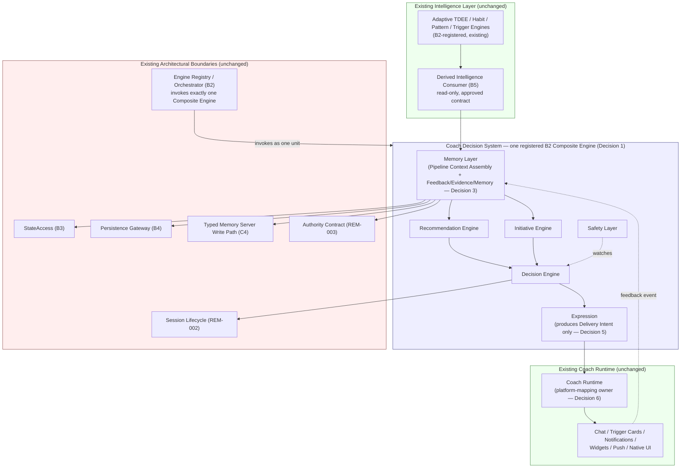
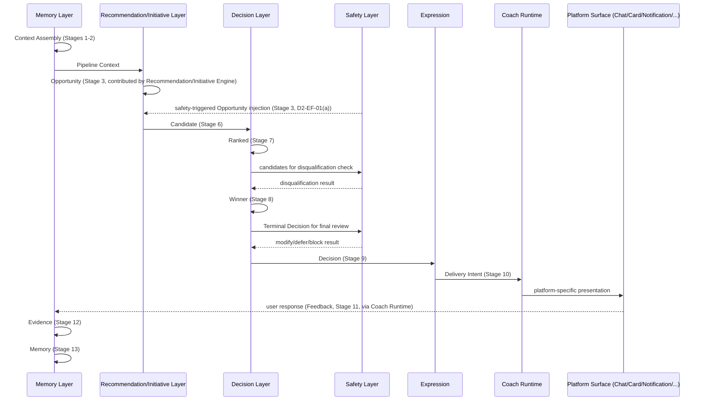

# D3 — Coach Decision System Architecture

**Document:** `docs/specs/D3_SPEC.md`
**Version:** 1.2
**Status:** Canonical
**Document Type:** Canonical Architecture Specification
**Owner:** Head of Product + AI Architect
**Applies Canonical Decisions:** Decision 1 through Decision 6 (this document, §17), issued by the
Head of Product and AI Architect, Canonical Review for D3.
**Prepared by:** Lead Engineer (canonical revision — implements Decisions 1–6 exactly as issued;
introduces no product or coaching-logic policy of its own, and no architecture decision beyond
what composing D1's decision policy and D2's orchestration pipeline with FITME's approved
architecture requires — see §17)

------------------------------------------------------------------------

# 1. Purpose

## 1.1 Objective

D3 defines the system architecture through which D1's decision policy and D2's orchestration
pipeline are realized inside FITME's existing runtime — the concrete component boundaries,
ownership, and integration points that let a Recommendation Engine, an Initiative Engine, a
Decision Engine, a Safety Layer, and a Memory Layer (D2 Unit 07) be built as part of this system
rather than as an abstract pipeline with no place to live. D2 itself states that its Engine
Responsibilities fix "logical orchestration responsibilities only... not implementation ownership,
module boundaries, or deployment structure" (D2 Unit 07) and reserves that question for a later
document. D3 is that document, at the architecture level only — it does not perform the
implementation D2 deferred; it defines the architectural boundaries within which that
implementation must occur. Where composing D1 and D2 with the existing architecture requires an
architectural decision — for example, how the Coach Decision System registers with the existing
Engine Registry — that decision is made explicitly in this document (Decisions 1–6, §17) rather
than left open; D3 introduces no new product or coaching-logic policy of its own.

## 1.2 Architectural Mission

D3's mission is translation, not invention: take the logical components D1 and D2 already define
and fix where each one sits relative to the architecture already approved and, in large part,
already built — the Engine Registry (B2), State Ownership and Access Boundaries (B3), the
Persistence Gateway (B4), the Derived Intelligence Consumption path (B5), the layered module
structure (C1), the canonical behavioral-event model (C3), and the Typed Memory Server Write Path
(C4) — together with the cross-cutting REM-002 Session Lifecycle Manager and REM-003 Generative
vs. Authoritative Boundary. Where an architectural question could not be answered by composing these
already-approved decisions, D3 did not answer it by invention; it named the gap for the Head of
Product and AI Architect, who resolved each one during Canonical Review as Decisions 1–6 (§17),
now applied throughout this document.

## 1.3 Success Criteria

D3 succeeds if, and only if:

- Every architectural statement it makes is traceable to D1, D2, an approved B/C-series
  specification, or the current Architecture document, and introduces no coaching, recommendation,
  evidence, memory, priority, personalization, or safety policy of its own (that remains D1's and
  D2's exclusive territory).
- No component D3 describes duplicates, redesigns, or bypasses an existing architectural boundary
  — most critically, B2's binding constraint that FITME "SHALL have exactly one logical Engine
  Registry" and that "no second competing engine registry or orchestration authority SHALL be
  introduced" (B2 §2), which this document satisfies by registering the Coach Decision System as a
  single Composite Engine (Decision 1).
- Every gap between what D1/D2 require and what the existing architecture already provides is
  named explicitly, not silently resolved.
- A future Recommendation Engine, Initiative Engine, Decision Engine, Safety Layer, and Memory
  Layer implementation can be scoped and reviewed against this document without first having to
  reverse-engineer how D2's Pipeline is supposed to fit inside B2's Registry, B3's state boundaries,
  and B4's Persistence Gateway.

------------------------------------------------------------------------

# 2. Scope

## 2.1 Included

- The architectural responsibilities, ownership, and runtime role of each component D2 Unit 07
  names (Recommendation Engine, Initiative Engine, Decision Engine, Safety Layer, Memory Layer).
- The architectural position of the Pipeline Context, the Terminal Decision, and the Decision
  Lifecycle (D2 Units 02, 04, 06) within the existing system — as architectural objects with an
  owner and a boundary, not as data structures or storage schemas.
- The relationship between the Coach Decision System and every existing architectural boundary it
  must compose with: the Engine Registry (B2), StateAccess (B3), the Persistence Gateway (B4), the
  Derived Intelligence Consumer (B5), the module layering and native-portability boundary (C1), the
  canonical event model (C3), and the Typed Memory Server Write Path (C4).
- Failure handling, extensibility, and native-compatibility posture, at the architectural level.

## 2.2 Out of Scope

- Decision policy — what the coach decides and why (D1's exclusive territory; not restated here).
- Orchestration logic — stage ordering, stage contracts, and exceptional flows (D2's exclusive
  territory; not restated here).
- Implementation: source code, module file layout, function signatures, APIs, algorithms,
  pseudocode, database schema, Firestore field names, prompt engineering, or UI/UX design. Where
  this document names an existing module (e.g. `js/engineRegistry.js`) it does so only to fix an
  architectural boundary already established by an approved SPEC — never to specify new code.
- Enabling TASK-004 (Recommendation Engine), TASK-005 (Initiative Engine), or TASK-006 (Decision
  Engine). Per the Roadmap, these remain paused/pending; D3 defines the architecture they would be
  built against, and does not itself unblock or schedule their implementation.

## 2.3 Authority Boundaries

D3 is authored under the Engineering Workflow's role definitions (§2, §5): architecture and product
decisions belong to the Head of Product and AI Architect; the Lead Engineer authors specifications
against decisions already approved. Every architectural decision in this document is either (a)
directly derivable by composing D1, D2, and an approved B/C-series decision, or (b) a canonical
decision issued by the Head of Product and AI Architect during Canonical Review (Decisions 1–6,
applied throughout this document and recorded in §17). No canonical terminology is redefined, no
existing architecture is replaced, and no scope is expanded beyond the skeleton already approved
for this document. D3 introduces no product or coaching-logic policy at any point; Decisions 1–6
are exclusively architectural — they fix composition, ownership, and delivery boundaries, never
what the coach decides.

------------------------------------------------------------------------

# 3. Canonical Dependencies

## 3.1 Governing Documents

- AI Constitution
- Product Bible
- Coach Bible
- Coach Knowledge Base
- Current Architecture (`docs/architecture/FITME_ARCHITECTURE_v1.md`)
- Engineering Workflow
- Roadmap
- Changelog

D3 relies on these only through the derivations D1 and D2 have already made from them (Governing
Principle, D2). It does not independently re-derive coaching or product policy from them.

## 3.2 Required Previous Work Items

- B1 — Canonical Memory Decision
- B2 — Engine Contract and Registry
- B3 — State Ownership and Access Boundaries
- B4 — Persistence Contract (Persistence Gateway)
- B5 — Habit and Pattern Consumption Path (Derived Intelligence Consumer)
- C1 — Modularization and Native-Portability Boundary
- C2 — Rejection and Suppression Feedback
- C3 — Event Model Decision
- C4 — Typed Memory Server Write Path
- REM-002 — Session Lifecycle Manager
- REM-003 — Generative vs. Authoritative Boundary
- D1 — Coach Intelligence Translation Model
- D2 — Coach Decision Pipeline Specification

## 3.3 Dependency Summary

| Work Item | What D3 Depends On It For |
|---|---|
| D1 | The decision-policy content every architectural component ultimately applies (never restated here) |
| D2 | The Pipeline, Stage Contracts, Engine Responsibilities, and Decision Lifecycle this document positions architecturally |
| B1 | The Canonical Memory Decision and the generative/authoritative distinction the Memory Layer must preserve |
| B2 | The single Engine Registry/Orchestrator constraint every architectural placement of D2's five components must respect |
| B3 | The state-ownership and access-boundary discipline the Coach Decision System's components must fit within |
| B4 | The closed Persistence Gateway operation catalog through which any durable write must occur |
| B5 | The approved, read-only Derived Intelligence consumption contract that already supplies Habit/Pattern signals |
| C1 | The layered module structure (Pure Domain / Application Services / UI / Engines-State-Persistence) and native-portability boundary |
| C2 | The existing recommendation-feedback family and suppression mechanism the Feedback/Evidence stages must reuse |
| C3 | The canonical behavioral-event vocabulary Decision Inputs and Feedback Processing must conform to |
| C4 | The trusted server-side write capability the Memory Layer's candidate-status discipline must reuse, not duplicate |
| REM-002 | The session-generation guard every user-scoped architectural component must integrate with |
| REM-003 | The Authoritative Write Contract and Authority Matrix every component touching persistence must satisfy |

### Architectural Decisions

D3 introduces no new dependency of its own; the table above is a closure over dependencies D1, D2,
and the B/C-series already established.

### Dependencies

As listed above; §4–§14 apply them individually.

### Open Engineering Considerations

None at this level — per-component gaps are raised in the sections where they arise and
consolidated in §17.

------------------------------------------------------------------------

# 4. Architectural Position

## 4.1 Position Within FITME

The Coach Decision System is a new architectural layer sitting between two things that already
exist and are not redesigned by this document: the **intelligence-producing layer** (Adaptive TDEE,
Habit, Pattern, and Trigger Engines, and their approved consumption path through B5's Derived
Intelligence Consumer) beneath it, and the **Coach Runtime** (§10.4) — the canonical platform
runtime responsible for rendering a Delivery Intent on the active client platform, currently
implemented for Web by the existing coach-message and trigger/notification components under
`js/coach/*`/`js/trigger/*`, C1 §20.7 — above it. It consumes Decision Inputs (D1 Unit 03) that
are already produced by the existing system, and it produces a Terminal Decision (D2 Unit 03) that
must ultimately reach the user through the Coach Runtime the existing architecture already owns.
D3 does not introduce a new delivery surface: Expression (D2 Stage 10) produces a platform-neutral
Delivery Intent, and the existing Coach Runtime is the sole owner that maps it to a platform-specific
presentation (Decision 5, Decision 6) — see §8.6 and §10.4.

## 4.2 Relationship to D1

D1 fixes what the coach decides and never how that decision is computed or where. D3 does not
restate any D1 rule; it fixes which architectural component is responsible for applying each D1
Unit, so that the policy D1 defines has exactly one architectural home per Unit rather than being
free-floating logic any component could reimplement. Where §8 assigns a D1 Unit to a component,
that assignment carries no license to alter the Unit's content.

## 4.3 Relationship to D2

D2 fixes the Pipeline's stage order and the logical orchestration authority for each stage (D2 Unit
07). D3 takes each of D2's five logical roles — Recommendation Engine, Initiative Engine, Decision
Engine, Safety Layer, Memory Layer — as given and fixes their architectural realization: ownership,
runtime position, and integration boundary. D3 does not renumber, reorder, or reinterpret D2's
Stages; §6–§9 describe how the existing architecture's components would host that fixed sequence,
not a competing one.

## 4.4 Relationship to B-Series

The B-series (B1–B5) is the architectural foundation the Coach Decision System is built on top of,
not beside. B2 already establishes the single Engine Registry/Orchestrator constraint (§2); B3
already establishes state-ownership boundaries; B4 already establishes the sole durable-write
boundary (the Persistence Gateway's closed operation catalog); B5 already establishes the sole
approved read path for Habit/Pattern-derived intelligence. Every architectural placement in §6–§11
is constrained to compose with these boundaries rather than create parallel ones. Where composing
them cleanly required a decision the B-series does not itself make — for example, whether D2's five
logical roles register as one or several B2 engines — the Head of Product and AI Architect resolved
it during Canonical Review as Decision 1 (§17): the Coach Decision System registers as a single B2
Composite Engine.

### Architectural Decisions

The Coach Decision System is positioned as a consumer of the existing intelligence layer and a
producer feeding the existing delivery layer; it introduces no new intelligence producer and no new
delivery surface.

### Dependencies

D1 (policy content), D2 (orchestration content), B2–B5 (architectural boundaries it must compose
with).

### Open Engineering Considerations

None; registry composition (Decision 1) and Expression's delivery boundary (Decisions 5–6) are
resolved — see §10.4 and §17.

------------------------------------------------------------------------

# 5. Core Principles

## 5.1 Responsibility Separation

Each architectural component owns exactly one D2 orchestration-authority role (D2 Unit 07) and no
component absorbs another's. This mirrors B2 Core Principle 5 ("no cross-engine ownership
assumption") and D2-INV-03 (Stage isolation): a Recommendation Engine component that also performed
Prioritization, or a Memory Layer component that also decided which Candidate wins, would violate
both. Responsibility separation is enforced architecturally by giving each role its own component
boundary with an explicit, narrow interface to its neighbors (§11.2), not by convention alone. The
Memory Layer's ownership of both Pipeline Context Assembly and the Post-Decision Continuation
(Decision 3) is a single, coherent memory-domain responsibility, not two — it does not cross into
Decision, Recommendation, Initiative, or Safety territory at either end of a Decision Pass.

## 5.2 Deterministic Architecture

D1's and D2's determinism guarantees (D1 Unit 01, D2 Unit 00/D2-INV-01) are guarantees about
decision content and stage sequencing; they hold only if the architecture that hosts them does not
introduce nondeterminism of its own — for example, two components racing to assemble Pipeline
Context from different snapshots of state, or a component reading Habit/Pattern intelligence
through a path other than B5's approved, already-deterministic consumption contract. The
architecture SHALL therefore route every Decision Input through exactly one owning component per
input category (§8.1), never through multiple independently-polling paths.

## 5.3 Explainability

D2 Unit 09 (Pipeline Traceability) requires every Terminal Decision to be logically attributable to
the Stage outputs that produced it. Architecturally, this requires that no component discard the
information a downstream component would need to reconstruct that attribution — the architecture's
job is to make traceability possible to implement, not to implement it. This is a structural
requirement on component boundaries (each component's output must retain enough of its own
reasoning to be attributed), not a mandate for a specific logging or audit mechanism (D2-TR-04).

## 5.4 Extensibility

The architecture SHALL allow a future decision type, context type, or internal collaborator (§13) to
be added by extending an existing component's declared inputs/outputs or by adding a new internal
collaborator within the Coach Decision System's single registered Composite Engine (Decision 1) —
never by reopening an already-fixed component's internal responsibility, and never by registering a
second, competing engine for Coach Decision System functionality. This mirrors the same discipline
B2 already applies to intelligence engines generally (new engines register; they do not patch
existing ones), applied one level down, inside the Composite Engine's own boundary.

## 5.5 Native Compatibility

Per C1 §20.5–§20.8, FITME already separates Pure Domain modules (no DOM/window/Firebase reference,
Node-loadable) from Platform Adapters (the six modules that do reference real platform APIs) and
from UI Presenters/Controllers. The Coach Decision System's components — Recommendation Engine,
Initiative Engine, Decision Engine, Safety Layer, and the Memory Layer's Pipeline Context Assembly
and Terminal Decision inputs — are, by the nature of D1/D2's own policy (pure decision logic over
already-assembled inputs, D1 Units 03–04), naturally Pure-Domain-shaped: none of D1's or D2's rules
require a DOM, browser, or Firebase reference to evaluate. Expression itself remains platform-neutral
(Decision 5); the existing Coach Runtime (Decision 6), which maps Delivery Intent into
platform-specific presentation, is the boundary where a platform-specific rendering/delivery adapter
differs between web and a future native client, consistent with C1's existing pattern (§20.5).

## 5.6 Architecture Invariants

The following invariants, together with Decisions 1–6 recorded throughout this document, are the
architectural decisions required to compose D1's decision policy and D2's orchestration pipeline
with FITME's approved architecture. D3 introduces no new product or coaching-logic policy; it
introduces exactly the architectural decisions that composition requires, no more.

- **AI-01 (Single Registry).** No architectural placement of a Coach Decision System component may
  introduce a second engine registry or orchestration authority (B2 §2).
- **AI-02 (Single Persistence Boundary).** No Coach Decision System component may write durable
  state other than through the Persistence Gateway's closed operation catalog (B4) or, for
  AI/inference-authored typed memory, the C4 trusted server-side write capability.
- **AI-03 (Single Memory Authority).** No Coach Decision System component may create a parallel
  memory authority alongside B1's Canonical Memory Decision or C4's write path (B2 §18).
- **AI-04 (State Ownership Preserved).** No Coach Decision System component may read or mutate state
  outside the access boundaries B3 establishes.
- **AI-05 (Session Safety).** Every user-scoped Coach Decision System component SHALL integrate with
  the existing REM-002 Session Lifecycle Manager; no parallel session-generation mechanism SHALL be
  introduced (B2 §19).
- **AI-06 (Authority Safety).** No Coach Decision System component's output becomes authoritative
  merely by having executed successfully (B2 §20); authority is granted only through REM-003's
  Authoritative Write Contract and B1's confirmation discipline.
- **AI-07 (Policy Non-Duplication).** No Coach Decision System component may encode a decision,
  priority, evidence, or safety rule not already fixed by D1 or D2.

### Architectural Decisions

§5.6's seven invariants are binding on every component described in §6–§11.

### Dependencies

B1, B2, B3, B4, C4, REM-002, REM-003, D1, D2.

### Open Engineering Considerations

None; §5 consolidates constraints already fixed elsewhere. Component-specific application is
addressed in §8 and §11.

------------------------------------------------------------------------

# 6. Architecture Overview

## 6.1 High-Level View

The handoffs shown between Memory Layer, Recommendation Engine, Initiative Engine, Decision Engine,
Safety Layer, and Expression above are coordinated by an **Internal Pipeline Orchestrator**: an
internal execution mechanism of the Composite Engine that sequences the already-defined D2 Stages
across these six collaborators. It is not a seventh collaborator with decision content authority, not
a new B2 Engine, not independently registered, and not a second orchestration authority — it exists
solely inside the single Composite Engine boundary the Engine Registry already invokes as one unit
(Decision 1; §11.1).

## 6.2 Architectural Layers

The Coach Decision System extends, rather than adds a parallel stack to, C1's existing four-tier
layering (C1 §20.2, §20.6):

| C1 Tier | Coach Decision System Placement |
|---|---|
| Pure Domain (no platform reference) | Recommendation Engine, Initiative Engine, Decision Engine, Safety Layer decision logic, and the Memory Layer's Pipeline Context Assembly/Terminal Decision-input logic (Decision 3) — all operate on already-assembled inputs and produce structured decisions, per D1 Unit 03's input discipline |
| Application Services | Memory Layer's orchestration of reads/writes through StateAccess and the Persistence Gateway; Expression's composition of a Terminal Decision into a platform-neutral Delivery Intent (Decision 5) |
| UI Presenters / Controllers | Unchanged — the Coach Runtime (Decision 6) that Expression hands Delivery Intent to (§10.4); on Web, currently realized by the existing `js/coach/coachPresenter.js` and `js/trigger/triggerController.js` |
| Engine Registry, Engines, State/Persistence | The Coach Decision System's single registered B2 Composite Engine (Decision 1); Memory Layer, Recommendation Engine, Initiative Engine, Decision Engine, Safety Layer, and Expression are internal collaborators, not independently registered |

## 6.3 Canonical Components

The following are the architectural components this document positions, each corresponding to one
D2 Unit 07 role or one D2 orchestration object. All six are internal architectural collaborators
within exactly one registered B2 Composite Engine — the Coach Decision System (Decision 1) — and
none is independently registered with the Engine Registry:

- **Memory Layer** — architectural realization of D2 Unit 07's Memory Layer role. In addition to its
  Stage 11–13 responsibilities (Feedback Processing, Evidence Update, Memory Update), the Memory
  Layer owns Pipeline Context Assembly (D2 Stages 1–2) as an internal responsibility (Decision 3):
  reading state, reading memory, reading derived intelligence, and assembling and producing the
  immutable Pipeline Context. There is no shared or independent ownership of Pipeline Context
  Assembly outside the Memory Layer. The Memory Layer is also the sole architectural bridge between
  the Coach Decision System and durable persistence (StateAccess, the Persistence Gateway, and the
  C4 write path), and the sole owner of Coaching History (§10.1, §10.3, Decision 4).
- **Recommendation Engine** — architectural realization of D2 Unit 07's Recommendation Engine role.
- **Initiative Engine** — architectural realization of D2 Unit 07's Initiative Engine role.
- **Decision Engine** — architectural realization of D2 Unit 07's Decision Engine role (Eligibility
  Evaluation, Prioritization, Winner Selection, Decision Formation orchestration authority).
- **Safety Layer** — architectural realization of D2 Unit 07's cross-cutting Safety Layer role,
  exercised at three checkpoints (D2 Unit 07, D2-EF-01).
- **Expression** — the architectural handoff point where a formed Terminal Decision is translated
  into a platform-neutral Delivery Intent (Decision 5); explicitly not one of D2 Unit 07's five
  engines (D1 Unit 15), and explicitly unaware of chat, trigger cards, notifications, widgets,
  push, UI, or platform. Once produced, a Delivery Intent is immutable (§8.6).

The existing **Coach Runtime** (§10.4, Decision 6), which maps Expression's Delivery Intent into
platform-specific presentation, is external to this Composite Engine and is not modified by this
document.

The **Internal Pipeline Orchestrator** (§6.1) coordinates D2 Stage execution across the six
components above; it is an internal execution mechanism of the single Composite Engine, not a
seventh component, not independently registered, and not a second orchestration authority (Decision
1).

## 6.4 Responsibility Matrix

| Component | Owns (D2 Stages) | Does Not Own |
|---|---|---|
| Memory Layer | Stages 1–2 (Pipeline Context Assembly, Decision 3), Stages 11–13 | Any Stage 3–9 decision content |
| Recommendation Engine | Stage 6 (Recommendation-kind), contributes to Stage 3 | Prioritization, Winner Selection, Decision Formation |
| Initiative Engine | Stage 6 (Initiative-kind), contributes to Stage 3 | Prioritization, Winner Selection, Decision Formation |
| Decision Engine | Stages 5, 7, 8, 9 | Candidate content generation |
| Safety Layer | Cross-cutting checks at Stages 3, 8, 9 | Ordinary (non-safety) Recommendation/Initiative content |
| Expression | Stage 10 (Delivery Intent production only) | Origination of decision content; platform/delivery-surface selection (owned by Coach Runtime, Decision 6) |

### Architectural Decisions

The six components above are the fixed architectural vocabulary for the remainder of this document,
realized as internal collaborators within exactly one registered B2 Composite Engine (Decision 1);
no additional top-level component, and no independent B2 registration, is introduced.

### Dependencies

D2 Unit 07 (role definitions), B3 (StateAccess), B5 (Derived Intelligence Consumer), C1 (layering).

### Open Engineering Considerations

None; registry composition, Pipeline Context ownership, and delivery-surface mapping are resolved
by Decisions 1, 3, 5, and 6.

------------------------------------------------------------------------

# 7. Runtime Flow

## 7.1 Entry Point

Architecturally, a Decision Pass (D2 Unit 03) begins from an existing B2 lifecycle trigger (B2 §5,
§10 — Trigger Catalog): `APP_READY`, `AUTH_SESSION_READY`, or the ad hoc `SOURCE_DATA_CHANGED`/
`WORKOUT_COMPLETED` path noted in B2 §19. The Coach Decision System reuses this existing Trigger
Catalog unchanged and introduces no new trigger type (Decision 2); a future trigger addition, if
ever required, is a future revision of B2 and this document, not a decision this document makes.

## 7.2 Context Assembly

The Memory Layer's Pipeline Context Assembly responsibility (§6.3, §8.1, Decision 3) reads Decision
Input categories (D1 Unit 03) exclusively through already-approved read paths: Profile and Runtime
State and Memory through StateAccess (B3); Derived Intelligence (Habit/Pattern signals) exclusively
through the B5 Derived Intelligence Consumer's approved contract, never through raw
`coachMemory.habits`/`patterns` storage (D1-MU-07, B5 §3.1); Behavioral Events through the canonical
event model (C3). This is the architectural enforcement point for D1-DI-01 (every input traceable to
an approved category) and D2-PP-02 (Context assembled once, immutable for the Decision Pass).

## 7.3 Decision Flow

At the architecture level, the Decision Flow is the sequence of component handoffs that host D2
Stages 3–9: the Memory Layer hands Pipeline Context to the Recommendation Engine and Initiative
Engine (Opportunity Detection contribution, Candidate Generation), and to the Decision Engine
(Eligibility Evaluation, Prioritization, Winner Selection, Decision Formation), with the Safety Layer
attached at its three fixed checkpoints (D2 Unit 07). D3 fixes only that these are distinct
components with a narrow handoff between them (§11.2); the sequencing logic itself remains exactly
as D2 Unit 03 and Unit 04 define it.

## 7.4 Delivery Flow

The Decision Engine's output (a Terminal Decision, D2 Stage 9) is handed to Expression (§6.3), which
is architecturally distinct from the five D2 Unit 07 engines (D1 Unit 15, D1-CDO-03). Expression
renders it into a platform-neutral Delivery Intent (Decision 5) containing everything required to
deliver the decision, without choosing or knowing any platform-specific presentation. The existing
Coach Runtime (Decision 6) is the sole architectural owner responsible for mapping Delivery Intent
into platform-specific presentation (chat, trigger card, notification, native UI, and future
surfaces), without altering any of the decision's content.

## 7.5 Feedback Flow

Following delivery, the existing canonical event model (C3) and the existing Feedback Type
vocabulary (C2 §6) are the architectural channel through which the Memory Layer's Feedback
Processing responsibility (D2 Stage 11, Decision 3) observes the user's response, as routed back
from the Coach Runtime (§10.4). This is not a new event channel — it is the same `kind:'feedback'`
family C2 introduced and C3 canonicalized, extended in scope (not in shape) to cover Terminal
Decisions produced by the Coach Decision System.

### Architectural Decisions

Runtime Flow reuses the existing B2 Trigger Catalog unchanged (Decision 2), assigns Pipeline Context
Assembly and Feedback/Evidence/Memory processing entirely to the Memory Layer (Decision 3), and
routes delivery through Expression's Delivery Intent and the existing Coach Runtime (Decisions 5–6);
no new I/O channel, trigger type, or delivery surface is introduced.

### Dependencies

B2 (triggers), B3 (state read), B5 (derived intelligence read), C2/C3 (feedback/event model).

### Open Engineering Considerations

None; entry point (Decision 2), context-assembly ownership (Decision 3), and delivery routing
(Decisions 5–6) are fully resolved.

------------------------------------------------------------------------

# 8. Component Responsibilities

## 8.1 Input Layer

**Responsibility:** host Pipeline Context Assembly (D2 Stages 1–2), performed by the Memory Layer.
**Why it exists:** D1 Unit 03 and D2 Unit 02 require every Decision Pass to begin from one
immutable, fully-categorized context; without an owning component, this discipline would have to be
reimplemented ad hoc by each consumer. **Ownership:** the Memory Layer exclusively (Decision 3) —
Pipeline Context Assembly is an internal Memory Layer responsibility, not an independently- or
shared-owned function. The Memory Layer delegates its underlying reads to StateAccess (B3) and the
Derived Intelligence Consumer (B5), but retains sole architectural ownership of assembling and
producing the immutable Pipeline Context. **Runtime role:** the Memory Layer's first responsibility
in a Decision Pass; produces the Pipeline Context consumed by every later component. **Dependencies:**
B3, B5, C3. **Interaction:** read-only; it never itself decides, ranks, or generates content — that
is the Decision, Recommendation, and Initiative layers' role.

## 8.2 Intelligence Layer

**Responsibility:** none — the existing Adaptive TDEE, Habit, Pattern, and Trigger Engines already
occupy this layer, and this document introduces no change to them. **Why noted here:** the Coach
Decision System's Input Layer consumes their output exclusively through the approved B5 path; this
is the seam, not a component this document owns. **Ownership:** unchanged — these remain B2-
registered engines under their existing contracts. **Runtime role:** unchanged. **Dependencies:**
none new. **Interaction:** one-directional, read-only, through B5.

## 8.3 Decision Layer

**Responsibility:** host the Decision Engine (D2 Stages 5, 7, 8, 9). **Why it exists:** D1 Unit 07's
Canonical Decision Hierarchy and D2's requirement that exactly one Terminal Decision be produced per
Decision Pass require a single component with the authority to evaluate eligibility, rank, select a
winner, and form the decision — mirroring, at the Coach Decision System's own internal scope, the
same "exactly one orchestration authority" principle B2 already established for engine
orchestration generally (B2 §2), and consistent with the Coach Decision System's own registration as
a single Composite Engine (Decision 1). **Ownership:** the Decision Engine component, an internal
collaborator of that Composite Engine, subject to the
Safety Layer's disqualification and final-review authority (D2 Unit 07). **Runtime role:** central
arbiter of the Decision Pass; the only component permitted to produce a Terminal Decision.
**Dependencies:** Recommendation Engine, Initiative Engine (Candidate input), Safety Layer.
**Interaction:** receives Candidates, never generates them (D2 Unit 07, Forbidden Responsibilities).

## 8.4 Recommendation Layer

**Responsibility:** host the Recommendation Engine (D2 Stage 6, Recommendation-kind; contributes to
Stage 3). **Why it exists:** D1 Unit 08's Recommendation Policy requires a component that applies it
in full, separated from the component that ranks or selects among its output (D2-INV-03). **Owner-
ship:** the Recommendation Engine component. **Runtime role:** Candidate producer only. **Depend-
encies:** Pipeline Context (Memory Layer); Decision Engine (downstream); Safety Layer (disqualification
does not bypass it, D2 Unit 07). **Interaction:** one-directional handoff of Candidates to
Prioritization; never receives ranking feedback that would let it re-generate.

## 8.5 Initiative Layer

**Responsibility:** host the Initiative Engine (D2 Stage 6, Initiative-kind; contributes to Stage
3). **Why it exists:** D1 Unit 09's Initiative Policy — including Relationship-Maturity gating
(D1-IP-02) — requires its own component boundary distinct from the Recommendation Engine, since the
two kinds of Candidate are governed by different D1 Units and must not be conflated (D2 Unit 07's
per-engine Forbidden Responsibilities). **Ownership:** the Initiative Engine component. **Runtime
role:** Candidate producer only, for Initiative-kind Candidates. **Dependencies:** same as §8.4.
**Interaction:** identical shape to the Recommendation Layer's, kept as a structurally separate
component so that Initiative-specific rules (D1-IP-04, D1-IP-08) cannot leak into Recommendation
Candidate generation or vice versa.

## 8.6 Delivery Layer

**Responsibility:** host Expression (D2 Stage 10), which translates a formed Terminal Decision into
a platform-neutral Delivery Intent (Decision 5) — never a platform-specific message, card, or
notification. **Why it exists:** D1 Unit 15 (D1-CDO-03) requires that decision and delivery remain
architecturally separate acts; Decisions 5–6 sharpen this further by requiring that platform
selection itself remain outside Expression, so that every Coach Decision System component (Decision
Engine and Expression alike) stays completely platform-agnostic, and platform-specific mapping is
owned by exactly one place. **Ownership:** Expression owns Delivery Intent production only; the
existing Coach Runtime (unchanged, external to the Composite Engine) owns platform mapping — chat,
trigger card, notification, native UI, and future surfaces such as voice, watch, or widget (Decision
6). **Runtime role:** last internal collaborator of the Decision Pass; hands Delivery Intent to the
Coach Runtime. **Dependencies:** Decision Engine (input); Coach Runtime (hand-off target).
**Interaction:** one-directional; produces no feedback into the Decision Layer; SHALL NOT reference
chat, trigger cards, notifications, widgets, push, UI, or platform in any form. A Delivery Intent
SHALL remain immutable once produced by Expression, mirroring the same immutability philosophy D2
already applies to Pipeline Context (D2-PP-02, §7.2).

### Architectural Decisions

Six layers (Input [Memory Layer-owned, Decision 3], Intelligence [unchanged], Decision,
Recommendation, Initiative, Delivery [Expression + Coach Runtime, Decisions 5–6]) host the Coach
Decision System's components with no cross-layer responsibility absorption.

### Dependencies

D1 Units 03/07/08/09/15; D2 Unit 07; B2 (existing engines), B3, B5, C1.

### Open Engineering Considerations

None; see §17 for genuine implementation-level items only.

------------------------------------------------------------------------

# 9. Decision Lifecycle

D2 Unit 06 fixes the Decision Lifecycle's nine states (Opportunity → Candidate → Ranked → Winner →
Decision → Delivered → Feedback → Evidence → Memory). D3 does not redefine this lifecycle; it fixes
which architectural component produces each state, so that the lifecycle is not merely a logical
sequence but a traceable path across components. Consistent with Decision 3, the Memory Layer
performs both ends of a Decision Pass — Context Assembly upstream and the Post-Decision Continuation
downstream — but, matching D2 Unit 07 exactly, Opportunity Detection itself (Stage 3) is contributed
by the Recommendation Engine, the Initiative Engine, and the Safety Layer, never by the Memory
Layer. The handoffs below are sequenced by the Internal Pipeline Orchestrator (§6.1, §6.3), the
Composite Engine's internal execution mechanism — not an additional component with decision
authority:

This diagram fixes only which component performs which D2 Stage; it does not add, remove, or
reorder any state D2 Unit 06 already defines, and a Silence or safety-superseded Terminal Decision
still follows D2-DL-02/D2-DL-04's rules for which states it skips. Opportunity Detection is never a
Memory Layer output — the Memory Layer supplies the Pipeline Context Opportunity Detection consumes,
exactly as D2 Unit 03/Unit 07 assign it.

### Architectural Decisions

Each of the nine Decision Lifecycle states maps to exactly one architectural component's output, as
shown above.

### Dependencies

D2 Unit 06 (lifecycle definition), §6–§8 (component definitions).

### Open Engineering Considerations

None; this section is a direct architectural projection of D2 Unit 06 and introduces no new rule.

------------------------------------------------------------------------

# 10. Integration with Existing Systems

## 10.1 Memory

Typed Memory and Coaching History are two distinct architectural domains, and D3 does not conflate
them (Decision 4). Typed Memory answers "what has the coach learned?"; Coaching History answers
"what decisions has the coach made?" They remain completely separate, with separate owners and
separate persistence paths.

**Typed Memory.** The Memory Layer (§6.3, §8) is the sole architectural bridge between the Coach
Decision System and FITME's Typed Memory architecture. It does not introduce a third memory
representation alongside the legacy `coachMemory` blob and the typed `users/{uid}/memories`
collection (Architecture §13); it integrates with the typed collection only, consistent with B1's
Canonical Memory Decision, and SHALL continue using the existing C4 write path only — no new or
parallel Typed Memory write path is introduced. Per D1-MU-01 and C4's status discipline (C4 §9,
§13.4), any memory the Memory Layer writes as a result of a coaching decision is AI/inference-authored
and therefore SHALL be written as a non-authoritative `candidate`-status record, through the same
compliance mechanism C4 already established — not a new one. Per §11.1's Ownership Rules, the Memory
Layer is the sole component authorized to initiate a durable write on the Coach Decision System's
behalf; it is therefore the architectural producer responsible for invoking the C4 write path
whenever a coaching decision warrants a candidate-status Typed Memory write. The concrete invocation
mechanism is implementation-level engineering, deferred to Engineering Readiness Review (§17).

**Coaching History.** Coaching History (D1-MU-03's recommendation/decision history) belongs to the
Memory Layer and persists through the Persistence Gateway (§10.3), independently of Typed Memory's
C4 write path. It SHALL NOT reuse the existing `RECOMMENDATION_FEEDBACK_RECORD` operation as its
architectural home — that operation remains C2's, scoped to recommendation-feedback suppression, not
to the Coach Decision System's own Coaching History. A dedicated Persistence Gateway operation for
Coaching History is anticipated at implementation time (§10.3, §17).

## 10.2 State Ownership

Per B3, every Coach Decision System component that reads or writes application state SHALL do so
through StateAccess's existing ownership and permission-matrix discipline, exactly as the existing
engines already do (C2's `recommendationFeedbackHistory`/`recordRecommendationFeedback` StateAccess
extension, scoped narrowly to the two consumers that needed it, is the precedent for how a new
capability gets a scoped permission entry rather than broadened access). The Coach Decision System
introduces no new runtime state category outside what D1 Unit 04's User State Model and D2 Unit 02's
Pipeline Context already name. Per Decision 3, the Memory Layer is the exclusive owner of Pipeline
Context Assembly; the concrete StateAccess read-surface wiring it uses to do so is implementation-
level engineering, deferred to Engineering Readiness Review (§17), not an open ownership question.

## 10.3 Persistence

Per B4, every durable write the Coach Decision System performs SHALL occur through the Persistence
Gateway's closed operation catalog (or, for candidate-status Typed Memory specifically, through the
C4 write path per §10.1) — never through a new direct-Firestore write path and never by extending
`saveProfile()`/`saveTodayData()`. Coaching History (recommendation/decision history, D1-MU-03) is
persisted through the Persistence Gateway as a Memory Layer responsibility, kept independent of
Typed Memory's C4 write path, and SHALL NOT reuse the existing `RECOMMENDATION_FEEDBACK_RECORD`
operation as its architectural home (Decision 4). Future implementation may introduce a dedicated
Persistence Gateway operation for Coaching History; its exact shape is Engineering Readiness
Review's task (§17), in the same manner C4 itself left its own invocation mechanism to Engineering
Readiness Review rather than fixing it canonically.

## 10.4 Coach Runtime

Expression (§8.6) does not introduce a new user-facing delivery mechanism, and does not itself choose
one (Decision 5). It produces exactly one platform-neutral artifact — a Delivery Intent — containing
everything required to deliver the decision, with no reference to chat, trigger cards, notifications,
widgets, push, UI, or platform.

The **Coach Runtime** is the canonical platform runtime responsible for rendering a Delivery Intent on
the active client platform (Decision 6): the single architectural owner responsible for mapping a
Delivery Intent into platform-specific presentation — chat, notification, card, native UI, and future
surfaces such as voice, watch, or widget — without altering any of the decision's content. The current
Web implementation of the Coach Runtime is provided by the existing coach-message composition/delivery
components under `js/coach/*` and the trigger-card/notification components under `js/trigger/*` (C1
§20.7); a future Native implementation would provide different runtime adapters. Every implementation
preserves the same Delivery Intent contract, so Expression and the Decision Engine need not change
across platforms. The Coach Runtime is not part of the Coach Decision System's registered Composite
Engine (Decision 1); it is the existing, unchanged delivery boundary the Composite Engine hands off
to. No new delivery surface is created by this document, and Expression SHALL NOT be extended with
platform-selection logic of any kind. The Decision Engine and Expression remain completely
platform-agnostic throughout.

### Architectural Decisions

The Coach Decision System integrates with exactly the existing memory, state, persistence, and
delivery boundaries named above; it creates none of its own.

### Dependencies

B1, B3, B4, B5, C1, C2, C4.

### Open Engineering Considerations

None at the Product/Architecture level; Typed Memory vs. Coaching History separation (Decision 4)
and Expression/Coach Runtime delivery routing (Decisions 5–6) are resolved. Only genuine
implementation-level items remain, consolidated in §17.

------------------------------------------------------------------------

# 11. Architectural Boundaries

## 11.1 Ownership Rules

- Only the Decision Engine may produce a Terminal Decision (§8.3; D2 Unit 07).
- Only the Recommendation Engine and Initiative Engine may generate Candidate content (§8.4, §8.5).
- Only the Safety Layer may disqualify a Candidate or modify/defer/block a Terminal Decision (§6.3;
  D1-AB-05).
- Only the Memory Layer may initiate a durable write on the Coach Decision System's behalf, and only
  through the Persistence Gateway or the C4 write path, including Coaching History and, where
  applicable, candidate-status Typed Memory writes (§10.1, §10.3; AI-02; Decision 4).
- Only Expression may translate a Terminal Decision into a Delivery Intent, and only after it is
  fully formed (§8.6; D1-CDO-03); only the existing Coach Runtime may map a Delivery Intent into
  platform-specific presentation (§10.4; Decision 5, Decision 6).
- No component other than the Memory Layer may originate a Decision Input read or assemble Pipeline
  Context (§8.1; D2-PP-03; Decision 3).
- Exactly one Coach Decision System engine is registered with the B2 Engine Registry; no internal
  collaborator (Memory Layer, Recommendation Engine, Initiative Engine, Decision Engine, Safety
  Layer, Expression) is independently registered (Decision 1).
- The Internal Pipeline Orchestrator (§6.1, §6.3) may only sequence D2 Stage execution across the
  six internal collaborators; it SHALL NOT itself generate Candidate content, rank, select a
  winner, form a Terminal Decision, or produce a Delivery Intent — each remains the exclusive
  responsibility of the component §11.1 already assigns it to (Decision 1).

## 11.2 Component Contracts

At the architecture level (not the Stage-Contract level D2 Unit 04 already fixes), each component's
boundary is:

| Component | Consumes From | Produces For | Forbidden To Touch |
|---|---|---|---|
| Memory Layer (Context Assembly + Feedback/Evidence/Memory, Decision 3) | StateAccess, B5 Consumer, C3 event model (Context Assembly); Coach Runtime's feedback signal, Decision Layer's Terminal Decision (Feedback/Evidence/Memory) | Recommendation/Initiative/Decision Layers (Pipeline Context); StateAccess, Persistence Gateway, C4 write path (durable writes) | Prioritization, Winner Selection, Decision Formation, Candidate generation |
| Recommendation Engine | Memory Layer (Pipeline Context) | Decision Layer | Prioritization, Winner Selection, durable state |
| Initiative Engine | Memory Layer (Pipeline Context) | Decision Layer | Prioritization, Winner Selection, durable state |
| Decision Engine | Recommendation/Initiative Layers, Safety Layer | Expression | Candidate generation, durable state |
| Safety Layer | Health/Safety Profile, Life Event Context (Memory Layer's Pipeline Context); Candidates and Terminal Decisions (Decision Layer) | Decision Layer (disqualification/modify/defer/block results) | Ordinary Recommendation/Initiative content generation |
| Expression | Decision Layer | Coach Runtime (Delivery Intent only) | Origination of decision content; platform/UI selection (Decision 5, Decision 6) |

## 11.3 Forbidden Responsibilities

Consolidating D2 Unit 07's per-engine Forbidden Responsibilities at the architecture level: no
component may perform Prioritization or Winner Selection except the Decision Engine; no component
may bypass the Safety Layer at any of its three checkpoints (AI-06 does not permit an exception); no
component may treat AI/inference-authored memory as authoritative without the confirmation
discipline B1 and C4 already fix; no component may select or reference a delivery platform except
the existing Coach Runtime (Decision 5, Decision 6); and no Coach Decision System component may
register independently with the Engine Registry apart from the single Composite Engine (Decision 1,
AI-01).

### Architectural Decisions

§11.1–§11.3 are the binding ownership and contract rules for every component named in §6–§9.

### Dependencies

D1 Units 08/09/12/14/15; D2 Unit 07; B2–B4; C3; C4.

### Open Engineering Considerations

None; all composition-level questions previously raised are resolved by Decisions 1–6 — see §17 for
genuine implementation-level items only.

------------------------------------------------------------------------

# 12. Failure Handling

## 12.1 Detection

The existing architecture already establishes the principle that an intelligence component's
failure must never block application startup or the UI (Architecture §15, Constraint 1 — Habit and
Pattern Engines' internal try/catch discipline; Architecture §19.6 — Persistence Gateway's honest
failure reporting). The Coach Decision System's components inherit this same principle: a failure
inside the Recommendation Engine, Initiative Engine, or Safety Layer's Candidate-level processing
SHALL be detectable and containable to the Opportunity it was processing (D2-EF-06, Pipeline Abort),
consistent with D2's own statement that "no Terminal Decision SHALL be fabricated in [a Stage
failure's] place" — but D2 explicitly leaves how such a failure is detected, retried, or logged as
engineering implementation outside its Scope, and D3 does not resolve that either.

## 12.2 Recovery

Per D2-EF-09 (Recovery Rules), the Pipeline resumes ordinary Stage sequencing on its next cycle
without special re-initialization, and no Pipeline Context from an aborted cycle is carried forward.
Architecturally, this means no component may cache or retain a partial Pipeline Context across
cycles as an optimization — each cycle's Memory Layer Context Assembly output is authoritative only
for that cycle (§8.1, Decision 3), matching the same "recompute from source" discipline the Habit and
Pattern Engines already apply (Architecture §15, Constraint 2).

## 12.3 Graceful Degradation

Where a Decision Input category is absent (D1-DI-04, D2-EF-08), the architecture SHALL proceed using
the categories available rather than treating absence as a Pipeline Abort. Where the Safety Layer or
Decision Engine cannot be reached at all, the architecture SHALL NOT substitute a default Terminal
Decision; D1-DI-02's prohibition on fabricating data extends, architecturally, to prohibiting a
fabricated decision.

### Architectural Decisions

Failure handling inherits the existing system's fail-open-for-availability,
never-fabricate-for-content posture; no new failure-handling policy is introduced.

### Dependencies

D1-DI-02/04; D2-EF-06/08/09; Architecture §15.

### Open Engineering Considerations

The concrete detection/retry/logging mechanism is engineering implementation, explicitly out of
D2's and D3's scope (D2-EF-06).

------------------------------------------------------------------------

# 13. Extensibility

## 13.1 Future Decision Types

D1 Unit 15 fixes exactly four decision kinds (Recommendation, Initiative, Silence, refusal/
escalation). A future decision kind would require a new D1 Unit before any architectural component
could host it — D3 does not pre-provision for one, but notes that the component boundaries in §8
(a distinct Candidate-producing layer per D1 Unit, arbitrated by a single Decision Layer) would
extend to a fifth kind by adding a new Candidate-producing component, not by modifying the Decision
Engine's arbitration role.

## 13.2 Future Context Types

D1 Unit 03 fixes eight Decision Input categories. A new category would require a Task SPEC extension
(D1-DI-01) before the Memory Layer's Pipeline Context Assembly responsibility (§8.1, Decision 3)
could admit it; architecturally, its per-category read-path discipline (§7.2) is already shaped to
add a category as one more owned read path, without altering how existing categories are read.

## 13.3 Future Engines

Two distinct extension directions exist. A future internal collaborator extending the Coach Decision
System's own decision-making (for example, a new candidate-producing role alongside the
Recommendation and Initiative Engines) would be added as a new internal collaborator within the
single registered Composite Engine (Decision 1) — never as a second, independently registered
engine. A future external consumer of the Coach Decision System's output (for example, a future
analytics or coaching-quality review capability) would, per B2 §3 (Core Principle 10, "incremental
adoption") and the existing precedent of B5 adding a new consumption capability without altering the
Habit/Pattern Engines' contracts, integrate through the same Memory Layer / StateAccess read
boundary B5 already established for Habit/Pattern data — not through direct access to Coach Decision
System internals.

### Architectural Decisions

Extensibility is achieved by adding components at existing seams (§8, §11.2), never by reopening an
existing component's fixed responsibility.

### Dependencies

D1 Units 03/15; B2 §3; B5.

### Open Engineering Considerations

None; this section describes extension mechanism, not a specific planned extension.

------------------------------------------------------------------------

# 14. Native Compatibility

Per C1 §20.8's Native Migration Contract, every module classified as Pure Domain or as part of the
Engine Registry/State/Persistence tier already satisfies Node-loadability with no DOM, `window`,
Firebase, or service-worker dependency, and is expected to be reusable, unchanged, in a future native
shell. As established in §5.5, the Coach Decision System's decision-logic components — Recommendation
Engine, Initiative Engine, Decision Engine, Safety Layer's evaluation logic, and the Memory Layer's
Pipeline Context Assembly and Terminal Decision-input logic — operate purely on already-assembled
inputs and structured outputs, with no inherent dependency on a browser or Firebase reference; they
are architecturally shaped to belong to C1's Pure Domain / Engine tier. Expression itself remains
platform-neutral (Decision 5); the existing Coach Runtime (§10.4, Decision 6), which maps Delivery
Intent into platform-specific presentation, is, like the six existing Platform Adapters (C1 §20.5),
the expected boundary where a platform-specific rendering/delivery adapter differs between web and a
future native client.

### Architectural Decisions

The Coach Decision System's decision-logic components, including Expression itself, are positioned
within C1's already-portable tier; only the existing Coach Runtime's platform-mapping role is
expected to require a platform-specific adapter.

### Dependencies

C1 §20.5, §20.6, §20.8.

### Open Engineering Considerations

None; this section restates an existing, already-approved architectural boundary as it applies to
the Coach Decision System's components.

------------------------------------------------------------------------

# 15. Architecture Invariants

The following consolidates every invariant this document establishes (§5.6, restated here as the
authoritative list per the approved skeleton). These invariants, together with Decisions 1–6 applied
throughout this document, are the architectural decisions required to compose D1's decision policy
and D2's orchestration pipeline with FITME's approved architecture — D3 introduces no new product or
coaching-logic policy of its own:

1. **AI-01 (Single Registry)** — no second engine registry or orchestration authority (B2 §2).
2. **AI-02 (Single Persistence Boundary)** — all durable writes through the Persistence Gateway or
   the C4 write path (B4, C4).
3. **AI-03 (Single Memory Authority)** — no parallel memory authority (B1, B2 §18, C4).
4. **AI-04 (State Ownership Preserved)** — all state access through StateAccess (B3).
5. **AI-05 (Session Safety)** — integration with the existing Session Lifecycle Manager, no parallel
   mechanism (REM-002, B2 §19).
6. **AI-06 (Authority Safety)** — no output becomes authoritative merely by executing successfully
   (REM-003, B2 §20).
7. **AI-07 (Policy Non-Duplication)** — no component encodes decision, priority, evidence, or safety
   policy not already fixed by D1 or D2.

------------------------------------------------------------------------

# 16. Required Diagrams

- **System Context Diagram** — §6.1.
- **Layer Diagram** — §6.2 (table; the existing C1 §20.2 Mermaid layer diagram is the canonical
  layer diagram and is not duplicated here — see Architecture §20.2).
- **Component Diagram** — §6.1 (the same diagram serves both system-context and component purposes;
  a second, redundant component diagram is not created per this document's instruction to avoid
  decorative duplication).
- **Runtime Sequence Diagram** — §9.
- **Decision Lifecycle Diagram** — §9 (the same sequence diagram maps each Decision Lifecycle state
  to its producing component; a separate lifecycle-only diagram would duplicate it).
- **Integration Diagram** — §6.1 (the "Existing Architectural Boundaries" subgraph already shows
  every integration point named in §10; a separate integration diagram would duplicate it).

------------------------------------------------------------------------

# 17. Canonical Architecture Decisions

## Decisions Applied (Decision 1–6)

The following canonical decisions were issued by the Head of Product and AI Architect during
Canonical Review and are applied throughout this document. They are recorded here for traceability;
none is left open elsewhere in this document.

1. **Decision 1 — Coach Decision System Composition.** The Coach Decision System is registered in
   the existing B2 Engine Registry as exactly one Composite Engine. The Memory Layer, Recommendation
   Engine, Initiative Engine, Decision Engine, Safety Layer, and Expression are internal
   architectural collaborators, not independently registered engines. An Internal Pipeline
   Orchestrator sequences D2 Stage execution across these six collaborators as an internal execution
   mechanism of the Composite Engine only — it is not a new B2 Engine, not independently registered,
   and not a second orchestration authority (§6.1, §6.3, §6.4, §9, §11.1).
2. **Decision 2 — Trigger Model.** The Coach Decision System reuses the existing B2 Trigger Catalog
   unchanged; no new trigger type is introduced (§7.1).
3. **Decision 3 — Pipeline Context Ownership.** Pipeline Context Assembly is an internal
   responsibility of the Memory Layer, not an independent or shared architectural owner (§6.3, §7.2,
   §8.1, §9, §10.2, §11.1, §11.2).
4. **Decision 4 — Coaching History.** Coaching History and Typed Memory are separate architectural
   domains. Coaching History belongs to the Memory Layer and persists through the Persistence
   Gateway, independently of Typed Memory's C4 write path; it does not reuse the
   `RECOMMENDATION_FEEDBACK_RECORD` operation as its architectural home (§10.1, §10.3).
5. **Decision 5 — Delivery Architecture.** Expression produces exactly one platform-neutral
   artifact, a Delivery Intent, and has no knowledge of chat, trigger cards, notifications, widgets,
   push, UI, or platform (§6.3, §8.6, §10.4, §11).
6. **Decision 6 — Coach Runtime.** The existing Coach Runtime is the single architectural owner
   responsible for mapping a Delivery Intent into platform-specific presentation; the Decision
   Engine and Expression remain completely platform-agnostic; no new delivery surface is created
   (§8.6, §10.4).

## Implementation-Level Items Deferred to Engineering Readiness Review

These are genuine implementation-level items, not Product or Architecture decisions, and do not
require further Product/AI Architect resolution before implementation begins:

- The concrete Persistence Gateway operation used for Coaching History (Decision 4 anticipates a
  dedicated operation; its exact shape is Engineering Readiness Review's task, in the same manner C4
  left its own invocation mechanism to Engineering Readiness Review rather than fixing it
  canonically — §10.3).
- The concrete mechanism by which the Memory Layer invokes the existing C4 write path when a
  coaching decision warrants a candidate-status Typed Memory write (§10.1; the Memory Layer's
  exclusive write-initiation ownership is already fixed by §11.1).
- The concrete StateAccess read-surface wiring the Memory Layer uses to assemble Pipeline Context
  (§10.2; the ownership question itself is resolved by Decision 3).

## Inherited, Unresolved CDRs from D1 and D2

D3 inherits, and does not attempt to resolve, D1's and D2's own open Canonical Decision
Requirements. Nothing in this document's architectural placements depends on their resolution:

- **D1 CDR-1** — formal rank of the Intelligence & Relationship Philosophy document.
- **D1 CDR-2** — scope of the Coach Bible's self-declared supremacy.
- **D1 CDR-3** — representation of the canonical decision (partially addressed at the architecture
  level by this document's component boundaries, §6–§9; the technical representation itself remains
  implementation, still open).
- **D1 CDR-4** — numeric thresholds.
- **D1 CDR-5** — enablement of the future engines (TASK-004/005/006 remain paused/pending per the
  Roadmap; this document does not unblock them).
- **D2 CDR-1** — resolved (multi-option Terminal Decision representation, Canonical Decision 7); no
  action required.
