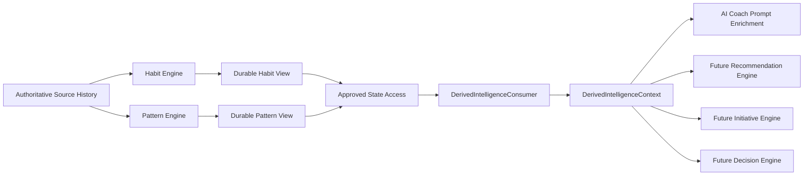
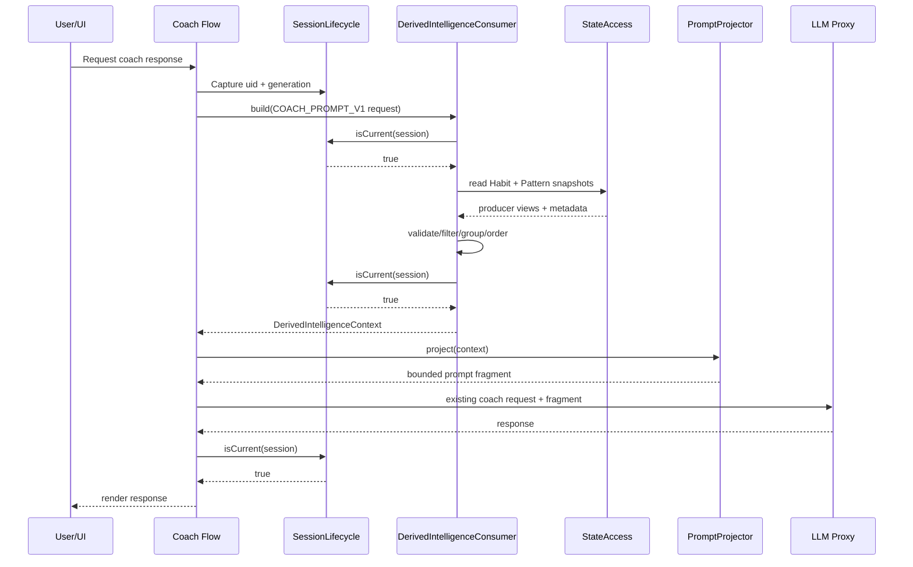
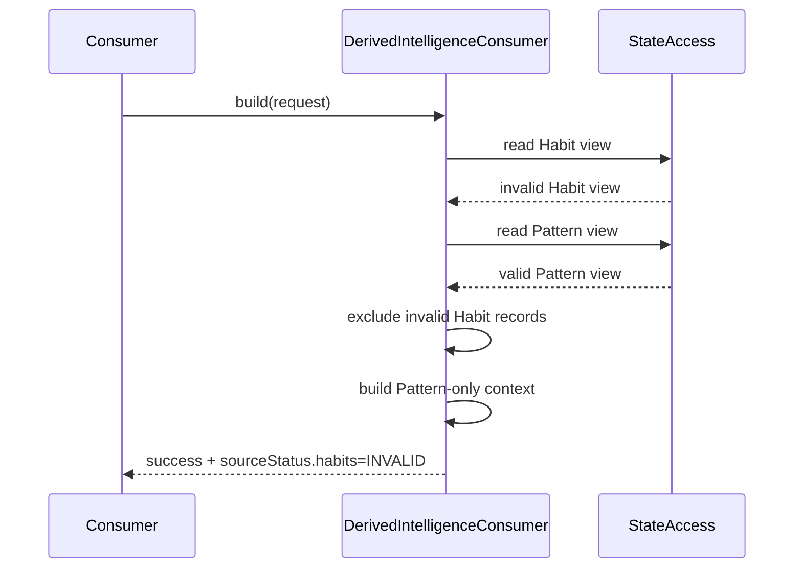
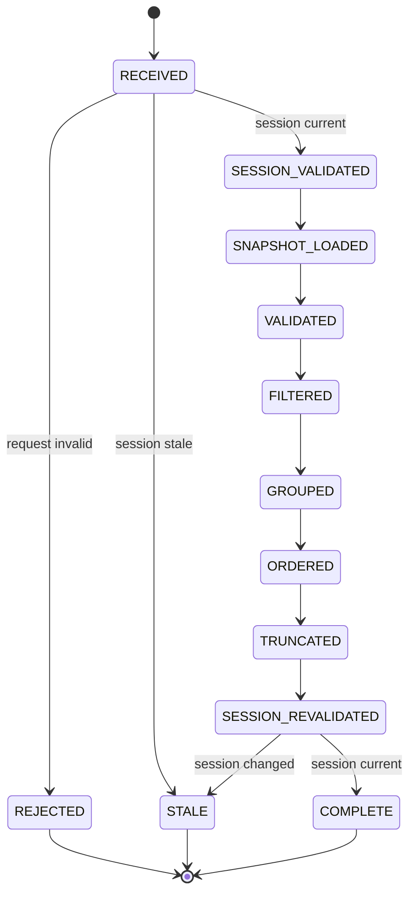

# B5 — Habit and Pattern Consumption Path

**Document:** `docs/tasks/B5/B5_SPEC.md`  
**Version:** 1.2  
**Status:** CLOSED  
**Implementation:** COMPLETED  
**Engineering Readiness Review:** READY  
**Implementation Review:** APPROVED  
**Implementation Version:** `2.24.0`  
**Closure Date:** 2026-07-19  
**Automated Tests (final):** `262 passed / 0 failed`  
**Phase:** Architecture Remediation Program — Phase B  
**Finding:** F9 — CLOSED  
**Owner:** FITME AI Architecture  
**Depends On:**  
- B1 — Canonical Memory Decision (CLOSED)  
- B2 — Engine Contract and Registry (CLOSED)  
- B3 — State Ownership and Access Boundaries (CLOSED)  
- B4 — Persistence Contract (CLOSED)  
- REM-002 — Session Lifecycle Manager (CLOSED)  
- REM-003 — Authority Contract (CLOSED)  

**Blocks:**  
- Recommendation Engine specification and implementation (now unblocked, subject to its own separate specification and approval)  
- Initiative Engine consumption of derived intelligence (remains disabled pending separate approval)  
- Decision Engine consumption of derived intelligence (remains disabled pending separate approval)  
- Any coach behavior that claims to use Habit or Pattern outputs (now unblocked — AI Coach integrated under `COACH_PROMPT_V1`)  

---

## Revision Authority — v1.2

B5 v1.2 is the canonical replacement for B5 v1.1 and B5 v1.0.

This correction preserves every approved v1.1 decision and resolves the sole blocker reported by the External Engineering Readiness Review: production exposure of the test-only `TEST_FULL_DIAGNOSTIC_V1` policy.

B5 v1.2 locks the following exposure boundary:

- The pure core module may implement the complete closed policy catalog for deterministic Node-based tests.
- The production browser integration SHALL expose only a production-safe adapter.
- The production-safe adapter SHALL reject `TEST_HARNESS` and `TEST_FULL_DIAGNOSTIC_V1` before invoking the core module.
- The test-only entry point SHALL be available to the Node test runner through a module export and SHALL NOT be attached to `window` or any production browser global.
- No production UI path may invoke or surface expanded diagnostic output.

All v1.1 decisions remain binding, including durable-aligned source snapshot semantics, consumer-to-policy authorization, request-purpose and sequence-context inputs, freshness fallbacks, hard-staleness behavior, duplicate source-ID handling, requested-limit clamping, normalized build outcomes, stale-session semantics and prompt projection limits.

No product behavior, producer algorithm, persistence operation, Firestore schema, Firestore Rules, Cloud Function or Recommendation Engine behavior is added by this correction.

---

## 1. Objective

Define one explicit, bounded and testable path through which FITME may consume Habit Engine and Pattern Engine outputs.

B5 SHALL establish:

- Which Habit and Pattern records are eligible for consumption.
- Which records are excluded.
- How records are filtered for lifecycle state, confidence, freshness, evidence and request relevance.
- How overlapping Habit and Pattern signals are deduplicated without changing producer-owned data.
- How contradictions are surfaced without inventing a false resolution.
- How a stable, read-only Derived Intelligence Context is assembled.
- Which consumers may use that context and for what purpose.
- How current AI Coach prompt enrichment may consume the context without becoming a decision engine.
- How the future Recommendation Engine may consume the same contract without direct access to producer storage.
- How stale sessions, missing data, corrupt records and partial producer failure are handled.
- How consumption remains deterministic, explainable, privacy-conscious and compatible with future native clients.

B5 SHALL close Finding F9 by converting Habit and Pattern outputs from passively stored derived views into safely consumable intelligence under one canonical contract.

---

## 2. Problem Statement

The Habit Engine and Pattern Engine already produce durable Derived Intelligence Views.

Their outputs are intentionally observational:

- A Habit describes repeated user behavior.
- A Pattern describes a recurring statistical relationship or sequence.
- Neither engine owns recommendations.
- Neither engine owns coaching decisions.
- Neither output is canonical memory merely because it is persisted.

Without B5, downstream code has no approved answer to the following questions:

1. May a consumer read `coachMemory.habits[]` or `coachMemory.patterns[]` directly?
2. Which lifecycle states are safe to use?
3. What confidence threshold is required?
4. How old may a signal be?
5. Does a Pattern override a Habit when both describe the same behavior?
6. What happens when they conflict?
7. How is a request-specific subset selected?
8. May the AI Coach state an observed signal as a fact?
9. May an LLM infer recommendations directly from all stored signals?
10. May a consumer persist, mutate or promote a signal while reading it?
11. How does a future Recommendation Engine consume these outputs without coupling itself to current storage?
12. How are invalid or legacy records handled?
13. How is session isolation preserved across asynchronous reads?
14. How can an engineer test exactly why a signal was included or excluded?

If these questions remain undefined, future consumers are likely to introduce:

- Direct storage coupling.
- Inconsistent thresholds.
- Duplicate or contradictory coaching.
- Over-personalization from weak evidence.
- Hidden promotion of derived data into memory or authority.
- LLM prompt pollution.
- Stale-account leakage after session change.
- Architecture drift across web and native clients.

B5 SHALL remove this ambiguity.

---

## 3. Scope

B5 covers consumption of the existing Habit and Pattern Derived Intelligence Views.

### 3.1 Included

- Read access to the current durable Habit view.
- Read access to the current durable Pattern view.
- Structural validation of records before consumption.
- Eligibility filtering.
- Lifecycle-state filtering.
- Confidence and evidence thresholds.
- Freshness and source-version checks.
- Request-domain and topic relevance filtering.
- Deterministic ordering.
- Overlap grouping.
- Contradiction annotation.
- Read-only context construction.
- Bounded prompt-safe summaries.
- Diagnostics and exclusion reasons.
- Consumption by the current AI Coach.
- A stable contract for future Recommendation, Initiative and Decision consumers.
- Graceful degradation when one or both views are unavailable.
- Session-generation validation before and after asynchronous boundaries.

### 3.2 Existing Producers in Scope

- Habit Engine.
- Pattern Engine.

B5 SHALL consume their approved output shapes as persisted under B4.

B5 SHALL NOT change their detection algorithms.

### 3.3 Initial Consumers in Scope

- AI Coach prompt enrichment.
- Future Recommendation Engine contract preparation.

The future Recommendation Engine itself remains out of scope.

---

## 4. Out of Scope

B5 SHALL NOT:

- Implement a Recommendation Engine.
- Decide what meal, workout or action to recommend.
- Implement Initiative Engine behavior.
- Implement Decision Engine behavior.
- Redesign Habit detection.
- Redesign Pattern detection.
- Recalculate Habit or Pattern confidence.
- Add LLM-based scoring of signals.
- Add a new memory system.
- Promote a Habit or Pattern into canonical memory.
- Change the B1 memory decision.
- Change B2 Engine Contract or Registry behavior.
- Change B3 ownership boundaries.
- Change B4 persistence operations.
- Add direct Firestore reads to AI consumers.
- Create a generic all-purpose AI Context Builder for every application domain.
- Define final recommendation ranking.
- Define user-facing recommendation explanations.
- Define suppression or rejection learning; that remains tracked under C2.
- Resolve the broader event-model decision; that remains tracked under C3.
- Implement server-side typed-memory writes; that remains tracked under C4.
- Change Firestore schema or Security Rules unless Engineering Readiness Review proves a strictly necessary compatibility change.
- Add UI for listing, editing or confirming Habits and Patterns.
- Create medical, clinical or safety conclusions from observed behavior.

---

## 5. Canonical Terminology

### 5.1 Derived Intelligence View

A producer-owned, recomputable projection generated from authoritative source history.

Habit and Pattern records are Derived Intelligence Views.

They are not source history and are not canonical memory.

### 5.2 Producer

The engine that computes and owns the durable view.

- Habit Engine owns the Habit view.
- Pattern Engine owns the Pattern view.

### 5.3 Consumer

A component that requests a filtered, read-only representation of derived intelligence.

### 5.4 Consumption Adapter

The B5 component that reads producer-owned views through approved state access, validates and filters them, and returns a stable Derived Intelligence Context.

Canonical name:

`DerivedIntelligenceConsumer`

### 5.5 Derived Intelligence Context

A request-scoped, immutable output containing only eligible Habit and Pattern signals plus diagnostics.

Canonical name:

`DerivedIntelligenceContext`

### 5.6 Signal

A normalized read-only representation of one eligible Habit or Pattern record.

### 5.7 Eligibility

Whether a stored record is allowed to enter a consumer context.

Eligibility is not the same as recommendation suitability.

### 5.8 Relevance

Whether an eligible signal relates to the current consumption request.

### 5.9 Overlap

Two or more signals that describe substantially the same observed behavior.

### 5.10 Contradiction

Two eligible signals that cannot both describe the same scope and time condition without qualification.

### 5.11 Consumer Policy

A closed, named set of rules governing which signals a specific consumer may receive.

---

## 6. Architectural Position



B5 sits after producer persistence and before consumer behavior.

It is a read boundary.

It SHALL NOT become:

- A producer.
- A persistence authority.
- A recommendation engine.
- A memory authority.
- A general application-state store.

---

## 7. Core Architectural Decision

FITME SHALL have exactly one logical consumption adapter for Habit and Pattern intelligence.

The adapter SHALL be named `DerivedIntelligenceConsumer` at the contract level.

All participating consumers SHALL request Habit and Pattern intelligence through this adapter.

After a consumer is migrated under B5, it SHALL NOT:

- Read `coachMemory.habits` directly.
- Read `coachMemory.patterns` directly.
- Read `habitsMeta` or `patternsMeta` directly.
- Apply private confidence thresholds.
- Apply private lifecycle-state rules.
- Construct private prompt fragments from raw producer records.
- Mutate producer-owned records.
- Persist consumption results back into producer views.

The adapter SHALL:

- Read through B3-approved access boundaries.
- Validate the current session.
- Normalize producer records into one stable signal contract.
- Apply a named Consumer Policy.
- Filter ineligible records.
- Filter irrelevant records.
- preserve provenance.
- Detect overlaps and contradictions.
- Produce deterministic output.
- Return diagnostics without unnecessary personal data.

---

## 8. Architectural Invariants

The following invariants are mandatory.

1. Habit and Pattern outputs remain Derived Intelligence Views.
2. Consumption does not promote derived intelligence into canonical memory.
3. Consumption does not mutate authoritative source history.
4. Consumption does not mutate producer-owned views.
5. Consumer registration or access grants no persistence authority.
6. A consumer SHALL NOT infer producer success from the presence of an in-memory object alone.
7. Only durably committed producer views are eligible for normal consumption.
8. A stale session SHALL NOT receive a context built for an earlier session generation.
9. The same stored views, request and policy SHALL produce the same context.
10. Signal inclusion and exclusion SHALL be explainable through deterministic reason codes.
11. A weak signal SHALL NOT be presented to the LLM as a confirmed user fact.
12. Contradictory signals SHALL NOT be silently collapsed into one asserted truth.
13. Absence of signals SHALL be a valid result.
14. Failure of Habit or Pattern retrieval SHALL degrade gracefully unless the requesting consumer explicitly requires derived intelligence.
15. B5 SHALL not become a generic unrestricted state-access escape hatch.
16. B5 SHALL not call the LLM.
17. B5 SHALL not decide recommendations.
18. B5 SHALL not persist full request-scoped contexts.
19. B5 SHALL preserve B1–B4 boundaries.
20. Future native clients SHALL be able to consume an equivalent contract without relying on browser-only globals.

---

## 9. Ownership Model

| Concern | Owner |
|---|---|
| Authoritative meal/workout/weight history | Existing authoritative state owners |
| Habit detection | Habit Engine |
| Pattern detection | Pattern Engine |
| Habit view persistence | Habit Engine through B4 Persistence Gateway |
| Pattern view persistence | Pattern Engine through B4 Persistence Gateway |
| Habit/Pattern storage shape | Producer contracts |
| Consumption eligibility rules | B5 DerivedIntelligenceConsumer |
| Consumer-specific policy | B5 policy catalog |
| Recommendation ranking | Future Recommendation Engine |
| Coach wording | AI Coach / presentation layer |
| Canonical memory | B1 memory owner |
| Session generation | REM-002 Session Lifecycle |

The adapter owns neither producer state nor consumer business decisions.

---

## 10. Approved Read Path

The approved logical read path is:

```text
Consumer
  -> DerivedIntelligenceConsumer.build(request)
    -> Session validation
    -> B3-approved state access
    -> durable-view snapshot
    -> structural validation
    -> policy filtering
    -> relevance filtering
    -> overlap/contradiction analysis
    -> immutable DerivedIntelligenceContext
  -> Consumer business logic
```

### 10.1 Prohibited Read Paths

The following are prohibited after migration:

```text
AI Coach -> userProfile.coachMemory.habits
Recommendation Engine -> userProfile.coachMemory.patterns
Consumer -> Firestore users/{uid}
Consumer -> producer internal detector functions
Consumer -> Persistence Gateway read-through
```

B4 Persistence Gateway remains a write contract and SHALL NOT be repurposed as a read facade.

---

## 11. Component Contract

### 11.1 Logical Interface

```text
DerivedIntelligenceConsumer.build(request)
  -> Promise<DerivedIntelligenceBuildResult>

DerivedIntelligenceBuildResult:
  status: SUCCESS | PARTIAL | EMPTY | FAILED | STALE_SESSION | REJECTED
  context: DerivedIntelligenceContext | null
  error:
    code: FailureCode | null
    message: string | null
```

The public contract SHALL always return a Promise-compatible normalized result, even when all approved state access is currently in-memory. Pure internal evaluation functions MAY remain synchronous.

### 11.2 Required Behaviors

The component SHALL:

- Reject malformed requests.
- Reject unknown consumer policies.
- Return `STALE_SESSION` for stale session requests.
- Return `EMPTY` with a valid empty context when no eligible signals exist.
- Distinguish empty results from retrieval failure.
- Never throw raw storage or Firestore errors to the AI Coach.
- Return stable error codes.
- Freeze or clone output so consumers cannot mutate internal state.

### 11.3 Forbidden Behaviors

The component SHALL NOT:

- Trigger Habit or Pattern recomputation.
- Wait for APP_READY engine runs unless explicitly invoked by orchestration outside B5.
- Modify `lastRun` or source fingerprints.
- Write diagnostics into user profile state.
- Add arbitrary user-profile fields into context.
- Accept unrestricted callback functions from consumers.
- Accept arbitrary storage paths.
- Accept raw predicate code supplied by consumers.

---

## 12. Build Request Contract

```text
DerivedIntelligenceBuildRequest:
  requestId: string
  consumer: ConsumerId
  policyId: ConsumerPolicyId
  session:
    uid: string
    generation: number|string
  intent:
    domain: DomainId
    purpose: IMMEDIATE | REVIEW
    topics?: TopicId[]
    localDate?: YYYY-MM-DD
    localTimeSegment?: TimeSegment
    weekday?: Weekday
    contextEvents?: ContextEventId[]
  limits?:
    maxSignals?: integer
    maxHabits?: integer
    maxPatterns?: integer
  diagnostics?:
    includeExcluded?: boolean
```

### 12.1 Required Fields

- `requestId`
- `consumer`
- `policyId`
- `session.uid`
- `session.generation`
- `intent.domain`
- `intent.purpose`

### 12.2 Request ID

`requestId` exists for correlation and deterministic diagnostics.

It SHALL NOT affect eligibility, ranking or output content.

### 12.3 Consumer ID

Initial approved values:

- `AI_COACH_PROMPT`
- `RECOMMENDATION_ENGINE`
- `INITIATIVE_ENGINE`
- `DECISION_ENGINE`
- `TEST_HARNESS`

Only `AI_COACH_PROMPT` and `TEST_HARNESS` are enabled runtime consumers under B5. `RECOMMENDATION_ENGINE` is authorized only as a contract/test target until its separate specification is approved. `INITIATIVE_ENGINE` and `DECISION_ENGINE` remain disabled.

### 12.4 Domain ID

Initial closed values:

- `NUTRITION`
- `WORKOUT`
- `WEIGHT`
- `MEASUREMENT`
- `ENGAGEMENT`
- `GENERAL_COACHING`

Unknown domains SHALL fail validation.

### 12.5 Topic IDs

Topics are normalized semantic labels, not free-form prompt text.

Examples:

- `MEAL_TIMING`
- `PROTEIN_INTAKE`
- `FOOD_LOGGING`
- `WORKOUT_FREQUENCY`
- `WEIGH_IN_FREQUENCY`
- `WEEKDAY_BEHAVIOR`
- `SEQUENCE_BEHAVIOR`

The initial implementation MAY define only the topic IDs represented by current producer records.

### 12.6 Intent Purpose

`intent.purpose` is a closed value:

- `IMMEDIATE` — the consumer is enriching a current decision or current conversation turn. Temporal and sequence qualifiers must match the current request context.
- `REVIEW` — the consumer is requesting a bounded retrospective summary. Historical weekday or time-segment signals may remain relevant even when they do not match the current daypart, provided domain and topic match.

A consumer SHALL NOT infer `REVIEW` merely because a temporal qualifier does not match.

### 12.7 Context Event IDs

`contextEvents` is an optional, normalized closed list used only to evaluate sequence prerequisites. Initial values MAY include current producer-supported events such as `WORKOUT_COMPLETED`, `WEIGH_IN_RECORDED`, `MEASUREMENT_RECORDED` and `MEAL_LOGGED`.

Free-form event text is prohibited. Unknown event IDs SHALL fail request validation. Absence of a required event means the sequence signal is not immediately relevant.

### 12.8 Limits

Limits SHALL be bounded by policy maxima.

A consumer SHALL NOT increase its access by requesting a value above the policy maximum.

---

## 13. Approved Source Snapshot Contract

B5 SHALL not infer durable commitment from individual record fields. B3-approved read operations SHALL return one detached source-view envelope per producer:

```text
DerivedViewSnapshot:
  sourceType: HABIT | PATTERN
  records: object[]
  meta: object | null
  availability: AVAILABLE | EMPTY | UNAVAILABLE | INVALID
  durableAligned: boolean
  producerId: string | null
  producerVersion: string | null
  sourceFingerprint: string | null
```

Rules:

1. `AVAILABLE` means the view exists, is structurally readable and contains one or more records.
2. `EMPTY` means the source is valid and durably aligned but contains zero records.
3. `UNAVAILABLE` means the approved state-access operation could not supply the view.
4. `INVALID` means the envelope or required metadata is structurally invalid.
5. `durableAligned: true` means the snapshot reflects the last successfully committed B4-aligned state, including a rollback-restored prior snapshot after a failed producer write.
6. `durableAligned: false` makes all records in that snapshot ineligible for production policies.
7. The snapshot SHALL be detached from mutable producer state.
8. B5 SHALL not call Firestore to verify this envelope and SHALL not infer `EMPTY` from a missing object.

---

## 14. Output Contract

```text
DerivedIntelligenceContext:
  schemaVersion: string
  requestId: string
  consumer: ConsumerId
  policyId: ConsumerPolicyId
  session:
    uidHashOrOpaqueRef?: string
    generation: number|string
  builtAt: ISO-8601 timestamp
  sourceStatus:
    habits: AVAILABLE | EMPTY | UNAVAILABLE | INVALID
    patterns: AVAILABLE | EMPTY | UNAVAILABLE | INVALID
  signals: DerivedSignal[]
  groups: SignalGroup[]
  contradictions: SignalContradiction[]
  summary:
    includedCount: integer
    habitCount: integer
    patternCount: integer
    excludedCount: integer
    truncated: boolean
  diagnostics:
    warnings: DiagnosticCode[]
    exclusions?: SignalExclusion[]
```

### 14.1 Output Immutability

The returned context SHALL be deeply immutable or a deep clone detached from producer state.

A consumer mutation SHALL never change:

- `userProfile`
- `coachMemory`
- Habit records
- Pattern records
- metadata

### 14.2 Schema Version

Initial version:

`derived-intelligence-context/1.0`

Consumers SHALL validate the major version.

### 14.3 No Raw User Identifier in Diagnostics

The context MAY retain an opaque session reference for internal correlation.

It SHALL NOT include raw email, phone or unnecessary personal identifiers.

---

## 15. Normalized Signal Contract

```text
DerivedSignal:
  id: string
  sourceType: HABIT | PATTERN
  sourceId: string
  producerId: string
  producerVersion: string
  domain: DomainId
  topic: TopicId
  labelKey: string
  lifecycle: SignalLifecycle
  confidence: number
  evidence:
    count: integer
    opportunityCount?: integer
    strength?: number
  temporal:
    firstObservedAt?: ISO-8601 timestamp | YYYY-MM-DD
    lastObservedAt?: ISO-8601 timestamp | YYYY-MM-DD
    expectedIntervalDays?: number
    weekday?: Weekday
    timeSegment?: TimeSegment
    windowDays?: integer
  qualifiers: string[]
  provenance:
    sourceView: HABITS_VIEW | PATTERNS_VIEW
    sourceFingerprint?: string
    durableAligned: boolean
  consumption:
    relevanceScore: number
    freshnessScore: number
    inclusionReasons: InclusionReasonCode[]
```

### 15.1 Signal IDs

Normalized signal IDs SHALL be deterministic.

Recommended form:

```text
HABIT:<sourceId>
PATTERN:<sourceId>
```

The adapter SHALL NOT generate random IDs.

### 15.2 Label Key

`labelKey` is a stable semantic identifier.

It SHALL NOT be an LLM-generated sentence.

Presentation layers MAY map it to localized text.

### 15.3 Qualifiers

Qualifiers preserve conditions such as:

- `ON_FRIDAY`
- `AFTER_WORKOUT`
- `EVENING`
- `WHEN_LOGGING_IS_ACTIVE`

Qualifiers SHALL be normalized and sorted deterministically.

---

## 16. Signal Lifecycle Mapping

Producer lifecycle values SHALL be normalized into the following consumption lifecycle:

- `OBSERVED`
- `CANDIDATE`
- `CONFIRMED`
- `ACTIVE`
- `WEAKENING`
- `INACTIVE`
- `UNKNOWN`

### 16.1 Default Consumption Rules

| Lifecycle | Prompt Policy | Recommendation Policy |
|---|---:|---:|
| OBSERVED | Exclude | Exclude |
| CANDIDATE | Exclude | Exclude |
| CONFIRMED | Include with cautious wording | Eligible as supporting evidence only |
| ACTIVE | Include | Eligible |
| WEAKENING | Include only if policy allows and freshness passes | Supporting evidence only |
| INACTIVE | Exclude | Exclude |
| UNKNOWN | Exclude | Exclude |

### 16.2 No Lifecycle Promotion

B5 SHALL NOT promote `CONFIRMED` to `ACTIVE` or otherwise change producer lifecycle.

---

## 17. Structural Validation

Each producer record SHALL be validated before normalization.

### 17.1 Required Common Fields

At minimum:

- Stable source ID.
- Recognized producer type.
- Recognized lifecycle/status.
- Finite confidence value.
- Recognized domain/topic mapping or deterministic fallback exclusion.
- Evidence count where the producer contract requires one.
- Last-observed or producer-run metadata sufficient for freshness evaluation.

### 17.2 Invalid Numeric Values

The following are invalid:

- `NaN`
- `Infinity`
- `-Infinity`
- Non-numeric confidence
- Confidence below 0
- Confidence above 1
- Negative evidence counts
- Opportunity count below evidence count where the producer definition forbids it

Invalid records SHALL be excluded.

They SHALL NOT be coerced into safe-looking defaults.

### 17.3 Missing Optional Fields

A missing optional field SHALL not invalidate the record.

It MAY reduce freshness certainty or relevance.

### 17.4 Unknown Future Fields

Unknown fields SHALL be ignored.

The adapter SHALL use an allowlist when constructing normalized signals so producer-internal fields do not leak into consumers.

### 17.5 Legacy Records

Legacy records with no supported mapping SHALL be excluded with `UNSUPPORTED_LEGACY_SHAPE`.

B5 SHALL not silently rewrite legacy records.

### 17.6 Duplicate Source IDs

Duplicate handling is canonical:

- Byte-equivalent normalized records with the same `sourceType` and `sourceId` SHALL collapse to one record.
- Non-equivalent records with the same `sourceType` and `sourceId` SHALL all be excluded with `DUPLICATE_SOURCE_ID_CONFLICT`; the adapter SHALL not choose by array order.
- The conflict SHALL produce a diagnostic warning and SHALL not invalidate unrelated records.

---

## 18. Durable-Alignment Eligibility

Only producer views known to represent a successful durable commit are normally eligible.

### 18.1 Required Evidence

Eligibility SHOULD be established through existing producer metadata and B4-aligned state-access semantics.

Where the current view shape cannot explicitly prove durable completion, implementation SHALL use the strongest approved indicator available and document it in the Engineering Readiness Review.

### 18.2 Failed Current Run

If the current producer run computed a new in-memory view but persistence failed and B4 rollback restored the prior durable-aligned snapshot, the restored snapshot remains eligible.

The failed candidate SHALL not be consumed.

### 18.3 Pending Persistence

A view explicitly marked pending SHALL be excluded for normal consumers.

A test harness MAY inspect pending data only under a dedicated non-production policy.

---

## 19. Consumer Policy Catalog

Consumer behavior SHALL be controlled by a closed policy catalog.

Consumers SHALL not supply arbitrary thresholds.

### 19.1 Policy: `COACH_PROMPT_V1`

Purpose:

Provide a small set of high-confidence observations for personalization of the current AI Coach.

Rules:

- Allowed lifecycle: `ACTIVE`, `CONFIRMED`.
- `WEAKENING` excluded by default.
- Minimum confidence: 0.75.
- Minimum evidence count: 3 unless producer contract requires more.
- Maximum total signals: 8.
- Maximum habits: 4.
- Maximum patterns: 4.
- Contradictory groups excluded from factual prompt assertions.
- Overlapping signals compressed into one prompt item with provenance retained internally.
- No raw counts unless helpful and policy-approved.
- No low-confidence or speculative wording.
- Prompt summary must distinguish “usually” from “sometimes”.

### 19.2 Policy: `RECOMMENDATION_SUPPORT_V1`

Purpose:

Provide evidence signals to a future Recommendation Engine.

Rules:

- Allowed lifecycle: `ACTIVE`, `CONFIRMED`, selected `WEAKENING`.
- Minimum confidence: 0.65.
- Minimum evidence count: producer-specific.
- Maximum total signals: 20.
- Maximum habits: 10.
- Maximum patterns: 10.
- Contradictions retained as structured annotations.
- No recommendation is produced by this policy.
- `WEAKENING` signals must be marked supporting-only.

This policy is contract-ready but SHALL not be treated as Recommendation Engine implementation.

### 19.3 Policy: `INITIATIVE_SUPPORT_V1`

Reserved for future work.

Disabled under B5 unless separately approved.

### 19.4 Policy: `DECISION_SUPPORT_V1`

Reserved for future work.

Disabled under B5 unless separately approved.

### 19.5 Policy: `TEST_FULL_DIAGNOSTIC_V1`

Test-only.

May return exclusions and expanded diagnostics.

It SHALL be callable only through the test-only module export used by the Node test runner.

It SHALL NOT be attached to a production browser global, invoked by a production UI path or accepted by the production-safe browser adapter.

The policy processes only the supplied authenticated-user snapshot and SHALL NOT provide cross-user, privileged backend or hidden repository data.

---

## 20. Confidence Rules

### 20.1 Producer Confidence Is Preserved

B5 SHALL preserve the producer confidence value.

It SHALL NOT recompute or blend confidence.

### 20.2 Consumption Threshold

A policy threshold controls eligibility.

This is a read filter, not a change to the signal’s confidence.

### 20.3 Boundary Comparison

Threshold comparison SHALL be explicit and consistent.

Canonical rule:

```text
eligible when confidence >= policy.minimumConfidence
```

### 20.4 No Source-Type Bonus

Habit and Pattern records SHALL not receive arbitrary source bonuses.

A Pattern is not automatically stronger than a Habit.

A Habit is not automatically stronger than a Pattern.

They describe different classes of observation.

---

## 21. Evidence Rules

### 21.1 Evidence Count

Evidence count SHALL be finite, integral and non-negative.

### 21.2 Opportunity Count

Where available, opportunity count SHALL be retained.

A consumer may distinguish:

- 4 occurrences in 4 opportunities.
- 4 occurrences in 40 opportunities.

B5 SHALL not convert that distinction into a recommendation score.

### 21.3 Producer-Specific Minimums

The adapter MAY define mappings from signal type to minimum evidence only when required to preserve approved producer semantics.

It SHALL not second-guess the producer detector with a parallel statistical model.

### 21.4 Weak Evidence

Signals failing policy evidence requirements SHALL be excluded with `INSUFFICIENT_EVIDENCE`.

---

## 22. Freshness Model

Freshness SHALL be deterministic and based only on explicit timestamps, dates, run metadata and expected intervals.

### 22.1 Freshness Inputs

Possible inputs:

- `lastObservedAt`
- `expectedIntervalDays`
- producer window length
- `habitsMeta.lastRun`
- `patternsMeta.lastRun`
- signal lifecycle
- request local date

### 22.2 No Wall-Clock Ambiguity

The request SHALL provide or derive one canonical local date using the application’s established date handling.

The same request date SHALL be used for all signal freshness calculations.

### 22.3 Freshness Score

B5 MAY expose a normalized `freshnessScore` from 0 to 1.

The score SHALL be deterministic.

Canonical v1.1 model:

```text
ageDays = max(0, wholeLocalDateDifference(requestLocalDate, lastObservedLocalDate))
referenceDays = max(1, expectedIntervalDays ?? windowDays ?? sourceFallbackDays)
freshnessScore = clamp(1 - (ageDays / (referenceDays * policy.hardStalenessMultiplier)), 0, 1)
```

Canonical source fallbacks:

- Habit signal without `expectedIntervalDays` or `windowDays`: `sourceFallbackDays = 7`.
- Pattern signal without `expectedIntervalDays` or `windowDays`: `sourceFallbackDays = 30`.

A missing `lastObservedAt`/equivalent date remains `FRESHNESS_UNKNOWN`; the fallback does not fabricate an observation date. Whole-local-date comparison SHALL use the single request date snapshot and SHALL not use elapsed milliseconds divided by 24 hours.

### 22.4 Hard Staleness

A signal is hard-stale when `ageDays > referenceDays × policy.hardStalenessMultiplier`. Equality is not stale. A hard-stale signal SHALL be excluded with `STALE_SIGNAL` even if producer confidence remains high.

### 22.5 Missing Freshness Data

A record lacking enough information for freshness evaluation SHALL be excluded from `COACH_PROMPT_V1`.

`RECOMMENDATION_SUPPORT_V1` MAY retain it only as low-certainty supporting evidence if the policy explicitly allows it.

---

## 23. Relevance Filtering

Eligibility answers “may this signal be consumed?”

Relevance answers “does this request need this signal?”

### 23.1 Domain Matching

Canonical domain matching:

- Exact domain match: eligible for normal relevance.
- `GENERAL_COACHING`: may receive cross-domain signals under policy limits.
- Unrelated domain: exclude.

### 23.2 Topic Matching

If request topics are supplied:

- Exact topic match receives highest relevance.
- Compatible parent/child topic mappings may receive secondary relevance.
- Unrelated topics are excluded.

### 23.3 Temporal Qualifier Matching

A signal with a temporal qualifier SHALL only receive full relevance when the request conditions match.

Examples:

- Friday Pattern on Friday: relevant.
- Friday Pattern on Tuesday: exclude unless the consumer is asking for a weekly review.
- Evening Habit during evening: relevant.
- Evening Habit during morning: exclude for immediate meal advice.

### 23.4 Sequence Matching

A sequence Pattern such as “after workout, logs a protein meal” requires a matching sequence context.

If the request does not indicate the prerequisite event, the signal SHALL not be treated as immediately active.

### 23.5 Relevance Score

B5 MAY compute a score from deterministic rule weights.

Recommended dimensions:

- Domain match.
- Topic match.
- Temporal qualifier match.
- sequence prerequisite match.
- lifecycle suitability.
- freshness.

Relevance score SHALL not include LLM judgment.

### 23.6 Stable Sorting

Signals SHALL be sorted by:

1. Relevance score descending.
2. Confidence descending.
3. Freshness score descending.
4. Evidence count descending.
5. Source type lexical order.
6. Source ID lexical order.

This tie-break order is canonical unless revised by approved ADR.

---

## 24. Habit and Pattern Relationship

Habit and Pattern are not a parent-child hierarchy.

They are independent observations.

### 24.1 No Global Precedence

B5 SHALL NOT define:

```text
Pattern > Habit
```

or:

```text
Habit > Pattern
```

### 24.2 Specificity

When two compatible signals overlap, a more specific qualified signal MAY be selected as the primary representation for the current request.

Example:

- Habit: user often logs dinner in the evening.
- Pattern: on Fridays, dinner is logged late.

On Friday night, the Pattern is more specific.

On Tuesday, the general Habit may be relevant and the Friday Pattern is not.

This is contextual specificity, not permanent precedence.

### 24.3 Independent Provenance

Even when signals are grouped, provenance for both SHALL remain available internally.

---

## 25. Overlap Detection

### 25.1 Purpose

Prevent duplicate prompt content and duplicate downstream evidence.

### 25.2 Overlap Key

Signals MAY be grouped when they share:

- Domain.
- Topic.
- Compatible semantic label family.
- Compatible qualifiers.
- Non-contradictory temporal scope.

### 25.3 Deterministic Grouping

Grouping SHALL use normalized keys, not natural-language similarity or LLM embeddings.

Initial recommended key:

```text
<domain>|<topic>|<labelFamily>|<normalizedQualifiers>
```

### 25.4 Group Output

```text
SignalGroup:
  id: string
  type: OVERLAP
  primarySignalId: string
  memberSignalIds: string[]
  reason: OverlapReasonCode
```

### 25.5 Primary Selection

Primary selection SHALL use:

1. Exact request qualifier match.
2. Higher specificity.
3. Higher relevance.
4. Higher confidence.
5. Higher freshness.
6. Stable source-ID tie-break.

### 25.6 No Data Loss

Grouping affects presentation and consumer convenience only.

It SHALL not delete producer records.

---

## 26. Contradiction Detection

### 26.1 Purpose

Avoid presenting incompatible observations as a single fact.

### 26.2 Contradiction Categories

- `TEMPORAL_SCOPE_CONFLICT`
- `OPPOSING_BEHAVIOR`
- `SEQUENCE_CONFLICT`
- `LIFECYCLE_CONFLICT`
- `UNKNOWN_SEMANTIC_CONFLICT`

### 26.3 Structured Output

```text
SignalContradiction:
  id: string
  signalIds: string[]
  category: ContradictionCategory
  resolvableByContext: boolean
  resolution?:
    selectedSignalId?: string
    reasonCode?: string
```

### 26.4 Context-Resolvable Contradiction

A general Habit and a specific weekday Pattern may appear contradictory but be resolved by current context.

Example:

- General Habit: dinner around 20:00.
- Friday Pattern: dinner around 23:00.

On Friday, the Pattern may be selected for the immediate context.

Both remain valid observations.

### 26.5 Unresolved Contradiction

If two signals claim opposing behavior under the same qualifiers and time scope, B5 SHALL not assert either as fact to the AI Coach.

`COACH_PROMPT_V1` SHALL exclude both from factual summary and add a diagnostic warning.

`RECOMMENDATION_SUPPORT_V1` MAY retain the structured contradiction for downstream conservative handling.

### 26.6 No LLM Resolution

B5 SHALL not ask the LLM to resolve contradictions.

---

## 27. Exclusion Reason Codes

Every excluded record SHALL map to one or more deterministic codes.

Initial closed catalog:

- `INVALID_RECORD_SHAPE`
- `DUPLICATE_SOURCE_ID_CONFLICT`
- `UNSUPPORTED_LEGACY_SHAPE`
- `UNKNOWN_SOURCE_TYPE`
- `UNKNOWN_LIFECYCLE`
- `INVALID_CONFIDENCE`
- `BELOW_CONFIDENCE_THRESHOLD`
- `INSUFFICIENT_EVIDENCE`
- `INELIGIBLE_LIFECYCLE`
- `STALE_SIGNAL`
- `FRESHNESS_UNKNOWN`
- `DOMAIN_MISMATCH`
- `TOPIC_MISMATCH`
- `TEMPORAL_QUALIFIER_MISMATCH`
- `SEQUENCE_PREREQUISITE_MISSING`
- `NOT_DURABLY_COMMITTED`
- `SOURCE_VERSION_UNSUPPORTED`
- `POLICY_LIMIT_EXCEEDED`
- `UNRESOLVED_CONTRADICTION`
- `SESSION_STALE`

Production contexts SHALL normally include only aggregate exclusion counts.

Detailed per-signal exclusions are allowed under `TEST_FULL_DIAGNOSTIC_V1` and controlled debug builds.

---

## 28. Inclusion Reason Codes

Initial catalog:

- `DOMAIN_MATCH`
- `TOPIC_MATCH`
- `CURRENT_TEMPORAL_MATCH`
- `SEQUENCE_CONTEXT_MATCH`
- `ACTIVE_LIFECYCLE`
- `CONFIRMED_LIFECYCLE`
- `CONFIDENCE_PASSED`
- `EVIDENCE_PASSED`
- `FRESHNESS_PASSED`
- `POLICY_SELECTED`
- `PRIMARY_OVERLAP_SIGNAL`

These codes support deterministic explanation and testing.

---

## 29. Source Metadata Validation

### 29.1 Habit Metadata

The adapter SHALL inspect the approved Habit metadata exposed through state access.

Relevant fields may include:

- last run date.
- producer version.
- source fingerprint.
- persistence status where exposed.

### 29.2 Pattern Metadata

The adapter SHALL inspect approved Pattern metadata.

Relevant fields may include:

- last run date/session.
- producer version.
- source fingerprint.
- expected version/conflict metadata where exposed.

### 29.3 Unsupported Producer Version

If a major producer version is unsupported, affected records SHALL be excluded with `SOURCE_VERSION_UNSUPPORTED`.

Minor additive versions SHOULD remain compatible when required fields are unchanged.

### 29.4 Missing View

A missing view is not automatically an error.

It SHALL map to `EMPTY` when the producer has legitimately produced no records.

It SHALL map to `UNAVAILABLE` or `INVALID` only when evidence indicates retrieval or structural failure.

---

## 30. Session Lifecycle Contract

B5 SHALL integrate with REM-002.

### 30.1 Request Capture

The request SHALL capture:

- current UID.
- current session generation.

### 30.2 Pre-Read Validation

Before accessing state, the adapter SHALL confirm the request session is current.

### 30.3 Post-Async Validation

After every asynchronous boundary, the adapter SHALL confirm the session remains current.

### 30.4 Stale Completion

If the session becomes stale:

- The context SHALL not be returned to the stale consumer.
- No UI effect SHALL occur.
- No prompt SHALL be sent using that context.
- The operation SHALL return or throw a normalized `SESSION_STALE` result according to the caller contract.

### 30.5 Account Isolation

No context may contain signals from more than one UID.

No cached context may survive sign-out or account switch.

---

## 31. Caching Policy

### 31.1 Request-Scoped Cache

The adapter MAY use an in-flight cache for identical requests within the same session generation and same source fingerprints.

### 31.2 Cache Key

A safe cache key SHALL include:

- session UID or opaque session identity.
- session generation.
- policy ID.
- domain.
- normalized topics.
- temporal context.
- Habit source fingerprint/version.
- Pattern source fingerprint/version.

### 31.3 No Cross-Session Cache

Caches SHALL be cleared on:

- sign-out.
- account switch.
- session-generation change.

### 31.4 No Durable Context Cache

A full `DerivedIntelligenceContext` SHALL not be persisted.

Producer views are already durable and recomputable.

### 31.5 Cache Is Not Required for Correctness

Disabling the cache SHALL not change output.

---

## 32. Determinism Contract

The adapter SHALL be deterministic.

Given identical:

- producer view snapshots.
- producer metadata.
- request.
- policy version.
- local date/time inputs.

it SHALL return byte-equivalent semantic output, excluding `builtAt` and non-semantic diagnostic timing.

### 32.1 Deterministic Inputs

The adapter SHALL not read the clock repeatedly during one build.

One timestamp/date snapshot SHALL be captured at request start.

### 32.2 Stable Collections

All arrays SHALL use stable sorting.

Object iteration order SHALL not determine result order.

### 32.3 No Randomness

Random IDs, random sampling and LLM-based ranking are prohibited.

---

## 33. Prompt-Safe Projection

The AI Coach SHALL not receive raw `DerivedIntelligenceContext` JSON by default.

B5 SHALL define a deterministic prompt-safe projection.

Canonical component name:

`DerivedIntelligencePromptProjector`

### 33.1 Responsibility

The projector SHALL:

- Accept only a validated B5 context.
- Use `COACH_PROMPT_V1` output.
- Convert signals into concise localized statements.
- Preserve cautious wording.
- Respect a strict character or token budget.
- Avoid exposing internal IDs, confidence decimals, fingerprints or diagnostics.

### 33.2 Forbidden Prompt Content

The prompt SHALL not include:

- Raw Firestore shapes.
- Full source history.
- Internal user IDs.
- Unresolved contradictions.
- Excluded signals.
- Weak candidate signals.
- Developer diagnostics.
- Claims that derived intelligence is authoritative truth.

### 33.3 Wording Levels

Recommended mapping:

- `ACTIVE`, high confidence: “בדרך כלל…”
- `CONFIRMED`: “נראה שבתקופה האחרונה…”
- No eligible signal: omit the section.

The projector SHALL not say:

- “המשתמש תמיד…” unless the producer semantics explicitly justify absolute wording, which current Habit and Pattern outputs do not.
- “עובדה ש…”
- “המשתמש חייב…”

### 33.4 Prompt Heading

Recommended internal heading:

```text
תובנות התנהגותיות שנצפו באפליקציה:
```

The heading SHALL make clear that signals are observations.

### 33.5 Prompt Budget

Initial maximum:

- 8 projected items.
- 1,200 Unicode characters total.

Truncation SHALL follow context ordering.

---

## 34. AI Coach Integration

### 34.1 Current Baseline

The current AI Coach builds a stateless request and appends selected client-side memory context to the system prompt.

B5 SHALL replace any direct raw Habit/Pattern prompt consumption with the approved adapter and projector.

### 34.2 Integration Rule

The AI Coach SHALL:

1. Build a B5 request for the current coaching domain/topics.
2. Receive a validated context.
3. Project it through the prompt projector.
4. Append the projection to the existing coach system prompt.
5. Continue gracefully if the projection is empty or unavailable.

### 34.3 Coach Does Not Own Filtering

`buildCoachSystemPrompt()` or equivalent presentation code SHALL NOT:

- inspect raw Habit lifecycle.
- inspect raw Pattern confidence.
- perform deduplication.
- resolve contradictions.
- choose thresholds.

### 34.4 No Blocking Requirement

Derived intelligence is optional enrichment for current Coach behavior.

If B5 fails safely, the Coach SHALL continue using existing authoritative/profile context and anti-hallucination constraints.

### 34.5 No Product Behavior Expansion

B5 integration SHALL not create new proactive messages, recommendation cards or UI flows.

---

## 35. Future Recommendation Engine Integration Contract

The future Recommendation Engine SHALL consume `DerivedIntelligenceContext` using `RECOMMENDATION_SUPPORT_V1`.

It SHALL NOT:

- Read raw Habit/Pattern storage.
- Treat one signal as sufficient recommendation authority.
- Alter producer records.
- Use a contradiction as positive evidence without resolution.

B5 provides evidence.

The Recommendation Engine will own:

- Candidate generation.
- Goal and authoritative-state constraints.
- Multi-source scoring.
- Recommendation ranking.
- suppression.
- explanation.

This boundary is mandatory.

---

## 36. Context Use Rules

### 36.1 Supporting Evidence Only

Habit and Pattern signals are supporting personalization evidence.

They SHALL not override:

- Authoritative current state.
- Explicit active user goal.
- Explicit current user request.
- Hard product constraints.
- Safety constraints.

### 36.2 Explicit User Statement

A current explicit user statement may explain an exception to a Habit or Pattern.

It SHALL not mutate the derived view through B5.

### 36.3 No Silent Behavioral Labeling

The Coach SHALL not expose sensitive or judgmental labels inferred from patterns.

Examples of prohibited wording:

- “אתה חסר שליטה.”
- “אתה תמיד נכשל בסופי שבוע.”
- “יש לך בעיית אכילה.”

B5 signals SHALL be phrased neutrally and behaviorally.

---

## 37. Privacy and Data Minimization

### 37.1 Minimum Necessary Data

Only fields required for consumption SHALL enter normalized signals.

### 37.2 No Raw History Duplication

B5 SHALL not copy raw meals, workouts or measurements into the context.

### 37.3 No Full Context Persistence

Contexts SHALL be request-scoped and ephemeral.

### 37.4 Diagnostics

Production diagnostics MAY record:

- policy ID.
- counts.
- source status.
- reason-code counts.
- duration buckets.
- truncation flag.

Production diagnostics SHALL NOT record:

- full signal labels containing user text.
- raw meal names.
- raw conversation text.
- full prompt fragments.
- user email or phone.

---

## 38. Failure Model

### 38.1 Normalized Result

The implementation SHALL distinguish:

- successful context with signals.
- successful empty context.
- partial source failure.
- total source failure.
- invalid request.
- stale session.

### 38.2 Failure Codes

Initial closed catalog:

- `INVALID_REQUEST`
- `UNKNOWN_CONSUMER`
- `UNKNOWN_POLICY`
- `UNKNOWN_DOMAIN`
- `SESSION_STALE`
- `STATE_ACCESS_UNAVAILABLE`
- `HABIT_VIEW_INVALID`
- `PATTERN_VIEW_INVALID`
- `CONTEXT_BUILD_FAILED`
- `UNSUPPORTED_SCHEMA_VERSION`

### 38.3 Partial Failure

If Habit view is invalid but Pattern view is valid:

- sourceStatus.habits = `INVALID`.
- valid Patterns MAY still be returned.
- warning `HABIT_VIEW_INVALID` is included.

The reverse applies equally.

### 38.4 Total Failure for Coach

For `AI_COACH_PROMPT`, total B5 failure SHALL degrade to no derived-intelligence prompt fragment.

It SHALL not block the Coach.

### 38.5 Total Failure for Future Required Consumer

A future consumer may declare derived intelligence required only through a separately approved policy and specification.

B5 v1.1 defines no production consumer that requires it.

---

## 39. Observability

B5 SHALL expose minimal deterministic diagnostics.

### 39.1 Events

Recommended logical events:

- `DERIVED_CONTEXT_BUILD_STARTED`
- `DERIVED_CONTEXT_BUILD_COMPLETED`
- `DERIVED_CONTEXT_BUILD_EMPTY`
- `DERIVED_CONTEXT_BUILD_PARTIAL`
- `DERIVED_CONTEXT_BUILD_FAILED`
- `DERIVED_CONTEXT_SESSION_STALE`
- `DERIVED_CONTEXT_TRUNCATED`

### 39.2 Metrics

Recommended metrics:

- Build duration.
- Habit source count.
- Pattern source count.
- Included count.
- Excluded count by reason.
- Contradiction count.
- Overlap-group count.
- Truncation rate.
- Partial-failure rate.
- Empty-context rate.

### 39.3 No Outcome Metrics in B5

Recommendation acceptance/rejection metrics belong to future Recommendation and C2 work.

B5 SHALL not claim recommendation-quality improvement as a direct acceptance criterion.

---

## 40. Performance Requirements

### 40.1 Initial Scale

Current producer caps and history scale are modest.

B5 SHALL remain efficient without premature distributed architecture.

### 40.2 Complexity Target

For `H` Habit records and `P` Pattern records:

- Validation and filtering SHOULD be O(H + P).
- Sorting MAY be O(N log N), where N is the eligible signal count.
- Overlap grouping SHOULD use normalized map keys rather than all-pairs comparison.

### 40.3 Latency Target

On supported pilot devices, in-memory context construction SHOULD complete within:

- p50: 10 ms.
- p95: 50 ms.
- hard target: 100 ms excluding optional logging.

These are engineering targets, not user-visible SLA commitments.

### 40.4 Memory Target

The adapter SHALL not duplicate full profile or history state.

It SHALL allocate only normalized signal/context structures.

### 40.5 Prompt Budget

The prompt projector SHALL enforce its own output budget independently of storage size.

---

## 41. Native and Multi-Client Compatibility

B5 SHALL be defined as a platform-neutral contract.

### 41.1 No Browser-Only Contract

The logical request and output SHALL not depend on:

- DOM elements.
- browser events.
- global function reassignment.
- localStorage as an authority.
- service-worker internals.

### 41.2 Current Web Implementation

The core filtering logic SHALL remain a pure module with deterministic module exports suitable for the Node test runner.

For compatibility with the static application, the production web build MAY expose a browser global only through a production-safe adapter.

The production-safe adapter SHALL:

- accept only production-enabled consumer-policy mappings.
- reject `consumer: TEST_HARNESS`.
- reject `policyId: TEST_FULL_DIAGNOSTIC_V1`.
- perform this rejection before invoking the pure core module.
- return the normalized policy-authorization failure defined by this specification.

The complete test-only entry point MAY be exported to the Node test runner, but SHALL NOT be attached to `window`, registered as a production browser global or referenced by production UI code.

### 41.3 Future Native Implementation

A native client may:

- implement the same pure policy/filter layer locally.
- receive producer views through a repository.
- consume a server-built equivalent context.

The schema and policy IDs SHALL remain portable.

### 41.4 Multi-Device Freshness

B5 v1.2 consumes the locally available durable-aligned snapshot.

Cross-device synchronization strategy remains outside B5.

B5 SHALL not falsely claim global real-time freshness.

---

## 42. Security Boundary

B5 is not a replacement for Firestore Security Rules.

It is an application-layer read contract.

### 42.1 UID Scope

Approved state access SHALL be scoped to the authenticated UID.

### 42.2 No Arbitrary Paths

The adapter SHALL not accept collection/document paths.

### 42.3 No Consumer Escalation

Consumer ID and policy ID SHALL be validated against the closed mapping in §51.1.

The production-safe browser adapter SHALL maintain a separate production-enabled mapping that excludes `TEST_HARNESS` and `TEST_FULL_DIAGNOSTIC_V1`.

A production caller SHALL not gain test-only access merely by passing a consumer ID or policy ID string. The adapter SHALL reject either test-only identifier before the pure core module is invoked.

The full test mapping SHALL exist only through the Node test-runner module export. It SHALL NOT be attached to `window`, exposed through a production browser global or wired into a production UI path.

This structural separation is the canonical enforcement mechanism for test-only policies in the current pure-client architecture. No backend authorization service is required by B5.

---

## 43. State Access Integration

B5 SHALL use B3-approved state access.

### 43.1 Required Read Operations

Logical operations:

```text
readDerivedHabitView(session)
readDerivedPatternView(session)
```

These may already exist or be added as narrow read operations.

### 43.2 Narrow Surface

The operations SHALL return only:

- the relevant producer view.
- producer metadata required for validation.

They SHALL not return the entire mutable user profile.

### 43.3 Snapshot Semantics

The adapter SHALL operate on one coherent snapshot per build.

If the current architecture cannot provide an atomic cross-view snapshot, the implementation SHALL:

- capture both views synchronously from the same in-memory state turn where possible.
- record their independent fingerprints/versions.
- avoid mixing pre- and post-session data.

No distributed transaction is required for observational consumption.

---

## 44. Engine Registry Relationship

B5 is not a new detection engine.

### 44.1 No Mandatory Registry Registration

The pure consumption adapter does not need to be registered as a B2 Engine if it only builds request-scoped read contexts.

### 44.2 Optional Future Registration

If future orchestration requires a formal engine run, that decision requires an ADR.

B5 v1.1 requires a pure service/module to avoid misclassifying read orchestration as an intelligence producer.

### 44.3 No Producer Triggering

The adapter SHALL not invoke Habit or Pattern Engine recomputation.

Producer execution remains owned by existing APP_READY/session orchestration.

---

## 45. Persistence Relationship

B5 SHALL perform no durable writes.

### 45.1 No Gateway Operation

B5 SHALL not add a Persistence Gateway operation for context builds.

### 45.2 No Consumption Marker

B5 SHALL not mark a Habit or Pattern as “used”.

Usage/outcome tracking belongs to future consumer-specific specifications.

### 45.3 No Last-Consumed Timestamp

No `lastConsumedAt` field SHALL be written to producer records.

Such writes would create consumer-producer coupling and alter recomputable views.

---

## 46. Prompt Fragment Migration

### 46.1 Existing Direct Fragment

If current code appends raw or semi-raw `coachMemory.habits` or `coachMemory.patterns` into the coach prompt, that path SHALL be replaced.

### 46.2 Migration Steps

1. Identify all direct Habit/Pattern reads used for coaching.
2. Introduce the B5 pure module and policy catalog.
3. Add narrow B3 state-access reads if absent.
4. Build `COACH_PROMPT_V1` context.
5. Project the context into prompt-safe text.
6. Replace direct reads with the projector result.
7. Add regression tests for empty/failure behavior.
8. Remove obsolete duplicate threshold/deduplication logic.

### 46.3 Behavioral Preservation

The migration SHALL preserve:

- Existing Coach availability.
- Existing network fallback.
- Existing coach style and length settings.
- Existing anti-hallucination instructions.
- Existing canonical-memory prompt behavior unless B5 explicitly removes only direct Habit/Pattern leakage.

### 46.4 No Memory Rewrite

B5 SHALL not rewrite the broader memory prompt system.

It SHALL only define the Habit/Pattern contribution.

---

## 47. Sequence Diagram — AI Coach



---

## 48. Sequence Diagram — Partial Source Failure



---

## 49. State Machine



### 49.1 No Persistent State Machine

This is a request lifecycle only.

No state-machine status SHALL be persisted to the user profile.

---

## 50. Reference Algorithm

The following pseudocode is canonical at the behavior level.

```text
build(request):
  validateRequest(request)
  policy = resolvePolicy(request.consumer, request.policyId)
  now = captureCanonicalTime(request)

  assertSessionCurrent(request.session)

  snapshot = readApprovedDerivedViews(request.session)

  assertSessionCurrent(request.session)

  habitResult = normalizeSource(HABIT, snapshot.habits, snapshot.habitsMeta)
  patternResult = normalizeSource(PATTERN, snapshot.patterns, snapshot.patternsMeta)

  candidates = concat(habitResult.valid, patternResult.valid)

  evaluated = candidates.map(signal => evaluate(signal, request.intent, policy, now))

  included = evaluated where eligibility == INCLUDED
  excluded = evaluated where eligibility == EXCLUDED

  contradictions = detectContradictions(included, request.intent)
  included = applyContradictionPolicy(included, contradictions, policy)

  groups = detectOverlaps(included, request.intent)
  included = selectPrimarySignals(included, groups, request.intent)

  ordered = stableSort(included, canonicalOrdering)
  limited = applyPolicyLimits(ordered, policy, request.limits)

  assertSessionCurrent(request.session)

  return immutableContext(
    request,
    policy,
    sourceStatuses,
    limited,
    groups,
    contradictions,
    diagnostics
  )
```

The implementation MAY differ structurally but SHALL preserve these semantics.

---

## 51. Policy Resolution

### 51.1 Closed Mapping

The approved mapping SHALL be explicit:

| Consumer | Allowed Policy |
|---|---|
| AI_COACH_PROMPT | COACH_PROMPT_V1 |
| RECOMMENDATION_ENGINE | RECOMMENDATION_SUPPORT_V1 |
| INITIATIVE_ENGINE | INITIATIVE_SUPPORT_V1 when enabled |
| DECISION_ENGINE | DECISION_SUPPORT_V1 when enabled |
| TEST_HARNESS | TEST_FULL_DIAGNOSTIC_V1 |

### 51.2 Mismatch

A consumer-policy mismatch SHALL fail with `UNKNOWN_POLICY` or a more specific `POLICY_NOT_ALLOWED_FOR_CONSUMER` code.

### 51.3 Versioning

Policy changes that alter inclusion behavior SHALL create a new policy ID/version.

They SHALL not silently change the semantics of an already-deployed policy without documentation and regression review.

### 51.4 Runtime Exposure Catalog

The closed mapping in §51.1 defines logical policy authorization for the complete core module. Runtime exposure is narrower:

| Runtime surface | Allowed consumers and policies |
|---|---|
| Production-safe browser adapter | Production-enabled mappings only; currently `AI_COACH_PROMPT` → `COACH_PROMPT_V1` |
| Node test-runner module export | Complete closed mapping in §51.1, including `TEST_HARNESS` → `TEST_FULL_DIAGNOSTIC_V1` |

Future consumers remain unavailable in the production adapter until their separate approval explicitly enables them.

A request that is logically valid in the complete catalog but unavailable on the current runtime surface SHALL fail deterministically with `POLICY_NOT_ALLOWED_FOR_CONSUMER` or a more specific locked runtime-exposure error if one is introduced before implementation review. It SHALL not fall through to policy execution.

---

## 52. Limits and Truncation

### 52.1 Policy Maxima

Effective limit is:

```text
min(requestedLimit or policyDefault, policyMaximum)
```

### 52.2 Per-Source Limits

Per-source limits SHALL be applied after global ordering while preserving overall relevance.

A recommended approach is deterministic selection with source quotas.

### 52.3 Truncation Diagnostics

When any eligible signal is dropped due to limits:

- `summary.truncated = true`.
- warning `DERIVED_CONTEXT_TRUNCATED` is emitted.
- detailed exclusions MAY use `POLICY_LIMIT_EXCEEDED`.

### 52.4 No Random Sampling

Truncation SHALL always retain the highest-ranked signals.

---

## 53. Localization Contract

The core adapter SHALL return semantic keys, not final localized prose.

### 53.1 Why

This preserves:

- Native-client compatibility.
- Future multi-language support.
- Separation between evidence and presentation.

### 53.2 Prompt Projector

The Hebrew prompt projector MAY map:

- label keys.
- lifecycle wording.
- qualifier wording.

into natural Hebrew.

### 53.3 Unsupported Label

If a label key has no approved presentation mapping:

- The signal SHALL remain available to structured consumers if semantically supported.
- It SHALL be omitted from the Coach prompt projection.
- A diagnostic warning MAY be emitted.

The projector SHALL not expose raw internal keys to the user-facing LLM prompt.

---

## 54. Explainability Contract

B5 explainability is internal and deterministic.

For every included signal, engineering SHALL be able to inspect:

- source type.
- source ID.
- producer version.
- lifecycle.
- confidence.
- evidence.
- freshness.
- relevance.
- inclusion reasons.
- overlap group.
- contradiction state.

For every excluded signal in diagnostic mode, engineering SHALL be able to inspect exclusion reason codes.

B5 SHALL not generate free-form AI explanations.

---

## 55. Edge Cases

### 55.1 New User

No Habits and no Patterns.

Expected:

- Successful empty context.
- Both source statuses `EMPTY` or `AVAILABLE` with zero records according to state-access semantics.
- Coach continues without a derived-intelligence section.

### 55.2 Habit View Missing, Pattern View Empty

Expected:

- Partial or empty context.
- No crash.
- No invented Habit fallback.

### 55.3 Corrupt Confidence

A record has `confidence: "high"`.

Expected:

- Record excluded with `INVALID_CONFIDENCE`.
- Other valid records continue.

### 55.4 Confidence Exactly at Threshold

Confidence equals 0.75 under `COACH_PROMPT_V1`.

Expected:

- Included if all other rules pass.

### 55.5 Inactive High-Confidence Signal

Status `INACTIVE`, confidence 0.95.

Expected:

- Excluded due to lifecycle.

### 55.6 Active Stale Signal

Status `ACTIVE`, last observed far beyond hard-staleness limit.

Expected:

- Excluded as stale.

### 55.7 General Habit and Specific Weekday Pattern

Expected:

- Both may validate.
- Current request context selects the temporally matching signal as primary.
- No global precedence mutation.

### 55.8 Same-Scope Opposing Signals

Expected:

- Structured contradiction.
- Excluded from Coach factual projection.

### 55.9 Duplicate Source IDs

Expected:

- Deterministic duplicate handling.
- Prefer exact duplicate collapse when payloads match.
- Mark source invalid or conflict when payloads differ.
- Never rely on array order.

### 55.10 Unknown Future Lifecycle

Expected:

- Normalize to `UNKNOWN` or exclude directly.
- Do not assume eligibility.

### 55.11 Session Changes During Build

Expected:

- Final context suppressed.
- `SESSION_STALE` outcome.
- No prompt call using stale data.

### 55.12 Policy Limit Below Zero

Expected:

- Invalid request.
- No silent coercion.

### 55.13 Policy Limit Above Maximum

Expected:

- Clamp to the applicable policy maximum.
- Emit diagnostic warning `REQUEST_LIMIT_CLAMPED`.
- The clamped effective limits SHALL be returned in diagnostics and tested.

### 55.14 Missing Local Date

Expected:

- Use one application-approved date provider.
- Capture once.
- No repeated `new Date()` decisions across stages.

### 55.15 Timezone Boundary

Request occurs near midnight.

Expected:

- One local-date snapshot governs the full build.
- No mixed-day filtering.

### 55.16 Empty Prompt Projection

Expected:

- Return empty string/null fragment.
- Existing Coach prompt remains valid.

### 55.17 Prompt Budget Exceeded

Expected:

- Keep highest-ranked projected items.
- preserve complete sentence boundaries.
- mark truncation internally.

### 55.18 Legacy Prompt Logic Still Present

Expected implementation review finding:

- Direct duplicate reads must be removed or disabled.
- Two parallel consumption paths are not allowed.

---

## 56. Test Strategy

B5 SHALL be implemented with pure unit-test coverage plus targeted integration tests.

### 56.1 Unit Test Domains

- Request validation.
- Policy resolution.
- Structural validation.
- lifecycle mapping.
- confidence threshold.
- evidence threshold.
- freshness.
- domain relevance.
- topic relevance.
- temporal qualifiers.
- sequence prerequisites.
- overlap grouping.
- primary selection.
- contradiction detection.
- stable sorting.
- limits and truncation.
- immutability.
- prompt projection.
- diagnostics.

### 56.2 Session Tests

- Current session succeeds.
- Stale before read fails.
- Stale after asynchronous read fails.
- Account switch clears cache.
- Different session generations never share in-flight result.

### 56.3 Integration Tests

- Read approved Habit/Pattern views through state access.
- Coach prompt receives only projected eligible signals.
- Coach prompt works when B5 returns empty.
- Coach prompt works when one source is invalid.
- Direct raw Habit/Pattern prompt consumption is absent.
- B4 failed-write rollback candidate is not consumed.

### 56.4 Regression Tests

- Habit Engine output unchanged.
- Pattern Engine output unchanged.
- B2 registry execution unchanged.
- B3 ownership contract unchanged.
- B4 persistence behavior unchanged.
- REM-002 sign-out/account-switch isolation preserved.
- Existing Coach fallback remains available.

---

## 57. Minimum Test Matrix

### 57.1 Request and Policy

1. Valid Coach request accepted.
2. Missing request ID rejected.
3. Missing session rejected.
4. Unknown consumer rejected.
5. unknown policy rejected.
6. Consumer-policy mismatch rejected.
7. Unknown domain rejected.
8. Duplicate topic IDs normalized deterministically.
9. Requested limit clamps to policy maximum.
10. Negative limit rejected.

### 57.2 Validation

11. Valid Habit normalized.
12. Valid Pattern normalized.
13. Missing source ID excluded.
14. Invalid confidence excluded.
15. Negative evidence excluded.
16. Unknown lifecycle excluded.
17. Unknown additive field ignored.
18. Legacy unsupported shape excluded.
19. Duplicate identical record collapsed.
20. Duplicate conflicting record diagnosed.

### 57.3 Eligibility

21. Active signal above threshold included.
22. Confirmed signal at threshold included.
23. Candidate signal excluded.
24. Inactive signal excluded.
25. Weakening excluded under Coach policy.
26. Weakening retained as supporting-only under Recommendation policy when fresh.
27. Stale active signal excluded.
28. Missing freshness excluded under Coach policy.
29. Insufficient evidence excluded.
30. Not-durably-committed signal excluded.

### 57.4 Relevance

31. Exact domain included.
32. Domain mismatch excluded.
33. Exact topic prioritized.
34. Topic mismatch excluded.
35. Friday Pattern relevant on Friday.
36. Friday Pattern excluded for immediate Tuesday request.
37. Friday Pattern relevant for weekly-review topic if policy permits.
38. Evening Habit relevant in evening.
39. Sequence Pattern excluded without prerequisite.
40. Sequence Pattern included with prerequisite.

### 57.5 Overlap and Contradiction

41. Compatible Habit and Pattern grouped.
42. specific current qualifier selected as primary.
43. General signal selected when specific qualifier does not match.
44. Same-scope opposing signals create contradiction.
45. unresolved contradictory signals omitted from Coach projection.
46. Recommendation policy retains contradiction annotation.
47. Group ID deterministic.
48. Member order deterministic.

### 57.6 Ordering and Limits

49. Higher relevance sorts first.
50. Confidence tie-break works.
51. Freshness tie-break works.
52. Evidence tie-break works.
53. Stable source-ID tie-break works.
54. Total limit enforced.
55. Per-source limit enforced.
56. Truncation flag set.
57. no random sampling.

### 57.7 Session and Immutability

58. stale pre-read session rejected.
59. stale post-read session rejected.
60. context detached from source arrays.
61. consumer mutation does not change producer state.
62. cache does not cross generation.
63. cache key changes with source fingerprint.
64. cache disabled produces same semantic output.

### 57.8 Prompt Projection

65. Active signal uses non-absolute wording.
66. Confirmed signal uses cautious wording.
67. Candidate not projected.
68. contradiction not projected.
69. internal IDs not projected.
70. confidence decimals not projected.
71. prompt budget enforced.
72. empty context produces empty fragment.
73. unsupported label omitted safely.
74. Hebrew text remains plain and concise.

### 57.9 Integration

75. Coach consumes B5 adapter.
76. Coach no longer reads raw Habits directly.
77. Coach no longer reads raw Patterns directly.
78. Habit-source failure does not block Coach.
79. Pattern-source failure does not block Coach.
80. total B5 failure does not block existing Coach fallback.
81. no B5 writes reach Persistence Gateway.
82. no producer recomputation triggered by consumption.

Minimum expected automated additions: all applicable tests above, with exact count reported during implementation review.

---

## 58. Acceptance Criteria

B5 is implementation-complete only when all of the following are true.

### 58.1 Architecture

- One logical `DerivedIntelligenceConsumer` exists.
- One versioned `DerivedIntelligenceContext` contract exists.
- Consumer policies are closed and versioned.
- Habit and Pattern retain independent producer ownership.
- No global Habit-vs-Pattern precedence exists.
- Overlap and contradiction behavior are explicit.
- B1–B4 invariants are preserved.

### 58.2 Read Boundaries

- Participating consumers do not read raw Habit or Pattern storage.
- State access exposes narrow read snapshots.
- No arbitrary profile access is introduced.
- No Firestore read is added directly to AI consumers.

### 58.3 Behavior

- Ineligible lifecycle states are excluded.
- Confidence, evidence and freshness filtering are deterministic.
- Request relevance is deterministic.
- Ordering and truncation are deterministic.
- Empty context is valid.
- Partial source failure is supported.
- Stale session completion is suppressed.

### 58.4 AI Coach

- Coach Habit/Pattern enrichment uses B5 only.
- Prompt projection is bounded.
- Weak or contradictory signals are not asserted as facts.
- Existing Coach behavior remains available when B5 is empty or unavailable.
- No new recommendation behavior is introduced.

### 58.5 Persistence and State

- B5 performs no durable writes.
- B5 does not mutate producer views.
- B5 does not add consumption markers to producer records.
- Contexts are not persisted.
- Caches are session-scoped and optional.

### 58.6 Quality

- Automated tests pass.
- Existing regression suite passes.
- Implementation Review confirms no parallel consumption path remains.
- Documentation and version metadata are updated.

---

## 59. Non-Functional Requirements

### 59.1 Reliability

Invalid individual records SHALL not crash the full build.

### 59.2 Predictability

Policy behavior SHALL be stable and versioned.

### 59.3 Maintainability

Core evaluation SHALL be pure and independently testable.

### 59.4 Extensibility

New consumers SHALL be added through named policies, not copied filtering logic.

### 59.5 Portability

Contracts SHALL remain usable outside the browser.

### 59.6 Privacy

Only minimum necessary derived fields SHALL leave the adapter.

---

## 60. Implementation Constraints

Engineering SHALL:

- Prefer one standalone pure module for validation/filtering/grouping.
- Keep state access narrow.
- Keep prompt projection separate from core eligibility.
- Preserve current producer output.
- Preserve current persistence contracts.
- Use existing session lifecycle checks.
- use explicit constants/policy objects.
- export or expose testable functions without leaking mutable state.

Engineering SHALL NOT:

- Rebuild Habit or Pattern detectors.
- Add a second Engine Registry.
- Add a second memory system.
- Write contexts to Firestore.
- Add arbitrary consumer callbacks.
- Use LLM ranking.
- Add hidden thresholds in Coach code.
- Conflate B5 with the future Recommendation Engine specification.

---

## 61. Recommended Module Boundaries

Logical decomposition:

```text
js/derivedIntelligenceConsumer.js
  - request validation
  - policy catalog
  - record normalization
  - eligibility evaluation
  - relevance evaluation
  - overlap/contradiction handling
  - stable ordering
  - context construction

js/derivedIntelligencePrompt.js
  - Hebrew label mapping
  - cautious wording
  - prompt budget
  - plain-text projection

js/stateAccess.js
  - narrow readDerivedHabitView
  - narrow readDerivedPatternView
```

Exact file placement may be adjusted during Engineering Readiness Review if current repository conventions require it.

A single file is acceptable for the initial static client if separation remains explicit and testable; the contracts matter more than file count.

---

## 62. Migration Plan

### Phase 1 — Pure Contract

- Implement schema constants.
- Implement policy catalog.
- Implement normalization and filtering.
- Implement tests with fixtures.

### Phase 2 — State Access

- Add or confirm narrow Habit/Pattern read operations.
- Add session checks.
- Add coherent snapshot behavior.

### Phase 3 — Coach Projection

- Implement prompt projector.
- Integrate into existing Coach prompt build path.
- Preserve fallback behavior.

### Phase 4 — Remove Parallel Paths

- Remove or disable direct raw Habit/Pattern prompt fragments.
- Confirm no other participating consumer bypasses B5.

### Phase 5 — Verification

- Run all automated tests.
- Conduct implementation review.
- inspect prompt output fixtures.
- confirm no persistence changes.
- update documentation/version.

---

## 63. Rollback Plan

B5 SHALL be reversible without data migration.

### 63.1 Why

B5 creates no new durable user data.

### 63.2 Rollback

If production regression occurs:

- Disable B5 prompt enrichment.
- Preserve the existing Coach prompt without derived signals.
- Leave Habit and Pattern producers unchanged.
- Leave durable views unchanged.

### 63.3 No Data Cleanup

No Firestore cleanup should be required.

---

## 64. Compatibility with Existing Data

### 64.1 Current Views

B5 SHALL consume current Habit and Pattern views through adapters.

### 64.2 No Bulk Migration

No bulk rewrite of existing users is required.

### 64.3 Invalid Existing Records

Invalid records are excluded at read time.

A separate data-repair task may be proposed only if invalid-record prevalence is material.

### 64.4 Recompute

Existing producers may naturally replace old views on their next approved run.

B5 SHALL not force recomputation.

---

## 65. Risks and Mitigations

### Risk 1 — B5 Becomes a Generic Context God Object

**Severity:** High  
**Mitigation:** Scope only Habit and Pattern consumption. Keep authoritative/profile/recommendation logic outside.

### Risk 2 — B5 Duplicates Producer Statistics

**Severity:** High  
**Mitigation:** Preserve producer confidence/evidence. Apply only policy thresholds and relevance.

### Risk 3 — Coach Overstates Observations

**Severity:** High  
**Mitigation:** Prompt-safe projector with lifecycle-aware cautious wording.

### Risk 4 — Direct Reads Remain in Legacy Code

**Severity:** High  
**Mitigation:** Migration inventory and implementation-review search for raw paths.

### Risk 5 — Contradictions Are Hidden

**Severity:** Medium  
**Mitigation:** Structured contradiction output; exclude unresolved contradictions from Coach assertions.

### Risk 6 — Context Grows Without Bound

**Severity:** Medium  
**Mitigation:** Closed policy limits and prompt budget.

### Risk 7 — Session Data Leaks Across Accounts

**Severity:** Critical  
**Mitigation:** REM-002 generation checks before and after asynchronous boundaries; no cross-session cache.

### Risk 8 — Future Consumers Copy Filters

**Severity:** High  
**Mitigation:** Versioned policy catalog and one adapter.

### Risk 9 — Policy Changes Cause Silent Behavior Drift

**Severity:** Medium  
**Mitigation:** Version policy IDs and regression fixtures.

### Risk 10 — Unsupported Producer Shape Is Treated as Valid

**Severity:** Medium  
**Mitigation:** allowlisted normalization and source-version checks.

---

## 66. Architecture Decision Records

### ADR-B5-001 — One Consumption Adapter

**Decision:** Adopt one logical `DerivedIntelligenceConsumer` for Habit and Pattern reads.  
**Status:** APPROVED IN B5 v1.1.  
**Rationale:** Prevent duplicated thresholds, direct storage coupling and inconsistent prompt behavior.

### ADR-B5-002 — B5 Is Not a General Context Builder

**Decision:** Scope B5 exclusively to derived Habit/Pattern consumption.  
**Status:** APPROVED IN B5 v1.1.  
**Rationale:** Authoritative-state assembly and recommendation decision logic belong to other layers. A generic context god object would violate B3 ownership and blur the future Recommendation Engine scope.

### ADR-B5-003 — No Global Habit/Pattern Precedence

**Decision:** Use request-specific specificity and relevance; do not define Pattern > Habit or Habit > Pattern.  
**Status:** APPROVED IN B5 v1.1.  
**Rationale:** The producers represent different observation classes.

### ADR-B5-004 — Closed Versioned Consumer Policies

**Decision:** Consumers select from approved policy IDs rather than supplying arbitrary thresholds.  
**Status:** APPROVED IN B5 v1.1.  
**Rationale:** Keeps behavior testable and prevents privilege expansion.

### ADR-B5-005 — Prompt Projection Is Separate

**Decision:** Keep prompt-language generation separate from eligibility and context construction.  
**Status:** APPROVED IN B5 v1.1.  
**Rationale:** Preserves portability, localization and testability.

### ADR-B5-006 — No Durable Consumption State

**Decision:** Do not persist contexts, use markers or last-consumed timestamps.  
**Status:** APPROVED IN B5 v1.1.  
**Rationale:** Avoid consumer-producer coupling and unnecessary personal-data duplication.

### ADR-B5-007 — Graceful Coach Degradation

**Decision:** Derived intelligence remains optional enrichment for current Coach behavior.  
**Status:** APPROVED IN B5 v1.1.  
**Rationale:** A read-layer failure must not make the Coach unavailable.

### ADR-B5-008 — Pure Service, Not Registry Engine

**Decision:** Implement B5 as a request-scoped service/module rather than a B2 registered engine.  
**Status:** APPROVED IN B5 v1.1.  
**Rationale:** B5 consumes existing intelligence; it does not produce durable intelligence or require scheduled orchestration.

---

## 67. Engineering Readiness Review Questions

Engineering Review SHALL answer all of the following before implementation begins.

1. What are the exact current Habit record fields and lifecycle values?
2. What are the exact current Pattern record fields and lifecycle values?
3. Which current metadata proves or strongly indicates durable-aligned state?
4. Are narrow B3 read operations already present?
5. Is source access synchronous or asynchronous in the current client?
6. Where does current Coach prompt code read Habit or Pattern data directly?
7. Does `coachMemoryPromptFragment()` currently include Habits, Patterns or only observations/preferences?
8. Are there any other direct consumers outside the Coach?
9. Which current domain/topic mappings can be derived without changing producers?
10. What stable label keys already exist?
11. Which records lack last-observed dates?
12. What hard-staleness constants best match existing producer windows?
13. What producer version metadata exists today?
14. Can duplicate source IDs occur?
15. What is the correct current local-date provider?
16. What is the exact current session-generation API?
17. How should normalized stale-session outcomes integrate with existing Coach fallback?
18. What prompt-character budget fits the existing system prompt and proxy limits?
19. Are Hebrew labels already generated by producers, and if so, should they be treated as presentation-only rather than semantic keys?
20. Does implementation require a compatibility adapter for current records?
21. Can the context build remain fully synchronous after state snapshot capture?
22. Is a cache beneficial at current scale, or should v1.1 omit it?
23. Which diagnostics infrastructure exists today?
24. What exact automated test command and baseline count apply before B5 changes?
25. Are any Firestore schema, rules or Functions changes actually necessary? Expected answer: no.

Any unresolved answer affecting contract correctness SHALL result in `NOT READY` or a SPEC revision request.

---

## 68. Review Gates

B5 SHALL pass the following gates.

### Gate 1 — Product/Architecture Approval

**Status for v1.1:** COMPLETED.

Scope, boundaries and ADRs are approved in this canonical revision.

### Gate 2 — Internal Architecture Audit

**Status for v1.1:** COMPLETED. Findings are incorporated.

The audit covered:

- hidden coupling.
- scope leakage into the future Recommendation Engine specification.
- undefined producer mappings.
- contradiction failures.
- session risks.
- portability risks.

### Gate 3 — External Engineering Readiness Review

Engineering inspects current code and returns:

- `READY`, or
- `NOT READY` with exact blocking questions/corrections.

**Status:** COMPLETED. `NOT READY` against v1.1 (one blocker, B5-BLOCK-001); `READY` against
the v1.2 correction.

### Gate 4 — Implementation

No architecture invention by Engineering.

**Status:** COMPLETED. See Appendix F.2.

### Gate 5 — Implementation Review

Verify contract conformance and absence of bypasses.

**Status:** COMPLETED. `APPROVED` after one correction round (production-safe adapter
separation; contradiction category) — see Appendix F.4.

### Gate 6 — Documentation and Closure

**Status:** COMPLETED. See Appendix F.5 and the Changelog/Roadmap/Remediation Plan entries
for `2.24.0`.

Update:

- B5_SPEC Appendix F closure record.
- Architecture.
- Roadmap.
- Changelog.
- Remediation Plan.
- implementation version.

---

## 69. Definition of Done

B5 is closed only when:

1. Specification approved.
2. Engineering Readiness Review returns `READY`.
3. Implementation complete.
4. Automated tests pass.
5. Implementation Review approved.
6. All blocking corrections applied.
7. Documentation synchronized.
8. Version updated.
9. Commit created.
10. Push completed.
11. Roadmap marks B5 complete.
12. Remediation Finding F9 is closed.
13. Recommendation Engine is formally unblocked.

---

## 70. Explicit Non-Decisions Deferred to the Recommendation Engine Specification

The following are intentionally not decided here:

- How recommendations are generated.
- How goals and current authoritative state are combined with derived signals.
- How recommendation candidates are scored.
- How recommendation confidence is computed.
- How accepted/rejected recommendations affect future ranking.
- How multiple recommendations compete.
- How safety or nutrition constraints veto a recommendation.
- How recommendations are explained to the user.
- How Initiative or Decision Engines use recommendations.

B5 only ensures that Habit and Pattern evidence reaches those future systems through a safe contract.

---

## 71. Canonical Examples

### 71.1 Evening Meal Habit

Stored Habit:

- Domain: Nutrition.
- Topic: Meal timing.
- Lifecycle: Active.
- Confidence: 0.88.
- Qualifier: Evening.
- Last observed: recent.

Coach request:

- Domain: Nutrition.
- Topic: Meal timing.
- Time segment: Evening.

Expected:

- Signal eligible.
- High relevance.
- May be projected as “בדרך כלל ארוחת הערב שלך מתועדת בשעות הערב.”
- It does not itself produce a meal recommendation.

### 71.2 Friday Late-Meal Pattern

Stored Pattern:

- Domain: Nutrition.
- Topic: Weekday behavior.
- Qualifier: Friday.
- Lifecycle: Confirmed.
- Confidence: 0.82.

Tuesday immediate meal request:

- Excluded for temporal mismatch.

Friday immediate meal request:

- Eligible and highly relevant.

Weekly review request:

- May be eligible even when today is not Friday because the intent is historical review.

### 71.3 Weak Candidate Habit

Stored Habit:

- Lifecycle: Candidate.
- Confidence: 0.71.

Expected under Coach policy:

- Excluded due to lifecycle even if near confidence threshold.

### 71.4 Contradictory Same-Scope Signals

Habit:

- Evening meals usually early.

Pattern:

- Evening meals usually late.

Both same current scope and no qualifier difference.

Expected:

- Contradiction emitted.
- Neither asserted in Coach prompt.
- Future Recommendation policy may receive the contradiction structure.

### 71.5 Producer Failure

Habit source invalid.

Pattern source valid.

Expected:

- Pattern-only context.
- Habit warning.
- Coach remains available.

### 71.6 Account Switch

Build starts for User A.

Session switches to User B before completion.

Expected:

- User A context discarded.
- No prompt sent with User A signals.
- User B receives no cached User A result.

---

## 72. Architecture Compliance Checklist

Before approval, verify:

- [x] B5 scope is only Habit/Pattern consumption.
- [x] B5 does not implement recommendations.
- [x] B5 does not become canonical memory.
- [x] B5 performs no writes.
- [x] B5 uses narrow B3 reads.
- [x] B5 preserves B4 durable-commit semantics.
- [x] B5 uses REM-002 session checks.
- [x] B5 has closed policy IDs.
- [x] B5 has versioned output schema.
- [x] B5 preserves producer confidence.
- [x] B5 has deterministic freshness rules.
- [x] B5 has deterministic relevance rules.
- [x] B5 has no global Habit/Pattern precedence.
- [x] B5 handles overlap.
- [x] B5 handles contradiction.
- [x] B5 has stable sorting and limits.
- [x] B5 output is immutable.
- [x] Prompt projection is separate.
- [x] Coach degrades gracefully.
- [x] Future Recommendation Engine has a clear evidence contract.
- [x] Native compatibility is preserved.
- [x] Diagnostics minimize personal data.
- [x] Test matrix covers all canonical branches.

---

## 73. Final Architecture Statement

B1 established what canonical memory is and what it is not.

B2 established how intelligence engines are registered and orchestrated.

B3 established state ownership and access boundaries.

B4 established one durable-write contract.

B5 now establishes one safe read-consumption contract for Habit and Pattern Derived Intelligence Views.

After B5:

- Habit Engine may continue to observe repeated behavior.
- Pattern Engine may continue to observe statistical relationships.
- Their outputs remain producer-owned, recomputable and non-authoritative.
- Consumers no longer need to know their storage shape.
- The AI Coach may use only a small, validated and cautiously worded subset.
- The future Recommendation Engine receives structured evidence without inheriting direct storage coupling.
- No recommendation, initiative or decision behavior is introduced prematurely.

The canonical flow is:

```text
Authoritative Source History
  -> Habit / Pattern Producers
  -> Durable Derived Intelligence Views
  -> B3 Narrow Read Access
  -> B5 DerivedIntelligenceConsumer
  -> Versioned DerivedIntelligenceContext
  -> Consumer-Specific Business Logic
```

This closes the architectural gap identified by Finding F9 while preserving every approved boundary from B1 through B4.

---

# Appendix A — Canonical Policy Constants

The following values are locked for B5 v1.1. Engineering SHALL implement them as written. Any change requires a new approved B5 specification version; Engineering Readiness Review may report incompatibility but SHALL NOT silently substitute different values.

## A.1 `COACH_PROMPT_V1`

```text
allowedLifecycle = [ACTIVE, CONFIRMED]
minimumConfidence = 0.75
minimumEvidenceDefault = 3
allowWeakening = false
maxSignals = 8
maxHabits = 4
maxPatterns = 4
includeUnresolvedContradictions = false
includeDetailedDiagnostics = false
hardStalenessMultiplier = 2.0
```

## A.2 `RECOMMENDATION_SUPPORT_V1`

```text
allowedLifecycle = [ACTIVE, CONFIRMED, WEAKENING]
minimumConfidence = 0.65
minimumEvidenceDefault = 3
producerSpecificMinimumMayRaiseDefault = true
allowWeakening = true
maxSignals = 20
maxHabits = 10
maxPatterns = 10
includeUnresolvedContradictions = true
includeDetailedDiagnostics = false
hardStalenessMultiplier = 3.0
```

These values are canonical B5 policy behavior. Producer-specific minimum evidence may only raise, never lower, the stated default and must be defined in the closed normalization mapping.

---

# Appendix B — Suggested Data Fixtures

Engineering tests SHOULD include fixtures for:

- Active meal-time Habit.
- Confirmed meal-time Habit.
- Candidate Habit.
- Weakening weekly logging Habit.
- Inactive weigh-in Habit.
- Friday timing Pattern.
- Sequence Pattern after workout.
- Frequency Pattern.
- Pattern without last-observed date.
- Corrupt confidence.
- Duplicate source ID.
- Unsupported producer version.
- Direct overlap.
- Context-resolvable conflict.
- Unresolved same-scope conflict.

Fixtures SHALL use synthetic data and SHALL not include real user information.

---

# Appendix C — Diagnostic Example

```text
DerivedIntelligenceContext:
  schemaVersion: derived-intelligence-context/1.0
  requestId: req-123
  consumer: AI_COACH_PROMPT
  policyId: COACH_PROMPT_V1
  sourceStatus:
    habits: AVAILABLE
    patterns: AVAILABLE
  signals:
    - id: HABIT:meal_evening
      sourceType: HABIT
      domain: NUTRITION
      topic: MEAL_TIMING
      lifecycle: ACTIVE
      confidence: 0.88
      consumption:
        relevanceScore: 1.0
        freshnessScore: 0.92
        inclusionReasons:
          - DOMAIN_MATCH
          - TOPIC_MATCH
          - CURRENT_TEMPORAL_MATCH
          - ACTIVE_LIFECYCLE
          - CONFIDENCE_PASSED
  summary:
    includedCount: 1
    habitCount: 1
    patternCount: 0
    excludedCount: 5
    truncated: false
```

This example is illustrative and does not lock exact serialized field naming beyond the contracts defined in Sections 14–15.

---

# Appendix D — Implementation Review Search Checklist

Implementation Review SHOULD search the repository for:

```text
coachMemory.habits
coachMemory.patterns
habitsMeta
patternsMeta
```

Every direct read SHALL be classified as:

- Producer-owned internal logic.
- B3 state-access implementation.
- Approved migration exception.
- Architecture violation.

No unexplained consumer direct read may remain.

---

# Appendix E — Canonical Revision Record

## E.1 Revision Status

- Supersedes: B5_SPEC v1.1 and v1.0.
- Canonical version: B5_SPEC v1.2.
- Internal Architecture Audit: completed.
- External Engineering Readiness Review of v1.1: `NOT READY` with one blocker (B5-BLOCK-001).
- v1.2 correction: resolves B5-BLOCK-001 by locking structural separation between the production-safe browser adapter and the Node-only diagnostic entry point.
- External Engineering Re-Review of v1.2: `READY`.
- External Implementation Review: found the v1.2 production-safe-adapter separation not yet built, plus a mislabeled contradiction category (§26.2). Both corrected in `js/derivedIntelligenceConsumer.js` and independently re-verified at runtime.
- Implementation permission: granted. Implementation is complete, verified and closed — see Appendix F.

## E.2 Locked Clarifications

This revision preserves all v1.1 clarifications and additionally locks runtime exposure separation for test-only diagnostics. The production browser adapter excludes `TEST_HARNESS` and `TEST_FULL_DIAGNOSTIC_V1`; the complete diagnostic mapping is available only through a Node test-runner module export that is not attached to a production browser global.

---

# Appendix F — Closure Template

## F.1 Engineering Readiness Review

- Result: `READY`. First pass against v1.1 returned one blocker (B5-BLOCK-001, production
  exposure of `TEST_FULL_DIAGNOSTIC_V1`); the v1.2 correction locked the production-safe
  adapter requirement to resolve it, and the subsequent External Engineering Re-Review of
  v1.2 returned `READY`.
- Date: 2026-07-19.
- Blocking questions: none outstanding. All 25 questions in §67 were answered against the
  live repository (Habit/Pattern record shapes, durable-alignment indicators, existing B3
  read operations, session-generation API, local-date provider, etc.) before implementation.
- SPEC revisions: v1.0 (draft) → v1.1 (canonical revision, resolved undefined freshness
  formula and other open questions) → v1.2 (canonical correction, locked the production-safe
  browser-adapter separation).

## F.2 Implementation Summary

- Files added: `js/derivedIntelligenceConsumer.js`, `js/derivedIntelligencePrompt.js`,
  `tests/derivedIntelligenceConsumer.test.js`, `tests/derivedIntelligencePrompt.test.js`,
  `tests/b5Wiring.test.js`.
- Files changed: `js/app.js` (async `buildCoachSystemPrompt()` + B5 wiring), `js/stateAccess.js`
  (new `derivedIntelligenceConsumer`/`BUILD` capability, no new writes), `index.html`, `sw.js`
  (module registration, version bump), `tests/b2Wiring.test.js` (pinned version literal).
- Direct reads removed: none pre-existed. Repository search (Appendix D checklist) found
  `coachMemoryPromptFragment()` already read only `coachMemory.observations`/`.preferences`;
  no direct `coachMemory.habits`/`.patterns` read was ever present in Coach prompt code.
- Policies implemented: `COACH_PROMPT_V1` (production-enabled), `RECOMMENDATION_SUPPORT_V1`
  (contract/test-only, reachable only through the Node module export), `TEST_FULL_DIAGNOSTIC_V1`
  (Node test-runner only). `INITIATIVE_SUPPORT_V1`/`DECISION_SUPPORT_V1` remain disabled.
- Prompt integration: `buildCoachSystemPrompt()` (`js/app.js`) — converted to `async`, calls
  `DerivedIntelligenceConsumer.build()` then `DerivedIntelligencePrompt.project()`, wrapped in
  try/catch so any B5 failure degrades silently to the existing prompt.

## F.3 Verification

- Automated tests: `262 passed / 0 failed` (170 pre-existing + 92 B5).
- Regression tests: B1, B2, B3, B4, REM-001, REM-002 and REM-003 suites pass unchanged.
- Session isolation: pre-read, post-read and pre-return session-generation checks
  implemented and covered by dedicated tests (stale pre-read / stale post-read / no
  cross-generation leakage).
- Persistence changes: none. Zero durable writes; no new Persistence Gateway operation.
- Firestore schema/rules/functions changes: none.

## F.4 Implementation Review

- Result: `APPROVED`, after one round of corrections.
- Corrections applied: (1) production-safe browser-adapter separation (§19.5/§41.2/§42.3/§51.4)
  — added `buildProductionSafe()` and a separate `PRODUCTION_SAFE_API` object; `window` now
  exposes only the production-safe surface (`AI_COACH_PROMPT`→`COACH_PROMPT_V1` only), while
  the complete core module (including `TEST_HARNESS`/`TEST_FULL_DIAGNOSTIC_V1`) remains
  reachable exclusively through the Node module export. (2) Contradiction category (§26.2)
  corrected from `LIFECYCLE_CONFLICT` to `OPPOSING_BEHAVIOR`. Both independently re-verified
  at runtime (simulated browser `window` global; direct output inspection), not solely by
  passing tests.
- Architecture deviations: none.

## F.5 Final Approval

- Product/Architecture approval: `APPROVED`.
- Implementation version: `2.24.0`.
- Commit: created.
- Push: completed.
- Closure date: 2026-07-19.
- Finding F9 status: CLOSED.
- Recommendation Engine status: formally unblocked, subject to its own separate specification and approval.

---

# Document Status

**Current Status:** CLOSED  
**Internal Architecture Audit:** COMPLETED AND INCORPORATED IN v1.1  
**External Review of v1.1:** NOT READY — B5-BLOCK-001 only  
**Correction:** B5-BLOCK-001 resolved in v1.2  
**External Re-Review of v1.2:** READY  
**Implementation Review:** APPROVED, after one correction round (production-safe adapter separation; contradiction category) — both independently re-verified  
**Implementation Permission:** GRANTED — implementation complete, verified and closed  

**END OF B5_SPEC v1.2 — CLOSED**
