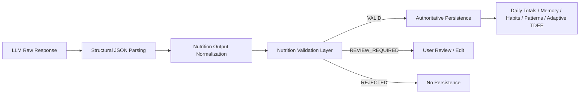

# REM-001 — LLM Nutrition Output Validation Layer

**Document:** `docs/tasks/REM-001/SPEC.md`  
**Version:** 1.2  
**Status:** Draft — Architecture Approval Required  
**Priority:** Critical Blocker  
**Owner:** FITME AI Architecture  
**Source Finding:** F6 — Independent AI Architecture Review  
**Blocks:** Recommendation Engine implementation and continuation beyond ENG-010

---

## 1. Objective

Prevent malformed, incomplete, contradictory, or implausible nutrition values produced by an LLM from being persisted as authoritative FITME history.

The system SHALL validate every AI-generated nutrition result after parsing and before any diary, daily-total, memory, habit, pattern, adaptive-target, or coaching state mutation.

---

## 2. Problem

The current nutrition-analysis flow structurally parses model JSON but does not enforce semantic or numeric validity.

A syntactically valid model response may currently contain:

- Missing required fields.
- Negative values.
- Non-finite values.
- Implausible calorie or macro values.
- Saturated fat greater than total fat.
- Sugar or fiber greater than total carbohydrates.
- Calories materially inconsistent with the reported macronutrients.
- Zero-filled values caused by permissive numeric coercion.

Once persisted, these values are treated as source history by deterministic downstream systems. Invalid AI output can therefore contaminate:

- Daily nutrition totals.
- Adaptive TDEE calculations.
- Habit detection.
- Pattern detection.
- Recommendation logic.
- User trust.

Prompt instructions asking the LLM to “self-check” are not an acceptable safety boundary.

---

## 3. Scope

REM-001 covers all nutrition objects generated from an LLM response, including AI analysis initiated from:

- Meal photographs.
- Nutrition-label photographs.
- Free-text food estimation that returns structured nutrition data.
- Any existing or future LLM path that produces calories or macronutrients for persistence.

The validation layer SHALL run after JSON parsing and before persistence or state mutation.

---

## 4. Out of Scope

REM-001 SHALL NOT:

- Redesign the meal logging UI.
- Change calorie or macro targets.
- Change barcode database logic.
- Change manual-entry calculations.
- Add a new Firestore collection.
- Add a second memory system.
- Modify Firebase Functions or Firestore rules unless implementation proves strictly necessary.
- Ask the LLM to make authoritative corrections.
- Implement Recommendation Engine behavior.
- Diagnose medical or nutritional conditions.

---

## 5. Architectural Position



The validator is a mandatory trust boundary.

No AI-generated nutrition object may bypass it.

---

## 6. Trust Model

### 6.1 Generative Output

LLM output is advisory and untrusted by default.

### 6.2 Validated Nutrition Object

An AI-generated nutrition object becomes eligible for authoritative persistence only after deterministic validation succeeds.

### 6.3 User Confirmation

User confirmation or editing may resolve a `REVIEW_REQUIRED` result.

User confirmation SHALL NOT override hard-invalid structural or non-finite values without first producing a valid normalized object.

---

## 7. Required Component

Create one pure validation component:

`NutritionOutputValidator`

The component SHALL:

- Receive a normalized candidate nutrition object.
- Perform deterministic validation.
- Return a structured validation result.
- Perform no persistence.
- Perform no UI rendering.
- Perform no LLM calls.
- Perform no global-state mutation.

---

## 8. Input Contract

The validator SHALL accept one candidate object with the following normalized fields:

```yaml
NutritionCandidate:
  name: string
  quantity: number | null
  unit: string | null
  kcal: number | null
  proteinG: number | null
  carbsG: number | null
  fatG: number | null
  saturatedFatG: number | null
  sugarG: number | null
  fiberG: number | null
  sourceType: string
```

Additional existing fields MAY be preserved but SHALL NOT affect validation unless explicitly added to this specification.

Missing optional fields SHALL remain `null`.

They MUST NOT be silently converted to `0`.

---

## 9. Output Contract

```yaml
NutritionValidationResult:
  status: VALID | REVIEW_REQUIRED | REJECTED
  normalized:
    NutritionCandidate
  errors:
    - code: string
      field: string | null
      severity: HARD | SOFT
  warnings:
    - code: string
      field: string | null
  metrics:
    calculatedMacroKcal: number | null
    kcalDifference: number | null
    kcalDifferenceRatio: number | null
```

### Status definitions

- `VALID` — eligible for authoritative persistence.
- `REVIEW_REQUIRED` — not eligible for persistence until the user confirms or edits the values.
- `REJECTED` — invalid object; must not be persisted.

---

## 10. Normalization Rules

Before validation:

1. Trim string fields.
2. Convert accepted numeric strings to finite numbers.
3. Convert empty strings to `null`.
4. Preserve missing numeric values as `null`.
5. Reject `NaN`, `Infinity`, and `-Infinity`.
6. Round persisted numeric nutrition values to a maximum of one decimal place.
7. Do not use a generic helper that converts invalid numbers to zero.

Normalization MUST be deterministic.

---

## 11. Hard Validation Rules

A hard-rule failure SHALL produce `REJECTED`.

| Code | Rule |
|---|---|
| `NUTRITION_NOT_OBJECT` | Parsed result is not an object. |
| `NAME_REQUIRED` | `name` is empty or missing. |
| `KCAL_REQUIRED` | `kcal` is missing. |
| `KCAL_NON_FINITE` | `kcal` is not finite. |
| `KCAL_NEGATIVE` | `kcal < 0`. |
| `KCAL_ABSOLUTE_MAX` | `kcal > 10000` for one persisted entry. |
| `MACRO_NON_FINITE` | Any provided macro is not finite. |
| `MACRO_NEGATIVE` | Any provided macro is below `0`. |
| `PROTEIN_ABSOLUTE_MAX` | `proteinG > 1000`. |
| `CARBS_ABSOLUTE_MAX` | `carbsG > 1500`. |
| `FAT_ABSOLUTE_MAX` | `fatG > 1000`. |
| `SATURATED_GT_FAT` | `saturatedFatG > fatG` when both exist. |
| `SUGAR_GT_CARBS` | `sugarG > carbsG` when both exist. |
| `FIBER_GT_CARBS` | `fiberG > carbsG` when both exist. |
| `QUANTITY_INVALID` | Provided quantity is non-finite or `<= 0`. |

The absolute maximum values are corruption guards, not nutritional recommendations.

---

## 12. Soft Validation Rules

A soft-rule failure SHALL produce `REVIEW_REQUIRED`, unless a hard failure also exists.

### 12.1 Required macro completeness

For ordinary meal or food estimation, `proteinG`, `carbsG`, and `fatG` SHALL be present.

Missing one or more of these fields produces:

`MACROS_INCOMPLETE`

For source paths that intentionally extract only partial label information, the caller MUST explicitly declare that partial macros are allowed. This permission MUST NOT be inferred.

### 12.2 Macro-to-calorie consistency

When protein, carbohydrates, and fat are present:

```text
calculatedMacroKcal =
    proteinG × 4
  + carbsG × 4
  + fatG × 9
```

Calculate:

```text
kcalDifference = abs(kcal - calculatedMacroKcal)
kcalDifferenceRatio = kcalDifference / max(kcal, 1)
```

Produce `MACRO_KCAL_MISMATCH` when both conditions are true:

```text
kcalDifference > 120
AND
kcalDifferenceRatio > 0.35
```

This is a review trigger, not an automatic rejection, because fiber, alcohol, sugar alcohols, rounding, and incomplete visual information can create legitimate variance.

### 12.3 Zero-value plausibility

Produce `ZERO_KCAL_WITH_MACROS` when:

```text
kcal == 0
AND
(proteinG > 0 OR carbsG > 0 OR fatG > 0)
```

Produce `POSITIVE_KCAL_ALL_MACROS_ZERO` when:

```text
kcal >= 100
AND
proteinG == 0
AND
carbsG == 0
AND
fatG == 0
```

Both cases require review.

---

## 13. Validation Decision Order

The validator SHALL apply rules in this order:

1. Structural validity.
2. Required fields.
3. Numeric finiteness.
4. Non-negative values.
5. Absolute corruption bounds.
6. Cross-field constraints.
7. Macro completeness.
8. Macro-to-calorie consistency.
9. Zero-value plausibility.
10. Final status selection.

Status selection:

```text
Any HARD error   → REJECTED
No HARD errors
+ any SOFT error → REVIEW_REQUIRED
No errors        → VALID
```

Warnings do not change status.

---

## 14. Persistence Rules

### 14.1 VALID

The normalized object MAY be persisted through the existing authoritative meal-save path.

### 14.2 REVIEW_REQUIRED

The object MUST NOT modify:

- Diary history.
- Daily totals.
- Memory.
- Habits.
- Patterns.
- Adaptive targets.
- Coach events.

The user SHALL receive the existing edit/review experience with the candidate values prefilled.

Persistence is permitted only after the edited or confirmed object is validated again and returns `VALID`.

### 14.3 REJECTED

The object MUST NOT be persisted.

The user SHALL receive a clear recovery path:

- Retry analysis.
- Edit manually.
- Cancel.

The UI MUST NOT display a technical validation code.

---

## 15. Integration Rules

The current flow SHALL be changed so that:

```text
parseModelJSON
→ normalizeNutritionCandidate
→ validateNutritionCandidate
→ route by validation status
→ persist only when VALID
```

All AI nutrition entry points MUST use the same validator.

Duplicated validation logic in individual call sites is forbidden.

The validator SHALL be callable independently for automated tests.

---

## 16. User Experience Requirements

- Validation MUST NOT introduce unnecessary friction for valid results.
- `VALID` results continue through the existing flow.
- `REVIEW_REQUIRED` results SHALL explain that FITME needs a quick confirmation because the estimate may be inconsistent.
- `REJECTED` results SHALL avoid blaming the user.
- The user SHALL retain the ability to edit the analyzed meal before saving.
- No technical error codes SHALL be shown to users.
- The system SHALL never silently replace implausible values with zero.

Suggested user-facing meaning, not fixed copy:

```text
FITME is not fully confident in this estimate.
Review the calories and macros before saving.
```

Exact UI copy remains implementation-level and must follow the AI Constitution.

---

## 17. Logging and Observability

The system SHALL log validation outcomes without logging unnecessary meal content.

Required diagnostic fields:

```yaml
nutritionValidation:
  status: VALID | REVIEW_REQUIRED | REJECTED
  sourceType: string
  errorCodes: string[]
  warningCodes: string[]
  validatorVersion: string
```

Logs MUST NOT include:

- Image bytes.
- Raw image URLs.
- Full LLM prompt.
- Authentication tokens.
- Unnecessary personal data.

Validation failure SHALL be observable separately from LLM parse failure.

---

## 18. Failure Handling

### Validator internal failure

If the validator throws unexpectedly:

- Treat the candidate as `REJECTED`.
- Do not persist.
- Log `VALIDATOR_INTERNAL_ERROR`.
- Present retry/manual-entry recovery.

### Parsing failure

If JSON parsing fails:

- Do not call the semantic validator with fabricated defaults.
- Do not persist.
- Use the existing analysis-error recovery path.

### UI failure after REVIEW_REQUIRED

If the review UI cannot open:

- Do not persist.
- Keep the candidate only in transient runtime state.
- Allow retry.

---

## 19. State and Security Invariants

1. Unvalidated AI output never becomes authoritative state.
2. Invalid numeric input is never converted silently to zero.
3. Validation is deterministic.
4. Validation performs no persistence.
5. Validation performs no LLM calls.
6. Every persisted AI-generated nutrition entry has passed the current validator.
7. Validator version is available in diagnostics.
8. Validation state is scoped to the current authenticated user session.
9. No cross-user transient candidate may survive sign-out.

Invariant 9 overlaps REM-002 and SHALL be respected here even before centralized session cleanup is implemented.

---

## 20. File Scope

Expected production changes:

- `app.js` or the current client module containing `parseModelJSON`, nutrition normalization, and AI meal persistence.
- A new pure validator module MAY be created if compatible with the current static application structure.
- A lightweight automated test file SHALL be added.

No Firestore schema or rules change is expected.

No Cloud Function change is expected.

Any deviation requires explicit architecture review before implementation.

---

## 21. Automated Test Requirements

A dependency-free test approach SHOULD be used where possible.

Tests SHALL cover at least:

1. Valid normal meal.
2. Numeric strings normalized correctly.
3. Missing calories rejected.
4. Negative calories rejected.
5. `NaN` rejected.
6. Saturated fat greater than fat rejected.
7. Sugar greater than carbohydrates rejected.
8. Fiber greater than carbohydrates rejected.
9. Material macro-calorie mismatch requires review.
10. Small rounding mismatch remains valid.
11. Missing macros require review.
12. Zero calories with positive macros requires review.
13. Invalid input is never converted to zero.
14. Same input always returns the same result.
15. `REVIEW_REQUIRED` and `REJECTED` objects never reach the persistence function.

Tests MUST verify both result status and error codes.

---

## 22. Manual Acceptance Scenarios

### Scenario A — Valid photo estimate

Given a plausible AI estimate:

```yaml
kcal: 620
proteinG: 42
carbsG: 68
fatG: 20
```

Expected:

- Status `VALID`.
- Existing save flow continues.
- Daily totals update once.

### Scenario B — Contradictory estimate

```yaml
kcal: 150
proteinG: 50
carbsG: 70
fatG: 30
```

Expected:

- Status `REVIEW_REQUIRED`.
- Nothing is persisted before user review.
- User can edit and revalidate.

### Scenario C — Corrupted estimate

```yaml
kcal: -400
proteinG: 25
carbsG: 40
fatG: 20
```

Expected:

- Status `REJECTED`.
- Nothing is persisted.
- Retry/manual recovery shown.

### Scenario D — Invalid numeric coercion

```yaml
kcal: "unknown"
proteinG: "25"
carbsG: "40"
fatG: "20"
```

Expected:

- Calories remain invalid.
- Calories are not converted to `0`.
- Status `REJECTED`.

---

## 23. Acceptance Criteria

REM-001 is complete only when all conditions are met:

- [ ] Every LLM-generated nutrition object passes through one shared validator.
- [ ] Validation occurs before every authoritative mutation.
- [ ] Missing or invalid numeric fields are not silently converted to zero.
- [ ] Hard-invalid objects are rejected.
- [ ] Suspicious but potentially valid objects require user review.
- [ ] Valid objects continue through the existing save flow.
- [ ] Review and rejection paths do not modify diary totals or downstream intelligence.
- [ ] The validator is pure and deterministic.
- [ ] Automated tests cover all required cases.
- [ ] Existing valid meal logging behavior remains functional.
- [ ] No new memory system or Firestore collection is introduced.
- [ ] Validation diagnostics are observable without exposing sensitive content.
- [ ] Product, architecture, engineering, and device acceptance are completed.

---

## 24. Approval Gate

Before implementation:

- Product approval confirms the user-review behavior.
- Architecture approval confirms validation boundaries and persistence rules.
- Engineering confirms exact integration points in the existing code.

Claude Code SHALL implement only after this specification is approved.

---

## 25. Next Remediation Task

After REM-001 receives implementation and device acceptance:

`REM-002 — Session State Reset and Account Isolation`


---

# Appendix A — Engineering Review Resolutions (v1.1)


# REM-001 — LLM Nutrition Output Validation Layer
## Version 1.1 (Engineering Review Resolved)

This document supersedes v1.0.

## Engineering Review Resolution

The following engineering findings from the implementation review have been incorporated.

### ER-001 — Validation at Persistence Boundary (RESOLVED)

Validation SHALL execute twice:

1. Immediately after AI normalization.
2. Immediately before the final persistence operation (`addMeal()` or its future equivalent).

If the user edits any nutrition field after AI analysis, the edited object MUST be validated again before persistence.

No object may reach authoritative storage without passing the second validation.

---

### ER-002 — Supported AI Entry Points (RESOLVED)

REM-001 applies to every AI-generated nutrition flow.

Current supported entry points:

- Text food estimation
- Meal photo analysis
- Nutrition-label photo analysis
- Meal editor AI item insertion
- Quick-log onboarding AI generation

All future AI nutrition flows MUST use the same validator.

#### Normalization Rules

Before validation every flow MUST be converted into a common internal structure.

Single-item responses:
- Validate the single NutritionCandidate.

Multi-item meal responses:
- Validate every item independently.
- Reject or review only the failing item.
- Recalculate meal totals.
- Validate the aggregated meal totals.
- Persist only when every item and the aggregate pass validation.

Suggestions are informational only and are never persisted or validated.

---

### ER-003 — Saturated Fat Rule (RESOLVED)

Current production AI responses do not include saturated fat.

Therefore:

- `SATURATED_GT_FAT` remains implemented.
- It is evaluated only when saturated fat exists.
- No AI prompt/schema expansion is part of REM-001.
- Future schema extensions automatically activate this rule.

---

### ER-004 — UI Boundary (RESOLVED)

REM-001 does NOT redesign meal logging.

Permitted UI additions:

- Review dialog
- Validation banner
- Retry dialog

No navigation, workflow, layout or visual redesign is permitted.

---

### ER-005 — Existing Data Model Mapping (RESOLVED)

Current fields map as follows:

| Existing | Validator |
|----------|-----------|
| protein | proteinG |
| carbs | carbsG |
| fat | fatG |
| sugar | sugarG |
| fiber | fiberG |
| amount | quantity |
| qty | normalized into `quantity` before validation |
| sodium | passthrough (not validated in REM-001) |

Only mapped validation fields participate in deterministic validation.

`qty` SHALL NOT create a separate validator field.

During normalization, any existing quantity multiplier represented by `qty` SHALL be folded into the normalized `quantity` value before validation.

No additional quantity-multiplier field exists in the validator contract.

The validator operates only on the normalized `quantity` field defined in the NutritionCandidate contract.

---

### ER-006 — Session Isolation (RESOLVED)

All transient validation candidates MUST be cleared on:

- Sign-out
- Account switch
- Authentication reset

Implementation SHALL integrate with the existing authentication lifecycle.

No transient nutrition candidate may survive between authenticated users.

---

## Status

Architecture Review: Approved

Engineering Review: Addressed

Status:
Ready for Engineering Readiness Review (Round 2)
